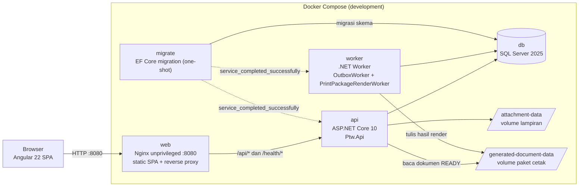
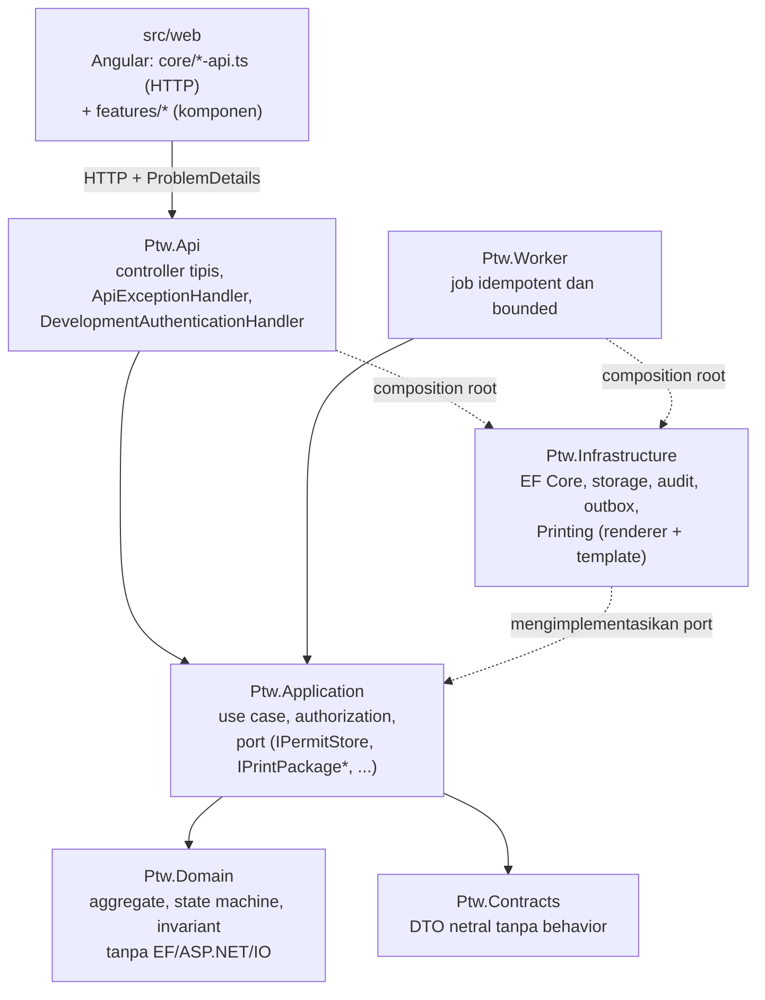
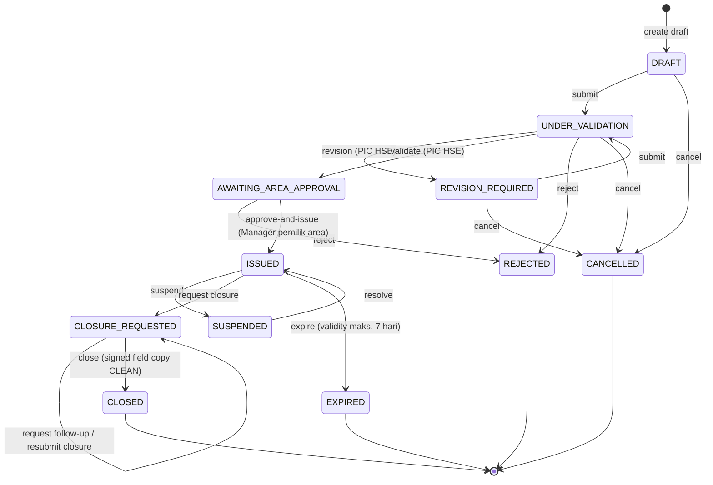
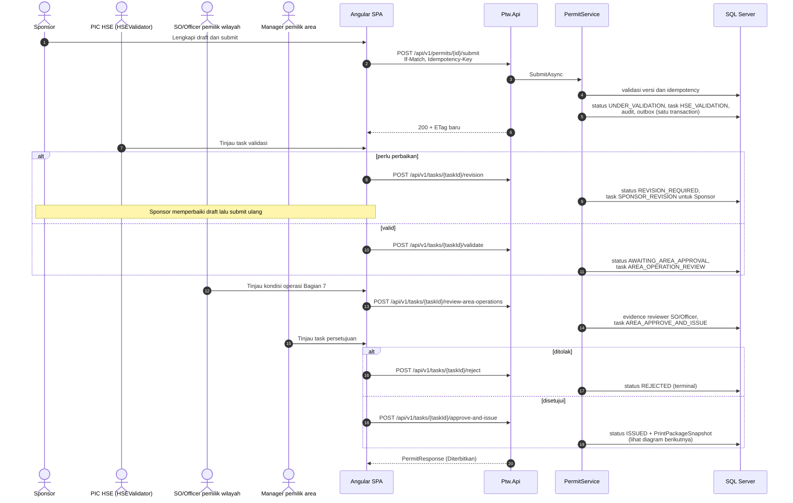

# NR PTW Online

NR PTW Online adalah modular monolith untuk pengelolaan Permit to Work (PTW) Nusantara Regas. Baseline implementasi saat ini mengacu pada BRD, PRD, dan FSD **v1.8**.

> [!IMPORTANT]
> Status **Diterbitkan** (`ISSUED`) belum otomatis mengizinkan pekerjaan dimulai. Gas test, toolbox/readiness, revalidasi harian/shift, completion, inspeksi/restorasi, handback, dan tanda tangan lapangan tetap dikendalikan pada hardcopy untuk MVP.

## Daftar isi

- [Ringkasan](#ringkasan)
- [Status implementasi](#status-implementasi)
- [Arsitektur](#arsitektur)
  - [Stack](#stack)
  - [Topologi runtime](#topologi-runtime)
  - [Lapisan kode dan arah dependency](#lapisan-kode-dan-arah-dependency)
  - [Struktur repository](#struktur-repository)
- [Lifecycle PTW](#lifecycle-ptw)
- [Sequence diagram](#sequence-diagram)
  - [Alur persetujuan v1.8](#alur-persetujuan-v18)
  - [Penerbitan, render paket cetak, dan unduhan](#penerbitan-render-paket-cetak-dan-unduhan)
- [Endpoint workflow v1.8](#endpoint-workflow-v18)
- [Menjalankan aplikasi](#menjalankan-aplikasi)
  - [Docker Compose](#docker-compose)
  - [Development lokal](#development-lokal)
- [Quality gate](#quality-gate)
- [Dokumentasi dan decision record](#dokumentasi-dan-decision-record)
- [Batas produksi](#batas-produksi)

## Ringkasan

MVP bersifat hybrid digital-ke-kertas. Sistem mengelola lifecycle PTW secara digital (draft, validasi HSE, persetujuan pemilik area, penerbitan, suspend/resume, renewal, closure) dan menerbitkan paket cetak resmi yang setia pada formulir terkontrol FM-001/002/003-B-002-NR-B220. Kegiatan lapangan tetap dikendalikan pada hardcopy.

Prinsip teknis utama:

- seluruh transition memakai command eksplisit dengan `If-Match` dan `Idempotency-Key`; tidak ada endpoint generik `setStatus`;
- aggregate, task/decision, audit event, outbox message, dan idempotency result commit atomik dalam satu transaction;
- authorization dan scope diberlakukan server-side; identitas actor berasal dari `/api/v1/me`;
- paket cetak dirender oleh Worker dari `PrintPackageSnapshot` yang immutable; hanya paket `READY` yang merupakan dokumen resmi.

## Status implementasi

Increment P0 lifecycle v1.8 telah tersedia:

- lifecycle aktif: `DRAFT`, `UNDER_VALIDATION`, `REVISION_REQUIRED`, `AWAITING_AREA_APPROVAL`, `ISSUED`, `SUSPENDED`, `CLOSURE_REQUESTED`, `CLOSED`, `REJECTED`, `CANCELLED`, `EXPIRED`;
- `PermitVersion` adalah revisi bisnis: edit draft, upload/hapus lampiran, dan perubahan status tidak menaikkan versi; submit ulang setelah `REVISION_REQUIRED` menaikkan tepat satu versi. Concurrency tetap memakai `If-Match`/ETag;
- submit membuat tepat satu task `HSE_VALIDATION`; tidak ada validator Distribusi Gas;
- Sponsor yang juga PIC HSE tidak dapat memvalidasi PTW miliknya sendiri;
- permintaan revisi membuat notifikasi tugas `SPONSOR_REVISION` yang ditugaskan langsung kepada Sponsor PTW; notifikasi tetap terlihat berdasarkan identitas Sponsor walaupun role aktifnya berubah, mengikuti exact versi draft selama perbaikan, diperbarui berkala pada ikon lonceng, dan selesai otomatis ketika PTW diajukan ulang. Migrasi rekonsiliasi membentuk task yang hilang untuk PTW existing yang sudah berstatus `REVISION_REQUIRED`;
- ringkasan PTW dan workflow menampilkan nama lengkap profil server untuk Sponsor, validator HSE, reviewer SO/Officer, dan approver Manager, serta label Bahasa Indonesia untuk kelas izin dan tipe pengaju; username/Subject ID tetap menjadi identifier internal dan tidak digunakan sebagai fallback nama pada UI. Evidence HSE baru membekukan nama actor, sedangkan evidence lama diperkaya dari direktori pengguna saat dibaca;
- setelah validasi HSE, Development/UAT membuat tepat satu task `AREA_OPERATION_REVIEW` untuk pool SO/Officer pemilik wilayah. Pemegang assignment yang pertama menyelesaikan task menetapkan checklist kondisi operasi Bagian 7; hanya setelah review itu selesai sistem membuat tepat satu task `AREA_APPROVE_AND_ISSUE` untuk Manager pemilik wilayah. Command Manager tetap atomik dan menyimpan decision, status `ISSUED`, audit, outbox, `PrintPackageSnapshot`, serta placeholder `GeneratedDocument` dalam satu `SaveChanges` transaction;
- release lokasi dikonfigurasi server-side; Development mengaktifkan ORF, Site-Office, dan Water-Based Activity, sedangkan lokasi lain ditolak fail-closed;
- suspend berlaku langsung dan resolve kembali ke `ISSUED`; request renewal Sponsor memerlukan signed field copy exact package/version dan baru membuat permit penerus tanpa overlap setelah Pemilik Wilayah menyetujui;
- closure memakai satu task pool Pemilik Wilayah yang dapat diselesaikan Manager maupun SO/Officer dengan assignment efektif dan scope lokasi yang cocok. Signed field copy yang dipilih Sponsor harus `CLEAN`, bermetadata lengkap, tidak superseded, serta cocok dengan exact PermitVersion dan PrintPackage; setelah diajukan, file itu menjadi unduhan utama PTW untuk review dan arsip penutupan, sedangkan paket cetak awal tetap tersedia sebagai referensi. Pemilik Wilayah kemudian mengisi verifikasi Bagian 10: nama Officer, hasil inspeksi area, status selesai, pemulihan sistem inhibited, handback/pengamanan area, dan keterbacaan evidence. Pekerjaan yang belum selesai dikembalikan kepada Sponsor tanpa menutup PTW atau memulihkan hak kerja; Sponsor dapat mengunggah hardcopy pengganti untuk paket cetak yang sama dan mengajukan ulang melalui command khusus;
- lampiran privat mengenali signature PDF/JPEG/PNG, menyimpan SHA-256, kategori, metadata dokumen, target version, PrintPackage, replacement lineage, serta evidence malware scan; file selain `CLEAN` tidak dapat diunduh;
- form draft Sponsor memuat tipe pengaju, klasifikasi header resmi (HOT: `Api Terbuka`/`Percikan Api` multi-select; COLD: tepat satu `Low Risk`/`High Risk`; CSE tanpa pilihan tambahan), work type multi-select (opsi `Lain-lain` mewajibkan detail yang ikut tercetak), nomor dan nama equipment, Work Order No. (opsional), plant/area, serta nomor/revisi/tanggal JSA. Referensi bahaya tambahan bersifat opsional dan informatif; JSA tetap menjadi sumber resmi identifikasi bahaya dan pengendalian. Deklarasi SIMOPS tidak ditampilkan karena belum terdapat pada template terkendali saat ini. Field bebas CLSR dan isolation/precaution tidak ditampilkan pada form Sponsor karena bukan kewenangan Sponsor; checklist kondisi operasi Bagian 7 ditetapkan SO/Officer pemilik wilayah setelah validasi HSE;
- dokumen dasar JSA, Prosedur Pekerjaan, ID, BPJS TK, FTW, dan E-SIMI wajib memiliki lampiran bertaut sebelum submit; kewajiban upload Prosedur Pekerjaan tidak otomatis memilih item tersebut pada checklist Bagian 4, sedangkan ID, BPJS TK, FTW, dan E-SIMI hanya menjadi evidence pengajuan dan tidak ditambahkan ke checklist PDF resmi;
- Bagian 4 memakai 15 pilihan dokumen sesuai template resmi: JSA wajib dan pilihan lain opsional. Setiap pilihan harus memiliki lampiran yang tertaut sebelum submit, metadata lampiran JSA harus cocok dengan draft, dan hasil checklist dicetak dari immutable snapshot;
- APD/perlengkapan safety Bagian 5 dipilih secara multi-select oleh PIC HSE pada tahap validasi dan tidak dapat diisi bebas oleh Sponsor; approval permit lama tanpa evidence Bagian 5 diblokir dan diarahkan melalui revisi; input hazards/controls bebas telah dihapus dari UI;
- paket cetak resmi dirender Worker dari `PrintPackageSnapshot` yang immutable dengan halaman resmi FM-001/002/003-B-002-NR-B220 sebagai template vektor. Hasil unduhan terdiri dari dua halaman A3: halaman 1 landscape untuk Bagian 1-7 dan halaman 2 portrait yang dimulai dari Bagian 8; sistem mengisi Bagian 1-5, termasuk profil/tanda tangan Sponsor pada Bagian 3, serta evidence Bagian 7 (checklist dan baris keputusan SO/Officer serta Manager), sedangkan Bagian 6 dan Bagian 8-10 tetap kosong untuk diisi manual di lapangan;
- kegagalan render tidak membatalkan keputusan penerbitan: status paket menjadi `RETRYING` dengan exponential backoff, lalu `FAILED` setelah batas percobaan, dan Administrator dapat menjadwalkan render ulang secara idempotent;
- hanya paket berstatus `READY` yang dapat diunduh; setiap unduhan menghasilkan audit event, dan pratinjau draft selalu diberi watermark `DRAFT / TIDAK BERLAKU` serta tidak pernah disimpan.
- deploy web menjaga `index.html` tetap tervalidasi, tidak mengalihkan chunk JavaScript yang hilang ke SPA shell, dan melakukan satu reload terbatas ketika lazy chunk lama gagal dimuat.

Ruleset resmi, acting assignment v1.8 lengkap, malware scanner produksi, E-SIMI adapter, external contractor scoping, serta master LocationRelease/ConfigurationBundle masih fail-closed atau partial. Pilihan Bagian 1, 4, dan 5 dicetak dari snapshot; katalog statis Bagian 4 mengikuti template resmi saat ini, sementara pengelolaan master data effective-dated tetap pekerjaan lanjutan. Detail dan traceability requirement → komponen → endpoint → migration → test ada di [status implementasi](docs/implementation-status.md).

## Arsitektur

### Stack

| Lapisan | Teknologi |
| --- | --- |
| Frontend | Angular 22, standalone components, Signals/RxJS, reactive forms |
| API | ASP.NET Core 10 / .NET 10, controller tipis, ProblemDetails |
| Persistence | EF Core 10, SQL Server 2025, transactional outbox |
| Background | .NET Worker (`OutboxWorker`, `PrintPackageRenderWorker`) |
| Cetak | PDFsharp, template terkontrol FM-001/002/003-B-002-NR-B220 |
| Runtime | Docker Compose, Nginx unprivileged |
| Test | xUnit, Testcontainers (MsSql), Vitest |

### Topologi runtime

Compose development menjalankan lima service dan tiga volume. Nginx melayani SPA dan menjadi reverse proxy ke API; `migrate` menjalankan EF Core migration satu kali sebelum `api` dan `worker` dimulai.



### Lapisan kode dan arah dependency

`Api` dan `Worker` bergantung pada `Application`; `Application` bergantung pada `Domain` dan `Contracts`; `Infrastructure` mengimplementasikan port yang didefinisikan `Application`. Tidak ada arah balik.



### Struktur repository

```text
src/Ptw.Domain          aggregate, state machine, invariant, katalog checklist formulir — tanpa EF/ASP.NET/IO
src/Ptw.Contracts       DTO netral — tanpa domain behavior
src/Ptw.Application     use case, authorization, ports (IPermitStore, IPrintPackage...), profil role assignment langsung
src/Ptw.Infrastructure  EF Core, storage, audit, outbox, Printing/ (renderer + template)
src/Ptw.Api             mapping HTTP, Security/ (DevelopmentAuthenticationHandler, HttpActorContext), login cookie lokal, ApiExceptionHandler
src/Ptw.Worker          OutboxWorker dan PrintPackageRenderWorker
src/web                 Angular: core/*-api.ts (HTTP) + features/* (komponen)
tests/Ptw.Domain.Tests           unit state machine
tests/Ptw.Api.IntegrationTests   end-to-end via PtwApiFactory + Testcontainers
tests/Ptw.Printing.Tests         regresi layout dokumen
deploy/compose                   compose.dev.yaml (production-like), compose.hotreload.yaml (bind mount + dotnet watch/ng serve)
deploy/nginx                     konfigurasi reverse proxy
docs/                            BRD/PRD/FSD v1.8, status implementasi
docs/decisions/                  register OPN-001..009 (semua masih DRAFT) dan PTW-RENEWAL (baseline Development)
.github/workflows/ci.yml         CI: build/test backend, build/test frontend, validasi compose config
```

## Lifecycle PTW



- `CLOSED`, `REJECTED`, `CANCELLED`, dan `EXPIRED` bersifat terminal.
- Suspend menghentikan hak kerja seketika; resolve hanya kembali ke `ISSUED`.
- Renewal tidak memperpanjang permit lama. Sponsor mengajukan hardcopy hasil verifikasi lapangan, Pemilik Wilayah meninjau melalui task khusus, lalu approval membuat aggregate draft baru tanpa overlap. Draft penerus tetap mengikuti submit, validasi HSE, dan approval penerbitan normal.
- Istilah UI untuk `ISSUED` adalah **Diterbitkan**.

## Sequence diagram

### Alur persetujuan v1.8

Setiap transition adalah command eksplisit yang membawa `If-Match` (versi aggregate) dan `Idempotency-Key`. Task command memakai `taskId`, bukan permit ID.



### Penerbitan, render paket cetak, dan unduhan

Keputusan penerbitan dan render dokumen dipisahkan: keputusan commit atomik di API, sedangkan render dilakukan asinkron oleh Worker. Kegagalan render tidak membatalkan penerbitan.


Pratinjau draft (`GET .../print-packages/preview`) merender langsung dari state saat ini dengan watermark `DRAFT / TIDAK BERLAKU` dan tidak pernah disimpan.

## Endpoint workflow v1.8

| Method | Endpoint | Command |
| --- | --- | --- |
| `POST` | `/api/v1/permits/{id}/submit` | `SubmitPermit` |
| `POST` | `/api/v1/tasks/{taskId}/validate` | `ValidateSubmission` |
| `POST` | `/api/v1/tasks/{taskId}/review-area-operations` | `ReviewAreaOperations` oleh SO/Officer pemilik wilayah; reviewer pertama menyelesaikan satu task |
| `POST` | `/api/v1/tasks/{taskId}/escalate` | eskalasi HSE dengan catatan |
| `POST` | `/api/v1/tasks/{taskId}/revision` | `RequestRevision` |
| `POST` | `/api/v1/tasks/{taskId}/reject` | `RejectPermit` |
| `POST` | `/api/v1/tasks/{taskId}/approve-and-issue` | `ApproveAndIssuePermit` |
| `POST` | `/api/v1/permits/{id}/suspensions` | `SuspendPermit` |
| `POST` | `/api/v1/permits/{id}/suspensions/resolve` | `ResolveSuspension` |
| `POST` | `/api/v1/permits/{id}/renew` | `RequestRenewal` |
| `POST` | `/api/v1/renewal-tasks/{taskId}/request-evidence` | `RequestRenewalEvidenceReplacement` |
| `POST` | `/api/v1/renewal-tasks/{taskId}/reject` | `RejectRenewal` |
| `POST` | `/api/v1/renewal-tasks/{taskId}/approve` | `ApproveRenewal` dan pembuatan draft penerus atomik |
| `POST` | `/api/v1/permits/{id}/closure-requests` | `RequestClosure` |
| `POST` | `/api/v1/permits/{id}/closure-requests/resubmit` | `ResubmitClosure` setelah tindak lanjut Pemilik Wilayah |
| `POST` | `/api/v1/closure-tasks/{taskId}/request-evidence` | `RequestClosureEvidenceReplacement` |
| `POST` | `/api/v1/closure-tasks/{taskId}/close` | `ClosePermit` |
| `POST` | `/api/v1/permits/{id}/cancel` | `CancelPermit` |
| `POST` | `/api/v1/permits/{id}/expire` | `ExpirePermit` |
| `GET` | `/api/v1/permits/{id}/print-packages` | daftar paket cetak dan status render |
| `GET` | `/api/v1/permits/{id}/print-packages/{pid}/content` | unduh dokumen resmi `READY` dengan audit |
| `GET` | `/api/v1/permits/{id}/print-packages/preview` | pratinjau draft ber-watermark, tidak disimpan |
| `POST` | `/api/v1/permits/{id}/print-packages/{pid}/retry` | render ulang oleh Administrator, idempotent |

Task command memakai `taskId`, bukan permit ID. Semua transition memerlukan `If-Match` dan `Idempotency-Key`. Tidak ada endpoint generik `setStatus`.

Endpoint baca/create draft, attachment (multipart dengan `supportingDocumentCode` untuk dokumen wajib dan Bagian 4), history, master lokasi, authorization, policy readiness/simulation/UAT, dan health tetap tersedia. Katalog dokumen wajib dibaca dari `GET /api/v1/reference-data/mandatory-documents`; katalog checklist formulir dibaca dari `/header-classifications`, `/work-types`, `/supporting-documents`, `/safety-equipment`, dan `/operational-conditions`. Nilai dikontrol dan divalidasi ulang di server. Mode demo dibaca publik lewat `GET /api/v1/auth/options` dan dikelola Administrator lewat `GET /api/v1/admin/settings/demo-mode` serta `POST .../demo-mode/enable|disable` (hanya Development, memerlukan `If-Match` dan `Idempotency-Key`). Assignment role langsung memakai `GET /api/v1/admin/authorizations/direct-role-options` dan `POST /api/v1/admin/authorizations/direct`; action code dan kompetensi diturunkan server dari profil role, bukan diterima dari klien. OpenAPI hanya diekspos pada Development melalui `/openapi/v1.json`.

Renewal tidak mengubah status PTW asal. Request Sponsor membuat task `AREA_RENEWAL_REVIEW` untuk Manager pemilik area; permit penerus (`DRAFT`, terhubung lewat `RenewedFromPermitId`) baru dibuat secara atomik saat task tersebut disetujui, dan selama review masih `PENDING` lampiran PTW asal tidak dapat diubah serta closure tidak dapat diajukan.

## Menjalankan aplikasi

### Docker Compose

```powershell
Copy-Item .env.example .env
docker compose --env-file .env -f deploy/compose/compose.dev.yaml up --build -d
```

Buka `http://localhost:8080`. Verifikasi stack dan health endpoint:

```powershell
docker compose --env-file .env -f deploy/compose/compose.dev.yaml ps
Invoke-WebRequest -UseBasicParsing http://localhost:8080/health/ready
```

Gunakan password development yang sama ketika me-rebuild stack dengan volume SQL yang sudah ada; mengganti environment variable tidak mengubah password yang tersimpan di volume. Menghentikan stack tanpa menghapus database:

```powershell
docker compose --env-file .env -f deploy/compose/compose.dev.yaml down
```

Jangan menambahkan `--volumes` kecuali memang bermaksud menghapus seluruh data development.

### Docker Compose dengan hot reload

`deploy/compose/compose.hotreload.yaml` menjalankan API, Worker, dan Angular dev server langsung dari repository yang di-bind-mount, bukan dari image hasil publish. Perubahan source diterapkan tanpa rebuild image: `dotnet watch` memakai .NET Hot Reload dan me-restart proses otomatis pada *rude edit* (startup, registrasi DI, model EF, atribut routing), sedangkan `ng serve` memakai HMR untuk template/style dan live reload untuk perubahan TypeScript. SDK .NET 10 tidak perlu terpasang di host.

```powershell
docker compose --env-file .env -f deploy/compose/compose.hotreload.yaml up -d
docker compose --env-file .env -f deploy/compose/compose.hotreload.yaml logs -f api web
```

Buka `http://localhost:8080` (dev server, proxy `/api` dan `/health` ke container `api`). Halaman awal adalah layar login; pengguna harus masuk dengan akun lokal atau memilih **Gunakan mode demo** bila fitur tersebut diaktifkan Administrator melalui **Administrasi > Pengaturan aplikasi**. API juga dipublikasikan langsung di `http://localhost:5080` (`PTW_API_PORT`). Start pertama lebih lama karena restore NuGet, `npm ci`, dan kompilasi berjalan di dalam container; hasilnya disimpan di named volume (`nuget-packages`, `api-artifacts`, `worker-artifacts`, `web-node-modules`) sehingga start berikutnya cepat. Output build .NET diarahkan ke `artifacts/` melalui `PTW_USE_ARTIFACTS_OUTPUT` (lihat `Directory.Build.props`) agar tidak bertabrakan dengan `bin/obj` host.

Catatan:

- file ini memakai nama project compose yang sama dengan `compose.dev.yaml` sehingga database dan volume lampiran/paket cetak dipakai bersama; hanya satu mode yang berjalan pada satu waktu, dan berpindah mode me-recreate `api`/`web`/`worker` tanpa menyentuh `db`;
- bind mount dari filesystem Windows tidak meneruskan event inotify ke container Linux, sehingga kedua watcher memakai polling (`DOTNET_USE_POLLING_FILE_WATCHER`, `--poll`; interval frontend diatur `PTW_WEB_POLL_MS`). Bila repository dipindahkan ke filesystem WSL2, set `PTW_DOTNET_POLLING=false` dan naikkan/kosongkan poll untuk menghemat CPU;
- migration baru tetap dibuat lewat `docker compose ... exec api dotnet tool restore` lalu `docker compose ... exec api dotnet ef migrations add <Nama> --project src/Ptw.Infrastructure --startup-project src/Ptw.Api`;
- mode ini bukan pengganti `compose.dev.yaml`: aturan cache Nginx, CSP, `404` chunk hilang, dan image runtime unprivileged hanya diverifikasi pada stack production-like tersebut. Container SDK berjalan sebagai root dan hanya untuk development lokal.

### Development lokal

Backend memerlukan SDK sesuai [global.json](global.json):

```powershell
dotnet tool restore
dotnet restore PtwOnline.sln
dotnet ef database update --project src/Ptw.Infrastructure/Ptw.Infrastructure.csproj --startup-project src/Ptw.Api/Ptw.Api.csproj
dotnet run --project src/Ptw.Api/Ptw.Api.csproj --urls http://localhost:5080
```

Frontend:

```powershell
Set-Location src/web
npm ci
npm start
```

Development identity hanya aktif pada environment `Development`. Profil yang relevan untuk flow v1.8 adalah Sponsor, PIC HSE (`HSEValidator`), pool SO/Officer pemilik wilayah (kode kompatibilitas `AreaOwnerSeniorOfficer`, termasuk review Bagian 7 dan penutupan), dan Manager pemilik area (`AreaOwnerManager`). Manager maupun pool SO/Officer dapat menindak satu task penutupan sesuai scope; penerbitan tetap khusus Manager. Identitas dan Sponsor aktif berasal dari `/api/v1/me`; header development diabaikan di luar Development.

Administrator dapat membuat akun lokal Development melalui **Administrasi > Pengguna**, lalu membuat, mengajukan, dan menyetujui assignment role melalui **Otorisasi pengguna**. Konfigurasi Development mengizinkan Administrator pembuat menjadi approver assignment yang sama; kedua identitas tetap direkam pada audit dan dapat bernilai sama. Default non-Development tetap mewajibkan maker-checker berbeda. Layar login memakai cookie HTTP-only; role dan scope tidak disimpan di cookie sebagai authority, tetapi dihitung ulang dari assignment approved/effective pada setiap request. Login lokal sengaja ditolak di luar environment `Development` sampai kontrak IdP/SSO OPN-007 disahkan. Mode demo dapat diaktifkan atau dinonaktifkan oleh Administrator melalui **Administrasi > Pengaturan aplikasi**; perubahan memakai concurrency, idempotency, audit, dan outbox. Saat nonaktif, tombol login disembunyikan dan autentikasi identitas demo ditolak server.

Form assignment langsung hanya meminta pengguna, role, area kewenangan bila role bersifat area-scoped, waktu mulai, dan tanggal akhir opsional. Checkbox **Tanpa tanggal berakhir** disimpan sebagai `EffectiveUntil = null`; akun masih dapat dinonaktifkan, sedangkan command pencabutan assignment eksplisit belum tersedia. Action code dan kompetensi tidak diterima dari form sederhana, tetapi diturunkan server dari `UserAuthorizationRoleProfiles`. Profil yang tersedia saat ini hanya konfigurasi Development untuk UX/UAT dan bukan matriks produksi OPN-002. Endpoint assignment generik tetap tersedia untuk kompatibilitas serta framework delegasi yang masih fail-closed.

Spesimen tanda tangan pengguna menerima PNG maksimum 256 KB dan 2000×2000 piksel serta dapat dipratinjau oleh Administrator tanpa cache browser. Versi lama tidak ditimpa; exact version, hash, dan byte PNG dibekukan ke snapshot/evidence Sponsor, reviewer SO/Officer, atau approval Manager, kemudian Worker mencetaknya bersama identitas aktor dan waktu tindakan dalam WIB. Pada Bagian 3, nama lengkap, jabatan, departemen, tanda tangan Sponsor, dan waktu submit berasal dari profil akun server; tanda tangan Pelaksana Pekerjaan tetap kosong untuk hardcopy sampai acknowledgement eksternal OPN-008 disahkan. Bukti visual ini bukan tanda tangan digital tersertifikasi.

Saat memakai hot reload, perubahan migration/model EF memerlukan restart container API agar langkah `--migrate` sebelum `dotnet watch` dijalankan kembali:

```powershell
docker compose --env-file .env -f deploy/compose/compose.hotreload.yaml restart api
```

Named volume `data-protection-keys` mempertahankan cookie login Development ketika container API dibuat ulang. Jangan menghapus volume tersebut atau `sql-data` untuk troubleshooting login/migration.

Pada Development dengan `Attachments:RequireMalwareScan=false` (nilai default `appsettings.Development.json`), upload lokal langsung diberi evidence internal `CLEAN` oleh adapter tepercaya agar submit, closure, dan renewal dapat diuji end-to-end tanpa scanner eksternal. Adapter ini tidak pernah terdaftar di luar Development; production tetap memakai adapter unavailable yang fail-closed sampai scanner resmi tersedia.

Migration baru dibuat dengan mengubah model/mapping lalu menjalankan
`dotnet ef migrations add <Nama> --project src/Ptw.Infrastructure --startup-project src/Ptw.Api`.
Jangan mengedit file migration hasil generate secara manual.

## Quality gate

Backend:

```powershell
dotnet restore PtwOnline.sln
dotnet build PtwOnline.sln --configuration Release --no-restore
dotnet test PtwOnline.sln --configuration Release --no-build
dotnet format PtwOnline.sln --verify-no-changes --no-restore
dotnet list PtwOnline.sln package --vulnerable --include-transitive
```

Frontend:

```powershell
Set-Location src/web
npm ci
npx prettier --check "src/**/*.{ts,html,scss}"
npm run build
npm test -- --watch=false
npm audit --audit-level=high
```

Jika .NET 10 hanya tersedia melalui Docker, mount Docker socket dan set `TESTCONTAINERS_HOST_OVERRIDE=host.docker.internal` agar integration test dapat menjalankan SQL Server disposable. Set `PTW_USE_ARTIFACTS_OUTPUT=true` dan shadow `artifacts/` dengan named volume agar output build Linux tidak bertabrakan dengan `bin/obj` host (lihat [AGENTS.md](AGENTS.md)).

Workflow GitHub Actions di [ci.yml](.github/workflows/ci.yml) menjalankan build/test backend, build/test frontend, dan validasi `compose config` pada setiap push dan pull request. Formatter, Prettier, dan audit dependency belum dijalankan CI sehingga wajib dijalankan lokal sebelum commit.

## Dokumentasi dan decision record

| Dokumen | Isi |
| --- | --- |
| [BRD v1.8](docs/BRD-NR-PTW-Online-v1.8-ID.md) | kebutuhan bisnis |
| [PRD v1.8](docs/PRD-NR-PTW-Online-v1.8-ID.md) | kebutuhan produk |
| [FSD v1.8](docs/FSD-NR-PTW-Online-v1.8-ID.md) | spesifikasi fungsional |
| [Status implementasi](docs/implementation-status.md) | traceability requirement → komponen → endpoint → migration → test |
| [Decision records](docs/decisions/README.md) | register OPN-001..009 (status DRAFT, bukan keputusan) dan PTW-RENEWAL (baseline Development) |
| [CLAUDE.md](CLAUDE.md) / [AGENTS.md](AGENTS.md) | panduan kerja dan aturan normatif untuk kontributor dan agen |

Urutan rujukan ketika ambigu: permintaan pengguna, decision record yang disahkan, invariant dan kontrak yang sudah diuji, BRD/PRD/FSD v1.8, lalu asumsi teknis yang dinyatakan eksplisit. Kebijakan OPN yang belum disahkan tidak boleh dikarang; jalur tersebut fail-closed.

## Batas produksi

Konfigurasi produksi default fail-closed: master authorization wajib siap, issuance policy tidak approved, dan attachment memerlukan scanner (`RequireMalwareScan=true`; adapter upload tepercaya hanya ada di Development). Jangan mengaktifkan issuance sampai exact ruleset, print template, campaign assets, owner mapping, authority, dan keputusan OPN terkait telah disahkan. Compose development bukan topologi HA produksi.
