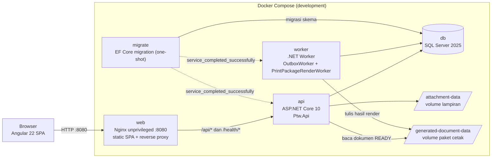
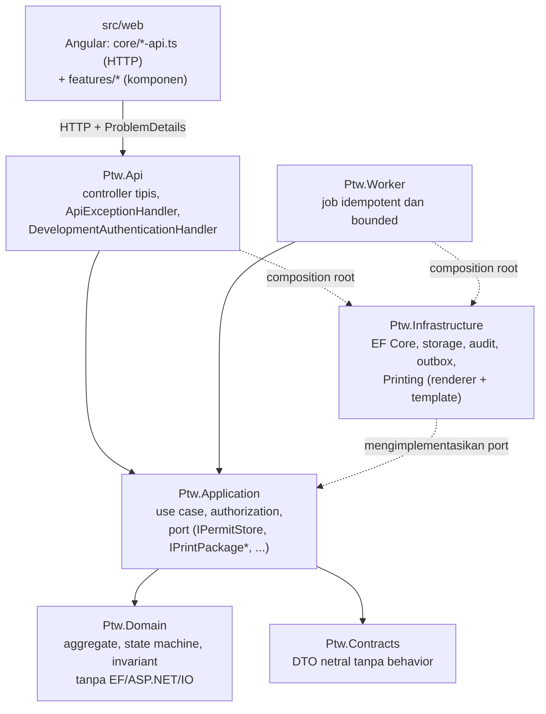
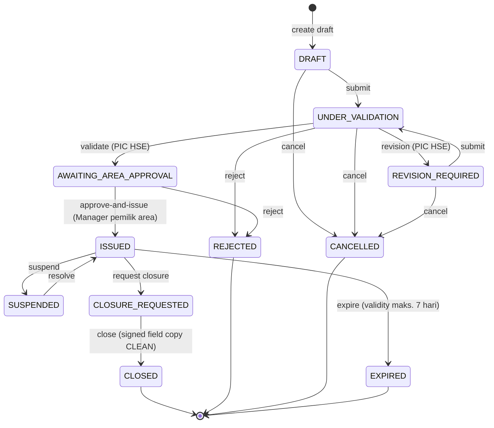
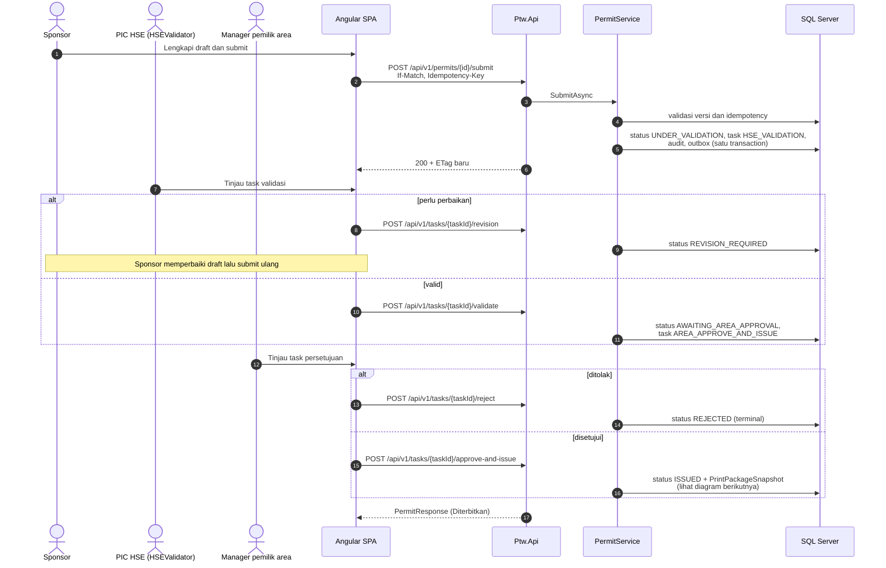
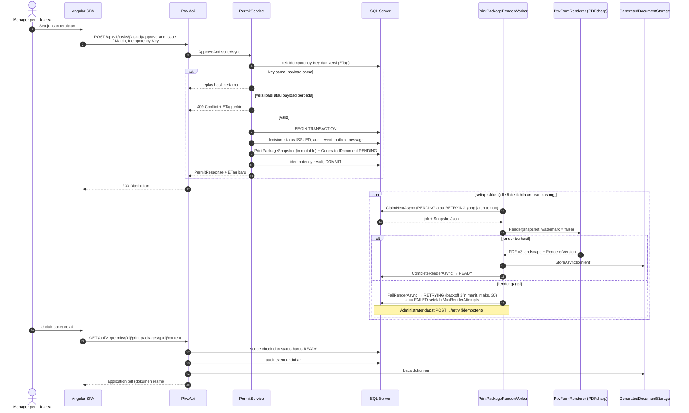

# NR PTW Online

NR PTW Online adalah modular monolith untuk pengelolaan Permit to Work (PTW) Nusantara Regas. Baseline implementasi saat ini mengacu pada BRD, PRD, dan FSD **v1.7**.

> [!IMPORTANT]
> Status **Diterbitkan** (`ISSUED`) belum otomatis mengizinkan pekerjaan dimulai. Gas test, toolbox/readiness, revalidasi harian/shift, completion, inspeksi/restorasi, handback, dan tanda tangan lapangan tetap dikendalikan pada hardcopy untuk MVP.

## Daftar isi

- [Ringkasan](#ringkasan)
- [Status implementasi](#status-implementasi)
- [Arsitektur](#arsitektur)
  - [Stack](#stack)
  - [Topologi runtime](#topologi-runtime)
  - [Lapisan kode dan arah dependency](#lapisan-kode-dan-arah-dependency)
  - [Struktur repository](#struktur-repository)
- [Lifecycle PTW](#lifecycle-ptw)
- [Sequence diagram](#sequence-diagram)
  - [Alur persetujuan v1.7](#alur-persetujuan-v17)
  - [Penerbitan, render paket cetak, dan unduhan](#penerbitan-render-paket-cetak-dan-unduhan)
- [Endpoint workflow v1.7](#endpoint-workflow-v17)
- [Menjalankan aplikasi](#menjalankan-aplikasi)
  - [Docker Compose](#docker-compose)
  - [Development lokal](#development-lokal)
- [Quality gate](#quality-gate)
- [Dokumentasi dan decision record](#dokumentasi-dan-decision-record)
- [Batas produksi](#batas-produksi)

## Ringkasan

MVP bersifat hybrid digital-ke-kertas. Sistem mengelola lifecycle PTW secara digital (draft, validasi HSE, persetujuan pemilik area, penerbitan, suspend/resume, renewal, closure) dan menerbitkan paket cetak resmi yang setia pada formulir terkontrol FM-001/002/003-B-002-NR-B220. Kegiatan lapangan tetap dikendalikan pada hardcopy.

Prinsip teknis utama:

- seluruh transition memakai command eksplisit dengan `If-Match` dan `Idempotency-Key`; tidak ada endpoint generik `setStatus`;
- aggregate, task/decision, audit event, outbox message, dan idempotency result commit atomik dalam satu transaction;
- authorization dan scope diberlakukan server-side; identitas actor berasal dari `/api/v1/me`;
- paket cetak dirender oleh Worker dari `PrintPackageSnapshot` yang immutable; hanya paket `READY` yang merupakan dokumen resmi.

## Status implementasi

Increment P0 lifecycle v1.7 telah tersedia:

- lifecycle aktif: `DRAFT`, `UNDER_VALIDATION`, `REVISION_REQUIRED`, `AWAITING_AREA_APPROVAL`, `ISSUED`, `SUSPENDED`, `CLOSURE_REQUESTED`, `CLOSED`, `REJECTED`, `CANCELLED`, `EXPIRED`;
- submit membuat tepat satu task `HSE_VALIDATION`; tidak ada validator Distribusi Gas;
- Sponsor yang juga PIC HSE tidak dapat memvalidasi PTW miliknya sendiri;
- satu task `AREA_APPROVE_AND_ISSUE` dan satu command atomik menyimpan decision, status `ISSUED`, audit, outbox, `PrintPackageSnapshot`, serta placeholder `GeneratedDocument` dalam satu `SaveChanges` transaction;
- release lokasi dikonfigurasi server-side; Development mengaktifkan ORF, Site-Office, dan Water-Based Activity, sedangkan lokasi lain ditolak fail-closed;
- suspend berlaku langsung, resolve kembali ke `ISSUED`, dan renewal membuat permit baru tanpa overlap;
- closure memakai task pemilik area dan memerlukan signed field copy yang `CLEAN`, bermetadata lengkap, tidak superseded, serta cocok dengan exact PermitVersion dan PrintPackage;
- lampiran privat mengenali signature PDF/JPEG/PNG, menyimpan SHA-256, kategori, metadata dokumen, target version, PrintPackage, replacement lineage, serta evidence malware scan; file selain `CLEAN` tidak dapat diunduh;
- form draft memuat tipe pengaju, work type, equipment/tag, plant/area, CLSR, SIMOPS, safety equipment, isolation/precaution, serta nomor/revisi/tanggal JSA; input hazards/controls bebas telah dihapus dari UI;
- paket cetak resmi dirender Worker dari `PrintPackageSnapshot` yang immutable dengan halaman resmi FM-001/002/003-B-002-NR-B220 sebagai template vektor A3 landscape; sistem mengisi Bagian 1-5 dan 7, sedangkan Bagian 6 dan Bagian 8-10 tetap kosong untuk diisi manual di lapangan;
- kegagalan render tidak membatalkan keputusan penerbitan: status paket menjadi `RETRYING` dengan exponential backoff, lalu `FAILED` setelah batas percobaan, dan Administrator dapat menjadwalkan render ulang secara idempotent;
- hanya paket berstatus `READY` yang dapat diunduh; setiap unduhan menghasilkan audit event, dan pratinjau draft selalu diberi watermark `DRAFT / TIDAK BERLAKU` serta tidak pernah disimpan.

Ruleset resmi, acting assignment v1.7 lengkap, malware scanner produksi, E-SIMI adapter, external contractor scoping, serta master LocationRelease/ConfigurationBundle masih fail-closed atau partial. Pilihan Bagian 1, 4, dan 5 dicetak dari snapshot, tetapi katalog checklist terkontrol masih perlu dipindahkan ke master data effective-dated. Detail dan traceability requirement → komponen → endpoint → migration → test ada di [status implementasi](docs/implementation-status.md).

## Arsitektur

### Stack

| Lapisan | Teknologi |
| --- | --- |
| Frontend | Angular 22, standalone components, Signals/RxJS, reactive forms |
| API | ASP.NET Core 10 / .NET 10, controller tipis, ProblemDetails |
| Persistence | EF Core 10, SQL Server 2025, transactional outbox |
| Background | .NET Worker (`OutboxWorker`, `PrintPackageRenderWorker`) |
| Cetak | PDFsharp, template terkontrol FM-001/002/003-B-002-NR-B220 |
| Runtime | Docker Compose, Nginx unprivileged |
| Test | xUnit, Testcontainers (MsSql), Vitest |

### Topologi runtime

Compose development menjalankan lima service dan tiga volume. Nginx melayani SPA dan menjadi reverse proxy ke API; `migrate` menjalankan EF Core migration satu kali sebelum `api` dan `worker` dimulai.



### Lapisan kode dan arah dependency

`Api` dan `Worker` bergantung pada `Application`; `Application` bergantung pada `Domain` dan `Contracts`; `Infrastructure` mengimplementasikan port yang didefinisikan `Application`. Tidak ada arah balik.



### Struktur repository

```text
src/Ptw.Domain          aggregate, state machine, invariant — tanpa EF/ASP.NET/IO
src/Ptw.Contracts       DTO netral — tanpa domain behavior
src/Ptw.Application     use case, authorization, ports (IPermitStore, IPrintPackage...)
src/Ptw.Infrastructure  EF Core, storage, audit, outbox, Printing/ (renderer + template)
src/Ptw.Api             mapping HTTP, DevelopmentAuthenticationHandler, ApiExceptionHandler
src/Ptw.Worker          OutboxWorker dan PrintPackageRenderWorker
src/web                 Angular: core/*-api.ts (HTTP) + features/* (komponen)
tests/Ptw.Domain.Tests           unit state machine
tests/Ptw.Api.IntegrationTests   end-to-end via PtwApiFactory + Testcontainers
tests/Ptw.Printing.Tests         regresi layout dokumen
deploy/compose                   compose.dev.yaml
deploy/nginx                     konfigurasi reverse proxy
docs/                            BRD/PRD/FSD v1.7, status implementasi
docs/decisions/                  OPN-001..009, PTW-RENEWAL — decision record yang disahkan
```

## Lifecycle PTW



- `CLOSED`, `REJECTED`, `CANCELLED`, dan `EXPIRED` bersifat terminal.
- Suspend menghentikan hak kerja seketika; resolve hanya kembali ke `ISSUED`.
- Renewal tidak memperpanjang permit lama; ia membuat aggregate dan nomor PTW baru tanpa overlap.
- Istilah UI untuk `ISSUED` adalah **Diterbitkan**.

## Sequence diagram

### Alur persetujuan v1.7

Setiap transition adalah command eksplisit yang membawa `If-Match` (versi aggregate) dan `Idempotency-Key`. Task command memakai `taskId`, bukan permit ID.



### Penerbitan, render paket cetak, dan unduhan

Keputusan penerbitan dan render dokumen dipisahkan: keputusan commit atomik di API, sedangkan render dilakukan asinkron oleh Worker. Kegagalan render tidak membatalkan penerbitan.



Pratinjau draft (`GET .../print-packages/preview`) merender langsung dari state saat ini dengan watermark `DRAFT / TIDAK BERLAKU` dan tidak pernah disimpan.

## Endpoint workflow v1.7

| Method | Endpoint | Command |
| --- | --- | --- |
| `POST` | `/api/v1/permits/{id}/submit` | `SubmitPermit` |
| `POST` | `/api/v1/tasks/{taskId}/validate` | `ValidateSubmission` |
| `POST` | `/api/v1/tasks/{taskId}/escalate` | eskalasi HSE dengan catatan |
| `POST` | `/api/v1/tasks/{taskId}/revision` | `RequestRevision` |
| `POST` | `/api/v1/tasks/{taskId}/reject` | `RejectPermit` |
| `POST` | `/api/v1/tasks/{taskId}/approve-and-issue` | `ApproveAndIssuePermit` |
| `POST` | `/api/v1/permits/{id}/suspensions` | `SuspendPermit` |
| `POST` | `/api/v1/permits/{id}/suspensions/resolve` | `ResolveSuspension` |
| `POST` | `/api/v1/permits/{id}/renew` | `CreateRenewal` |
| `POST` | `/api/v1/permits/{id}/closure-requests` | `RequestClosure` |
| `POST` | `/api/v1/closure-tasks/{taskId}/request-evidence` | `RequestClosureEvidenceReplacement` |
| `POST` | `/api/v1/closure-tasks/{taskId}/close` | `ClosePermit` |
| `POST` | `/api/v1/permits/{id}/cancel` | `CancelPermit` |
| `POST` | `/api/v1/permits/{id}/expire` | `ExpirePermit` |
| `GET` | `/api/v1/permits/{id}/print-packages` | daftar paket cetak dan status render |
| `GET` | `/api/v1/permits/{id}/print-packages/{pid}/content` | unduh dokumen resmi `READY` dengan audit |
| `GET` | `/api/v1/permits/{id}/print-packages/preview` | pratinjau draft ber-watermark, tidak disimpan |
| `POST` | `/api/v1/permits/{id}/print-packages/{pid}/retry` | render ulang oleh Administrator, idempotent |

Task command memakai `taskId`, bukan permit ID. Semua transition memerlukan `If-Match` dan `Idempotency-Key`. Tidak ada endpoint generik `setStatus`.

Endpoint baca/create draft, attachment, history, master lokasi, authorization, policy readiness/simulation/UAT, dan health tetap tersedia. OpenAPI hanya diekspos pada Development melalui `/openapi/v1.json`.

## Menjalankan aplikasi

### Docker Compose

```powershell
Copy-Item .env.example .env
docker compose --env-file .env -f deploy/compose/compose.dev.yaml up --build -d
```

Buka `http://localhost:8080`. Verifikasi stack dan health endpoint:

```powershell
docker compose --env-file .env -f deploy/compose/compose.dev.yaml ps
Invoke-WebRequest -UseBasicParsing http://localhost:8080/health/ready
```

Gunakan password development yang sama ketika me-rebuild stack dengan volume SQL yang sudah ada; mengganti environment variable tidak mengubah password yang tersimpan di volume. Menghentikan stack tanpa menghapus database:

```powershell
docker compose --env-file .env -f deploy/compose/compose.dev.yaml down
```

Jangan menambahkan `--volumes` kecuali memang bermaksud menghapus seluruh data development.

### Development lokal

Backend memerlukan SDK sesuai [global.json](global.json):

```powershell
dotnet tool restore
dotnet restore PtwOnline.sln
dotnet ef database update --project src/Ptw.Infrastructure/Ptw.Infrastructure.csproj --startup-project src/Ptw.Api/Ptw.Api.csproj
dotnet run --project src/Ptw.Api/Ptw.Api.csproj --urls http://localhost:5080
```

Frontend:

```powershell
Set-Location src/web
npm ci
npm start
```

Development identity hanya aktif pada environment `Development`. Profil yang relevan untuk flow v1.7 adalah Sponsor, PIC HSE (`HSEValidator`), dan Manager pemilik area (`AreaOwnerManager`). Identitas dan Sponsor aktif berasal dari `/api/v1/me`; header development diabaikan di luar Development.

Migration baru dibuat dengan mengubah model/mapping lalu menjalankan
`dotnet ef migrations add <Nama> --project src/Ptw.Infrastructure --startup-project src/Ptw.Api`.
Jangan mengedit file migration hasil generate secara manual.

## Quality gate

Backend:

```powershell
dotnet restore PtwOnline.sln
dotnet build PtwOnline.sln --configuration Release --no-restore
dotnet test PtwOnline.sln --configuration Release --no-build
dotnet format PtwOnline.sln --verify-no-changes --no-restore
dotnet list PtwOnline.sln package --vulnerable --include-transitive
```

Frontend:

```powershell
Set-Location src/web
npm ci
npx prettier --check "src/**/*.{ts,html,scss}"
npm run build
npm test -- --watch=false
npm audit --audit-level=high
```

Jika .NET 10 hanya tersedia melalui Docker, mount Docker socket dan set `TESTCONTAINERS_HOST_OVERRIDE=host.docker.internal` agar integration test dapat menjalankan SQL Server disposable.

## Dokumentasi dan decision record

| Dokumen | Isi |
| --- | --- |
| [BRD v1.7](docs/BRD-NR-PTW-Online-v1.7-ID.md) | kebutuhan bisnis |
| [PRD v1.7](docs/PRD-NR-PTW-Online-v1.7-ID.md) | kebutuhan produk |
| [FSD v1.7](docs/FSD-NR-PTW-Online-v1.7-ID.md) | spesifikasi fungsional |
| [Status implementasi](docs/implementation-status.md) | traceability requirement → komponen → endpoint → migration → test |
| [Decision records](docs/decisions/README.md) | OPN-001..009 dan PTW-RENEWAL yang disahkan |
| [CLAUDE.md](CLAUDE.md) / [AGENTS.md](AGENTS.md) | panduan kerja dan aturan normatif untuk kontributor dan agen |

Urutan rujukan ketika ambigu: permintaan pengguna, decision record yang disahkan, invariant dan kontrak yang sudah diuji, BRD/PRD/FSD v1.7, lalu asumsi teknis yang dinyatakan eksplisit. Kebijakan OPN yang belum disahkan tidak boleh dikarang; jalur tersebut fail-closed.

## Batas produksi

Konfigurasi produksi default fail-closed: master authorization wajib siap, issuance policy tidak approved, dan attachment memerlukan scanner. Jangan mengaktifkan issuance sampai exact ruleset, print template, campaign assets, owner mapping, authority, dan keputusan OPN terkait telah disahkan. Compose development bukan topologi HA produksi.
