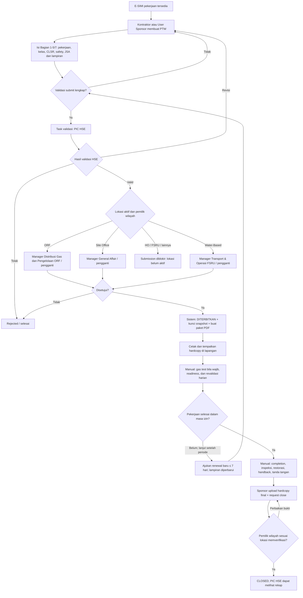

# Business Requirements Document (BRD)
## Nusantara Regas Permit to Work Online

| Atribut | Nilai |
| --- | --- |
| Produk | NR PTW Online |
| Versi | 1.7 — tiga lokasi aktif dan pembaruan pemilik wilayah |
| Tanggal | 16 September 2026 |
| Status | Draft terkontrol; memerlukan persetujuan Product Owner, Operasi, HSSE, dan TI |
| Pemilik bisnis yang diusulkan | Fungsi Operasi/HSSE Nusantara Regas |
| Dokumen terkait | [PRD v1.7](PRD-NR-PTW-Online-v1.7-ID.md), [FSD v1.7](FSD-NR-PTW-Online-v1.7-ID.md) |

## 1. Ringkasan eksekutif

NR PTW Online adalah sistem internal untuk mendigitalkan proses Izin Kerja (*Permit to Work/PTW*) Nusantara Regas tanpa mengurangi kontrol keselamatan yang saat ini terdapat pada formulir manual. Sistem melengkapi E-SIMI yang telah dimiliki NR: **E-SIMI mengendalikan izin masuk instalasi, sedangkan PTW mengendalikan izin melaksanakan pekerjaan tertentu pada lokasi, periode, dan kondisi lapangan tertentu.** Persetujuan salah satunya tidak menggantikan yang lain.

Ruang lingkup dibuat lebih sederhana daripada benchmark Pertamina Geothermal/JPO. Kontraktor atau User Sponsor dapat mengajukan PTW. Setiap submission wajib divalidasi oleh **satu validator, yaitu PIC HSE**. Setelah PIC HSE menyatakan valid pada versi yang sama, **Manager departemen pemilik wilayah**, atau **pejabat pengganti resmi yang masih berlaku**, memberi approval penerbitan. Sistem lalu menetapkan status **DITERBITKAN (`ISSUED`)** dan menghasilkan paket PTW siap cetak beserta bukti persetujuan elektronik. Departemen Distribusi Gas dan Pengelolaan ORF berperan sebagai pemilik wilayah ORF, bukan validator.

Rilis awal menggunakan model hibrida pada **tiga lokasi aktif: ORF, Site Office, dan Water-Based Activity**. Pemilik wilayah ditentukan otomatis dari lokasi: ORF dimiliki Departemen Distribusi Gas dan Pengelolaan ORF; Site Office dimiliki Departemen General Affair; dan Water-Based Activity dimiliki Departemen Transport & Operasi FSRU. Bagian pengajuan, validasi, approval penerbitan, pelacakan, perpanjangan, dan penutupan dikelola dalam aplikasi. Hardcopy resmi tetap ditempatkan di lapangan; gas test awal, validasi harian, pembukaan/penutupan harian, dan tanda tangan lapangan diisi manual pada lembar cetak. Pada akhir pekerjaan, Sponsor mengunggah hardcopy lengkap sebagai bukti, lalu pemilik wilayah memverifikasi penutupan. PIC HSE tidak menjadi approver penutupan, tetapi memperoleh visibilitas dan rekap.

Solusi dibangun sebagai aplikasi modular baru yang terintegrasi dengan E-SIMI melalui API/adapter. SQL Server menjadi *system of record* untuk data PTW; E-SIMI tetap menjadi *system of record* izin masuk. Tidak ada akses langsung ke tabel E-SIMI kecuali diputuskan melalui desain integrasi formal. Target teknologi dijelaskan pada PRD dan FSD: ASP.NET Core 10/.NET 10 LTS, Angular 22, SQL Server 2025, dan Docker Compose.

## 2. Tujuan dokumen dan otoritas sumber

BRD ini menyepakati kebutuhan dan aturan bisnis sebelum pembangunan. Jika sumber bertentangan, urutan otoritas yang diusulkan adalah:

1. SOP PTW NR yang berlaku dan revisi yang disahkan.
2. Keputusan tertulis Product Owner, Operasi, HSSE, dan TI.
3. Formulir PTW manual NR revisi 2021 beserta maksud kontrol keselamatannya.
4. Keputusan yang dikonfirmasi dari rapat progress 7 September 2026.
5. Keputusan yang dikonfirmasi dari rapat tindak lanjut 12 Agustus 2026.
6. BRD, PRD, dan pola operasional E-SIMI milik NR.
7. Benchmark PGE/JPO sebagai referensi, bukan kebijakan NR.

### 2.1 Sumber analisis

| Sumber | Pemanfaatan |
| --- | --- |
| Formulir manual FM-001-B-001/002/003-NR-B220 | Struktur izin, tiga kelas izin, sepuluh kelompok kontrol, masa berlaku maksimum tujuh hari |
| Rekaman rapat 12 Agustus 2026 | Arah ruang lingkup, sponsor internal, integrasi E-SIMI, otorisasi berbasis kompetensi, gas test kondisional, validasi harian |
| Gambar alur benchmark JHSEA/PGE | Referensi create/copy/extend, review, dan jalur persetujuan berbasis risiko |
| BRD, PRD, README E-SIMI | Konteks izin masuk, data organisasi, identitas, notifikasi, audit, dan kebutuhan integrasi |
| Klarifikasi flow dan lokasi, 1 September 2026 | Menggantikan batasan pengaju internal saja: Kontraktor/User Sponsor dapat mengajukan; approval dan penerbitan mengikuti pemilik area |
| Klarifikasi otoritas approval, 1 September 2026 | Approval pemilik area untuk menuju penerbitan wajib dilakukan Manager pemilik area atau pejabat pengganti dengan penugasan/delegasi resmi yang aktif |
| Rekaman rapat progress 7 September 2026 | Paritas isi template, penghapusan duplikasi bahaya/kontrol, paket cetak, operasi lapangan manual, bukti hardcopy saat close, penyederhanaan approver penutupan, renewal, dan pilot ORF |
| Klarifikasi validator, 8 September 2026 | Menetapkan validator tunggal PIC HSE; Distribusi Gas & Pengelolaan ORF tetap sebagai pemilik area ORF/Site Office, bukan validator |
| Klarifikasi lokasi aktif dan pemilik wilayah, 16 September 2026 | Menetapkan ORF, Site Office, dan Water-Based Activity sebagai lokasi aktif; memperbarui pemilik wilayah Site Office menjadi General Affair dan Water-Based Activity menjadi Transport & Operasi FSRU |
| Analisis rapat bertimestamp | `.analysis/meeting-2026-09-07/meeting-findings.txt`; memisahkan keputusan, usulan, pertanyaan terbuka, dan perilaku prototipe |

### 2.2 Keputusan flow sampai versi 1.6

| ID | Keputusan | Status |
| --- | --- | --- |
| DEC-101 | Pengajuan dapat dibuat oleh Kontraktor atau User Sponsor. | Dikonfirmasi |
| DEC-102 | Setiap submission divalidasi oleh tepat satu validator: PIC HSE. | Dikonfirmasi; menggantikan interpretasi dua validator |
| DEC-103 | Sistem membuat satu validation task aktif untuk PIC HSE pada setiap submission. | Dikonfirmasi v1.6 |
| DEC-104 | Approval baru dapat berjalan setelah validasi PIC HSE berstatus valid pada PermitVersion yang sama. | Dikonfirmasi v1.6 |
| DEC-105 | Approval dan penerbitan PTW mengikuti departemen pemilik area. | Dikonfirmasi |
| DEC-106 | HO dimiliki General Affair; ORF dan Site Office dimiliki Distribusi Gas & Pengelolaan ORF; FSRU dan Water-Based Activity dimiliki Transportasi & FSRU Operation. | Digantikan DEC-116 pada 16 Sep 2026 |
| DEC-107 | Istilah resmi setelah approval penerbitan adalah **PTW Diterbitkan** (`ISSUED`), bukan `OPEN`. Kesiapan mulai/lanjut kerja tetap dikendalikan terpisah melalui isian dan tanda tangan hardcopy. | Dikonfirmasi; diselaraskan v1.5 |
| DEC-108 | Approval pemilik area sebelum penerbitan wajib dilakukan oleh Manager departemen pemilik area atau pejabat pengganti yang ditunjuk secara resmi, memiliki scope yang sama, dan masih efektif pada saat keputusan. | Dikonfirmasi |
| DEC-109 | Isi kontrol pada tiga template PTW manual dipertahankan; tata letak digital/cetak boleh dioptimalkan. | Dikonfirmasi 7 Sep 2026 |
| DEC-110 | Bahaya dan pengendalian tidak diketik ulang pada form PTW; rincian tersebut bersumber dari JSA terlampir. | Dikonfirmasi 7 Sep 2026 |
| DEC-111 | Setelah approval penerbitan, sistem menghasilkan paket PTW siap cetak dengan bukti persetujuan dan lembar lapangan. | Dikonfirmasi 7 Sep 2026 |
| DEC-112 | Gas test, revalidasi harian, pembukaan/penutupan harian, dan tanda tangan lapangan tetap manual pada hardcopy untuk rilis awal. | Dikonfirmasi 7 Sep 2026 |
| DEC-113 | Close mewajibkan upload hardcopy lengkap; Sponsor mengajukan penutupan dan pemilik area memverifikasi. PIC HSE tidak meng-approve close, tetapi memperoleh rekap. | Dikonfirmasi 7 Sep 2026 |
| DEC-114 | Pilot/rilis awal difokuskan pada ORF; lokasi lain merupakan rollout berikut setelah aturan area/template dikonfirmasi. | Digantikan DEC-116 pada 16 Sep 2026 |
| DEC-115 | Perpanjangan dicatat sebagai PTW turunan maksimum tujuh hari, tidak overlap, memerlukan dokumen/attachment baru, dan menghasilkan paket cetak baru. | Dikonfirmasi 7 Sep 2026 |
| DEC-116 | Lokasi aktif rilis awal adalah ORF, Site Office, dan Water-Based Activity. ORF dimiliki Departemen Distribusi Gas dan Pengelolaan ORF; Site Office dimiliki Departemen General Affair; Water-Based Activity dimiliki Departemen Transport & Operasi FSRU. HO dan FSRU tidak aktif sampai configuration bundle dan sign-off masing-masing tersedia. | Dikonfirmasi 16 Sep 2026 |

## 3. Latar belakang dan masalah bisnis

Proses kertas saat ini memiliki kontrol keselamatan yang penting, tetapi menimbulkan kelemahan operasional:

- status izin, pihak yang harus bertindak, dan masa kedaluwarsa tidak terlihat secara real time;
- kewenangan penandatangan dan masa berlaku kompetensi tidak dapat diperiksa otomatis;
- data pekerjaan, JSA, isolasi, hasil gas test, validasi harian, dan handback tersebar;
- keterkaitan dengan E-SIMI dan dokumen pendukung sulit direkonsiliasi;
- perubahan kondisi atau penangguhan berisiko hanya tercatat pada lembar fisik;
- pelaporan dan audit membutuhkan kompilasi manual;
- persetujuan administratif berpotensi disalahartikan sebagai izin mulai bekerja.

## 4. Sasaran dan indikator keberhasilan

### 4.1 Sasaran bisnis

1. Menyediakan satu rekaman PTW digital yang dapat ditelusuri dari draft sampai penutupan.
2. Menjamin kontrol dan dokumen wajib mengikuti kelas izin, bahaya, risiko, lokasi, dan kondisi pekerjaan.
3. Memastikan hanya personel dengan peran, wilayah, kompetensi, dan otorisasi aktif yang dapat bertindak.
4. Memisahkan persetujuan rencana dari verifikasi kesiapan lapangan dan izin mulai kerja.
5. Memberikan visibilitas izin aktif, tertunda, kedaluwarsa, dan pekerjaan yang belum di-handback.
6. Mengurangi duplikasi melalui integrasi E-SIMI dan master data NR.

### 4.2 KPI yang diusulkan

| KPI | Definisi | Target awal; dikonfirmasi PO |
| --- | --- | --- |
| Kelengkapan saat submit | Persentase submission yang lolos validasi pertama | ≥ 90% setelah 3 bulan |
| Waktu keputusan | Median dari submit sampai keputusan final, di luar waktu revisi pemohon | ≤ 1 hari kerja |
| Kepatuhan otorisasi | Aksi terkontrol oleh personel dengan otorisasi aktif | 100% |
| Ketertiban penutupan | PTW selesai yang ditutup dengan inspeksi dan handback | ≥ 98% |
| Bukti revalidasi | Hardcopy final memuat validasi harian/shift yang diwajibkan dan terbaca | 100% sampel close |
| Keterlacakan audit | Transisi material dengan aktor, waktu, alasan, dan versi | 100% |
| Duplikasi data | PTW terkait E-SIMI yang mengambil data referensi otomatis | ≥ 95% |

## 5. Ruang lingkup

### 5.1 Dalam lingkup MVP

- cakupan operasional awal untuk ORF, Site Office, dan Water-Based Activity dengan pemilik wilayah sesuai matriks Bagian 6.1;
- autentikasi pengguna internal dan akun kontraktor terkelola, dengan otorisasi berbasis peran, perusahaan, lokasi, risiko, dan kompetensi;
- pembuatan dan pengajuan PTW oleh Kontraktor atau User Sponsor;
- input/tautan E-SIMI; pengisian otomatis melalui API diperlakukan sebagai backlog integrasi dengan fallback manual yang tervalidasi;
- Pekerjaan Panas, Pekerjaan Dingin, dan Memasuki Ruang Terbatas (CSE);
- data pekerjaan, pihak terlibat, lokasi, jadwal, kelas izin, elemen CLSR, APD/perlengkapan safety, isolasi, SIMOPS, dan dokumen pendukung yang mengikuti template PTW;
- JSA sebagai sumber rincian bahaya/pengendalian; SOP/prosedur, E-SIMI, sertifikat, drawing, dan bukti relevan sebagai lampiran terkontrol;
- matriks dokumen/checklist wajib menurut kelas dan jenis pekerjaan, dengan kemampuan menambah item khusus tanpa menghapus kontrol standar;
- validasi wajib oleh PIC HSE, termasuk revisi/penolakan;
- approval penerbitan oleh Manager pemilik area atau pengganti resminya; approval yang berhasil menerbitkan PTW dan mengunci snapshot dokumen;
- generator paket PDF/cetak yang mempertahankan isi template, menampilkan bukti persetujuan elektronik, menyediakan lembar manual gas test/revalidasi/penutupan, serta lampiran kampanye keselamatan terkontrol;
- penggunaan hardcopy di lapangan untuk gas test, validasi harian, pembukaan/penutupan harian, tanda tangan pelaksana, penyelesaian, inspeksi, restorasi, dan handback;
- pengajuan close oleh Sponsor dengan upload hardcopy final wajib dan verifikasi pemilik area; PIC HSE memperoleh akses rekap tanpa task approval close;
- copy dan renewal dengan nomor baru serta lineage; keputusan dan hasil pengujian tidak ikut disalin;
- notifikasi, task queue, dashboard, pencarian, ekspor, cetak, dan audit trail;
- master lokasi, jenis pekerjaan, matriks dokumen, checklist, elemen CLSR, template cetak/kampanye, otorisasi, dan template notifikasi;
- API integrasi E-SIMI dan deployment dengan Docker Compose.

### 5.2 Di luar lingkup MVP

- akses anonim atau registrasi mandiri publik; akses Kontraktor harus melalui onboarding, verifikasi perusahaan, dan akun terkelola;
- authoring/approval elektronik JSA, SOP, MOC, lifting plan, atau LOTO sebagai subproses tersendiri;
- pengisian gas test, validasi harian, work period, dan tanda tangan pelaksana secara online pada rilis awal;
- integrasi otomatis alat gas detector, badge/gate, CCTV, atau sensor;
- aplikasi mobile native dan operasi offline penuh;
- penggantian atau migrasi aplikasi E-SIMI;
- aktivasi operasional HO dan FSRU pada rilis awal; desain tetap menyiapkan rollout kedua lokasi tersebut setelah governance, template, dan otoritasnya disahkan;
- tanda tangan digital tersertifikasi PSrE, kecuali disetujui sebagai fase lanjutan.

### 5.3 Pemetaan sepuluh bagian formulir manual

| Bagian formulir | Perlakuan digital target |
| --- | --- |
| 1. Jenis Pekerjaan | Checklist spesifik izin; Hot Work membedakan api terbuka/percikan bila SOP mensyaratkan, Cold Work mendukung klasifikasi risiko, dan CSE diperlakukan high risk sampai ada kebijakan lain |
| 2. Penjelasan Pekerjaan | Tanggal permohonan/rencana, equipment/tag, plant/area, uraian, dan drawing/reference. Tidak ada kolom bebas bahaya/pengendalian yang menduplikasi JSA. |
| 3. Permintaan Izin Kerja | Sponsor dan pelaksana, perusahaan, pernyataan/acknowledgement, serta snapshot identitas. Sponsor dapat mewakili crew pada sistem; nama/tanda tangan pelaksana tetap di hardcopy. |
| 4. Dokumen Pendukung | Checklist requirement dan register lampiran privat, minimal JSA serta dokumen lain sesuai pekerjaan; requirement final dikonfigurasi dari template/STK dan dapat ditambah tanpa menghapus item standar. |
| 5. Perlengkapan Safety Tambahan/Khusus | APD/kontrol khusus seperti respirator, scaffold, harness/lifeline, APAR, gas monitor, BA, watchman, ventilasi, LOTO, barricade, radio, life jacket, fire blanket, drip pan, dan tambahan HSSE |
| 6. Gas Tes Awal | Sistem mencetak lembar kosong sesuai template; Gas Tester mengisi dan menandatangani secara manual di lapangan bila diwajibkan. Hasil lengkap terlihat kembali setelah hardcopy diunggah saat close. |
| 7. Izin dari Bagian Operasi | Dipenuhi melalui validasi dan approval penerbitan pemilik area; paket cetak menampilkan identitas, peran, waktu, dan bukti keputusan elektronik. |
| 8. Revalidasi Izin Kerja | Lembar cetak terpisah yang cukup besar untuk pengisian manual harian/shift hingga tujuh hari; tidak ada kewajiban membuka aplikasi setiap hari pada MVP. |
| 9. Pekerjaan Selesai | Diisi dan ditandatangani manual oleh pelaksana/Sponsor pada hardcopy, kemudian diunggah sebagai bukti close. |
| 10. Inspeksi dan Pengembalian ke Operasi | Diisi/ditandatangani manual oleh pemilik area pada hardcopy; pemilik area lalu memverifikasi close di sistem. |

Checklist digital mempertahankan maksud keselamatan formulir, tetapi nama, urutan, dan mandatory flag final mengikuti SOP/STK yang disahkan. Paket cetak boleh memecah format A3 lama menjadi beberapa halaman A4 agar kolom tulisan dan tanda tangan terbaca, tanpa menghilangkan isi. Lampiran kampanye keselamatan memuat materi resmi 10 CLSR, 8 Arahan Direksi, dan 9 Perilaku Wajib dari template terkontrol. Lampiran bukan pengganti approval dokumen asal maupun verifikasi lapangan.

## 6. Pemangku kepentingan dan peran

| Peran | Tanggung jawab utama | Aksi terkontrol |
| --- | --- | --- |
| Product Owner | Menetapkan prioritas, aturan, KPI, dan acceptance | Menyetujui baseline produk |
| Kontraktor/Pengaju Eksternal | Menyusun PTW untuk pekerjaan perusahaannya melalui akun terkelola | Draft, submit, perbaikan, renewal, dan menyiapkan bukti lapangan sesuai scope akun |
| User Sponsor | Pengaju internal NR dan/atau sponsor pekerjaan kontraktor; accountable atas representasi crew pada sistem | Draft, submit, perbaikan, renewal, upload hardcopy final, dan request close |
| Pelaksana/Performing Authority | Menjelaskan metode kerja, menjalankan kontrol, dan melakukan validasi/tanda tangan lapangan | Tidak wajib mempunyai akun pada MVP; acknowledgement/tanda tangan melalui hardcopy |
| PIC HSE | Validator tunggal yang memvalidasi bahaya, risiko, kontrol, JSA, kelengkapan pengajuan, dan kebutuhan gas test | Validate, request revision, reject, escalate |
| Departemen Distribusi Gas dan Pengelolaan ORF | Pemilik wilayah ORF | Menyediakan Manager/pengganti resmi sebagai approver penerbitan dan pemilik proses wilayah; bukan validator |
| Departemen General Affair | Pemilik wilayah Site Office | Menyediakan Manager/pengganti resmi sebagai approver penerbitan dan verifier close Site Office; bukan validator |
| Departemen Transport & Operasi FSRU | Pemilik wilayah Water-Based Activity | Menyediakan Manager/pengganti resmi sebagai approver penerbitan dan verifier close Water-Based Activity; bukan validator |
| Area Approver/Owner | Manager departemen pemilik wilayah, atau pejabat pengganti resmi | Approval penerbitan; sistem menerbitkan PTW dan membuat paket cetak. Pada close, pemilik wilayah memverifikasi bukti hardcopy dan menutup PTW. |
| Petugas Lapangan Pemilik Wilayah | Menjaga kontrol wilayah dan mengisi bagian operasional pada hardcopy | Gas test/readiness/revalidasi/inspeksi/tanda tangan manual sesuai kewenangan SOP |
| Gas Tester | Melakukan pengujian atmosfer bila diwajibkan | Record/sign gas test secara manual pada lembar PTW |
| Isolating Authority | Menyiapkan/verifikasi isolasi | Catatan dan tanda tangan manual pada hardcopy sesuai template |
| Site/Shift Supervisor | Revalidasi kondisi harian/shift | Tanda tangan pembukaan/penutupan periode pada hardcopy |
| Administrator | Mengelola konfigurasi terkontrol | Master data/ruleset; tidak boleh self-approve |
| Auditor/Read-only | Memeriksa bukti dan riwayat | Read/export sesuai cakupan |

Untuk approval pemilik wilayah, level Manager merupakan syarat bisnis. Namun jabatan saja tidak cukup: aktor tetap harus memiliki assignment aktif, scope departemen/lokasi yang sesuai, dan memenuhi pemisahan tugas. Pejabat pengganti hanya dapat bertindak bila penugasan/delegasinya tercatat resmi, efektif, dan dapat diaudit.

### 6.1 Matriks pemilik area

| Kode lokasi | Lokasi | Departemen pemilik area | Tanggung jawab pada flow |
| --- | --- | --- | --- |
| `HO` | Head Office (HO) | Departemen General Affair | **Tidak aktif**; target rollout setelah sublokasi, template, dan posisi berwenang disahkan |
| `ORF` | ORF | Departemen Distribusi Gas dan Pengelolaan ORF | **Aktif**; menyediakan Manager Area Approver dan verifier close ORF |
| `SITE_OFFICE` | Site Office | Departemen General Affair | **Aktif**; menyediakan Manager Area Approver dan verifier close Site Office |
| `FSRU` | FSRU | Departemen Transport & Operasi FSRU | **Tidak aktif**; target rollout setelah template dan posisi berwenang disahkan |
| `WATER_BASED` | Water-Based Activity | Departemen Transport & Operasi FSRU | **Aktif**; menyediakan Manager Area Approver dan verifier close Water-Based Activity |

Pemilik wilayah ditentukan dari lokasi utama PTW. ORF, Site Office, dan Water-Based Activity diaktifkan pada rilis awal melalui `LocationRelease` dan configuration bundle terpisah. HO dan FSRU tetap `DISABLED` sampai sign-off pemilik wilayah, wording, checklist, dan template cetak tersedia. Pekerjaan lintas wilayah harus dipecah menjadi PTW terpisah atau mengikuti aturan multi-area yang kelak disahkan; sistem tidak boleh memilih satu pemilik wilayah secara diam-diam.

## 7. Alur bisnis target

### 7.1 Makna status utama

| Status | Makna bisnis | Pekerjaan boleh berjalan? |
| --- | --- | --- |
| DRAFT | Sedang disusun | Tidak |
| REVISION_REQUIRED | Harus diperbaiki | Tidak |
| UNDER_VALIDATION | Validasi PIC HSE berjalan | Tidak |
| AWAITING_AREA_APPROVAL | Validasi PIC HSE lengkap; menunggu approval pemilik area | Tidak |
| ISSUED | Approval penerbitan selesai, snapshot terkunci, dan paket cetak resmi tersedia | Hanya setelah seluruh isian/tanda tangan lapangan yang diwajibkan pada hardcopy dinyatakan valid |
| SUSPENDED | Izin berhenti sementara | Tidak |
| CLOSURE_REQUESTED | Sponsor telah mengunggah hardcopy final dan meminta penutupan; menunggu verifikasi pemilik area | Tidak |
| CLOSED | Inspeksi/restorasi/handback selesai | Tidak; terminal |
| REJECTED/CANCELLED/EXPIRED | Terminal atau perlu proses baru sesuai kebijakan | Tidak |

## 8. Kebutuhan bisnis

Prioritas: **M** Must, **S** Should, **C** Could.

### 8.1 Identitas, kewenangan, dan pemisahan tugas

| ID | Kebutuhan | P |
| --- | --- | --- |
| BR-AUT-001 | Sistem hanya dapat digunakan oleh identitas internal/terfederasi yang terverifikasi. | M |
| BR-AUT-002 | Setiap aksi terkontrol memvalidasi peran, cakupan lokasi, kelas izin, risiko, kompetensi, masa otorisasi, dan status PTW. | M |
| BR-AUT-003 | Pengguna tidak boleh menyetujui PTW yang dibuatnya sendiri apabila matriks SoD melarang. | M |
| BR-AUT-004 | Delegasi harus memiliki pemberi, penerima, ruang lingkup, tanggal mulai/akhir, dan alasan. | M |
| BR-AUT-005 | Pencabutan/berakhirnya otorisasi langsung memblokir aksi baru tanpa menghapus bukti lama. | M |
| BR-AUT-006 | Kontraktor hanya dapat mengakses PTW milik perusahaan/assignment-nya melalui akun terverifikasi; tidak ada anonymous atau self-registration. | M |
| BR-AUT-007 | Akun Kontraktor harus memiliki sponsor/penanggung jawab NR, perusahaan, masa aktif, dan proses revoke. | M |
| BR-AUT-008 | Penugasan pejabat pengganti Manager harus merekam Manager yang digantikan, penerima penugasan, dasar/nomor dokumen, departemen dan lokasi, tanggal mulai/akhir, alasan, status, serta pihak yang mengesahkan. | M |
| BR-AUT-009 | Task approval tidak dapat dialihkan secara ad hoc; hanya assignment Manager atau penugasan pengganti resmi yang efektif pada waktu keputusan yang dapat digunakan. | M |

### 8.2 E-SIMI dan inisiasi

| ID | Kebutuhan | P |
| --- | --- | --- |
| BR-INT-001 | PTW harus dapat ditautkan ke E-SIMI berjenis pekerjaan dan menampilkan nomor/status E-SIMI; pilot menyediakan entry tervalidasi dan desain adapter. | M |
| BR-INT-002 | Bila API E-SIMI tersedia, data orang, perusahaan, lokasi, tujuan, jadwal, dan nomor E-SIMI diambil otomatis; pengguna tidak mengetik ulang data yang tersedia. | S |
| BR-INT-003 | Kegagalan integrasi tidak boleh menghasilkan tautan semu; pengguna mendapat status dan langkah pemulihan yang jelas. | M |
| BR-INT-004 | Izin masuk yang dicabut/berakhir harus terlihat pada PTW aktif dan memicu penilaian operasional. | M |
| BR-INI-001 | Kontraktor atau User Sponsor dapat membuat draft baru, copy draft historis yang dapat diakses, atau renewal dengan lineage. | M |
| BR-INI-002 | Copy/renewal tidak menyalin approval, acknowledgement, gas test, work period, atau tanda kesiapan lama. | M |
| BR-INI-003 | Sistem menyimpan jenis pengaju (`CONTRACTOR` atau `USER_SPONSOR`) serta identitas perusahaan/sponsor yang accountable. | M |
| BR-INI-004 | Bila pegawai HSE menjadi Sponsor pekerjaan, validation task HSE tetap harus diputuskan oleh validator HSE lain yang berwenang dan memenuhi SoD. | M |

### 8.3 Klasifikasi, risiko, dan dokumen

| ID | Kebutuhan | P |
| --- | --- | --- |
| BR-CLS-001 | Sistem mendukung Hot Work, Cold Work, dan CSE sebagai kelas izin terkendali. | M |
| BR-CLS-002 | Kombinasi pekerjaan yang memerlukan lebih dari satu izin harus dapat saling ditautkan. | S |
| BR-RSK-001 | Sistem merekam klasifikasi PTW, elemen CLSR, SIMOPS, dan indikator risiko yang memang terdapat pada template/STK; rincian bahaya dan pengendalian tidak diduplikasi dari JSA. | M |
| BR-RSK-002 | PIC HSE memvalidasi bahwa JSA, klasifikasi, elemen CLSR, perlengkapan safety, dan dokumen telah konsisten. | M |
| BR-DOC-001 | Dokumen wajib dikendalikan berdasarkan matriks requirement aktif dan terversi; production tidak menggunakan daftar lampiran bebas sebagai satu-satunya kontrol. | M |
| BR-DOC-002 | Lampiran harus dapat ditelusuri ke pengunggah, waktu, kategori, versi, dan hash integritas. | M |
| BR-DOC-003 | JSA wajib menjadi referensi bahaya/pengendalian; setiap submit/renewal menyimpan nomor/revisi/tanggal JSA atau metadata ekuivalen serta file yang berlaku. | M |
| BR-DOC-004 | Pengguna dapat menambah dokumen/checklist khusus pekerjaan dengan uraian dan alasan, tetapi tidak dapat menghapus requirement standar. | M |
| BR-DOC-005 | Lampiran renewal tidak disalin otomatis; pengaju harus menyediakan ulang file yang masih valid agar setiap izin memiliki evidence mandiri. | M |

### 8.4 Review dan keputusan

| ID | Kebutuhan | P |
| --- | --- | --- |
| BR-RVW-001 | Setiap submission wajib memperoleh validasi PIC HSE sebelum masuk approval pemilik area. | M |
| BR-RVW-002 | Satu validation task dibuat untuk PIC HSE. PIC HSE dapat memvalidasi, meminta revisi, menolak, atau eskalasi dengan catatan wajib. | M |
| BR-RVW-003 | Revisi material setelah validasi membatalkan validasi terdampak dan mengulang gate yang relevan. | M |
| BR-RVW-004 | Approval task hanya dibuat setelah validasi PIC HSE berstatus valid pada versi PTW yang sama. | M |
| BR-APR-001 | Approval penerbitan dilakukan oleh Manager departemen pemilik area atau pejabat pengganti resmi yang masih efektif, dengan scope lokasi/departemen yang sesuai. | M |
| BR-APR-002 | Bukti keputusan menyimpan aktor aktual, kapasitas sebagai Manager/pengganti, Manager yang digantikan bila berlaku, ID penugasan/otorisasi, timestamp, versi data, dan pernyataan yang disetujui. | M |
| BR-APR-003 | Approval yang berhasil mengunci PermitVersion dan secara atomik menetapkan status `ISSUED`; pekerjaan belum boleh dimulai sampai prasyarat/tanda tangan lapangan pada hardcopy dipenuhi. | M |
| BR-APR-004 | Routing lokasi aktif wajib mengikuti matriks Bagian 6.1: ORF ke Departemen Distribusi Gas dan Pengelolaan ORF; Site Office ke Departemen General Affair; Water-Based Activity ke Departemen Transport & Operasi FSRU. | M |
| BR-APR-005 | Bila Manager berhalangan, sistem hanya merutekan approval kepada pengganti yang penugasannya telah disahkan, belum kedaluwarsa, tidak dicabut, dan mencakup departemen/lokasi serta risiko PTW tersebut. | M |
| BR-APR-006 | Berakhir atau dicabutnya penugasan pengganti sebelum keputusan memblokir approval dan merutekan ulang task tanpa menghapus riwayat. | M |
| BR-APR-007 | Paket cetak menampilkan bukti elektronik aktor, jabatan/peran, kapasitas pengganti bila ada, keputusan, dan waktu; bentuk ini bukan tanda tangan digital tersertifikasi kecuali kelak disahkan. | M |

### 8.5 Kesiapan lapangan dan pengujian gas

| ID | Kebutuhan | P |
| --- | --- | --- |
| BR-FLD-001 | Sistem menghasilkan lembar lapangan untuk verifikasi lokasi, toolbox, personel, APD, isolasi, SIMOPS, dan kontrol yang berlaku; petugas mengisinya manual sebelum pekerjaan dimulai. | M |
| BR-GAS-001 | Paket cetak menyertakan bagian gas test bila diwajibkan template/kelas izin; gas test diisi dan ditandatangani manual oleh petugas kompeten. | M |
| BR-GAS-002 | Parameter, unit, identitas alat/tester, titik, waktu, hasil, dan acceptance mengikuti template/SOP yang berlaku; sistem tidak menghitung verdict pada MVP. | M |
| BR-GAS-003 | Hardcopy yang berisi gas test menjadi bagian bukti final yang wajib diunggah saat penutupan. | M |
| BR-ISS-001 | Setelah validasi PIC HSE lulus, Manager pemilik area/pengganti resmi dapat menyetujui penerbitan; sistem menerbitkan PTW dan membuat paket cetak secara atomik. | M |
| BR-ISS-002 | Sistem memverifikasi lokasi, pemilik area, scope otorisasi approver, kelengkapan dokumen, dan PermitVersion sebelum penerbitan. | M |
| BR-ISS-003 | `ISSUED` berarti dokumen izin resmi telah diterbitkan, bukan bahwa seluruh prasyarat lapangan otomatis terpenuhi; hak mulai kerja tetap bergantung pada isian/tanda tangan hardcopy dan kondisi aktual. | M |

### 8.6 Masa berlaku, periode kerja, suspend, dan penutupan

| ID | Kebutuhan | P |
| --- | --- | --- |
| BR-LIF-001 | Masa berlaku setiap PTW maksimum tujuh hari; basis hari kalender/hari kerja mengikuti keputusan SOP yang harus dikonfirmasi sebelum go-live. | M |
| BR-LIF-002 | Pekerjaan melewati batas membutuhkan PTW baru dengan lineage dan approval baru. | M |
| BR-WPR-001 | Setiap shift/hari kerja wajib direvalidasi pada hardcopy sebelum dimulai; lembar menyediakan ruang hingga batas masa berlaku. | M |
| BR-WPR-002 | Digitalisasi work period harian bukan lingkup MVP; sistem tetap menampilkan masa berlaku dan status izin, sedangkan bukti periodik diperoleh dari scan final. | M |
| BR-SUS-001 | Kondisi tidak aman, perubahan pekerjaan/lokasi/personel kunci, alarm, isolasi berubah, E-SIMI tidak valid, atau hasil gas tidak valid dapat memicu suspend. | M |
| BR-SUS-002 | Resume memerlukan alasan penangguhan diselesaikan dan prasyarat diverifikasi ulang. | M |
| BR-CLO-001 | Sponsor mengajukan close hanya setelah completion, pemeriksaan lokasi, restorasi/isolasi, handback, dan tanda tangan manual selesai; upload hardcopy final yang terbaca adalah wajib. | M |
| BR-CLO-002 | Closed bersifat terminal; koreksi administratif dilakukan sebagai addendum audit, bukan mengubah sejarah. | M |
| BR-CLO-003 | Pemilik area memverifikasi bukti, dapat meminta upload ulang, lalu menetapkan `CLOSED`; PIC HSE tidak memiliki task approval close tetapi dapat mengakses rekap. | M |
| BR-CLO-004 | Sistem menyimpan hash, versi, pengunggah, waktu upload, dan keputusan verifier terhadap hardcopy final. | M |

### 8.7 Visibilitas, notifikasi, audit, dan administrasi

| ID | Kebutuhan | P |
| --- | --- | --- |
| BR-DSH-001 | Dashboard menunjukkan draft, waiting validation, awaiting area approval, issued, expiring, expired, renewal, closure requested, dan closed. | M |
| BR-TSK-001 | Setiap aktor mempunyai antrean tugas sesuai otoritas dan SLA. | M |
| BR-NOT-001 | Notifikasi dikirim pada submission, revision, rejection, approval, readiness, expiry, suspend, resume, completion, dan close. | M |
| BR-NOT-002 | Kegagalan notifikasi tidak mengubah keputusan bisnis dan harus dapat diulang serta dipantau. | M |
| BR-AUD-001 | Semua perubahan material, keputusan, unduhan sensitif, konfigurasi, dan integrasi dicatat secara append-only. | M |
| BR-ADM-001 | Ruleset/master data menggunakan maker-checker, effective dating, dan tidak mengubah interpretasi PTW historis. | M |
| BR-REP-001 | Pengguna berwenang dapat mencari, memfilter, mencetak, dan mengekspor data sesuai ruang lingkup. | M |
| BR-PRN-001 | Sistem membuat PDF terkunci dan terversi yang memuat isian Bagian 1-7 yang relevan, bukti persetujuan, lembar manual Bagian 6/8-10, QR/reference, serta materi kampanye keselamatan terkontrol. | M |

## 9. Aturan bisnis inti

| ID | Aturan |
| --- | --- |
| RB-001 | PTW tidak valid tanpa pengaju, Sponsor accountable, pekerjaan, lokasi, pelaksana, jadwal, kelas izin, JSA yang berlaku, elemen/checklist wajib, dan dokumen wajib. |
| RB-002 | Waktu mulai harus lebih kecil dari waktu selesai; durasi izin maksimum tujuh hari. |
| RB-003 | E-SIMI yang terkait harus mencakup orang/lokasi/periode yang relevan sebelum PTW diterbitkan. |
| RB-004 | Keputusan approval penerbitan dan transisi `ISSUED` direkam sebagai dua event audit dalam satu transaksi bisnis agar tidak terbentuk izin tanpa keputusan atau keputusan tanpa dokumen resmi. |
| RB-005 | Perubahan material setelah approval mengembalikan PTW ke jalur review yang ditentukan ruleset. |
| RB-006 | Hanya satu versi PTW yang menjadi versi kerja aktif; versi sebelumnya tetap immutable untuk audit. |
| RB-007 | Gas test dan revalidasi lapangan pada MVP dicatat manual pada hardcopy; kewajiban, frekuensi, dan batas hasil mengikuti SOP/template. |
| RB-008 | Suspend/cancel menghentikan hak kerja segera; pencatatan sistem dilakukan oleh aktor berwenang tanpa menghapus hardcopy atau masa berlaku PTW. |
| RB-009 | Copy hanya menyalin data persiapan yang aman; renewal tidak menyalin attachment, approval, bukti elektronik, atau isian lapangan. |
| RB-010 | Semua waktu disimpan sebagai UTC dan ditampilkan dengan zona Asia/Jakarta disertai tanggal/jam. |
| RB-011 | Validasi PIC HSE harus mengacu pada current PermitVersion; perubahan material membatalkan validasi sebelumnya. |
| RB-012 | AreaOwnerDepartment diturunkan dari Location master dan tidak dapat dipilih bebas oleh pengaju. |
| RB-013 | Approval penerbitan dilakukan oleh Manager pemilik area atau pengganti resminya; sistem menerbitkan PDF resmi dari snapshot yang disetujui. |
| RB-014 | `ISSUED` menyatakan dokumen izin telah diterbitkan; hak bekerja ditentukan oleh masa berlaku, gas test/revalidasi/tanda tangan hardcopy yang diwajibkan, dan kondisi aktual. |
| RB-015 | Kolom bahaya/pengendalian bebas yang menduplikasi JSA tidak menjadi bagian form digital; perubahan JSA setelah submit merupakan perubahan material dan memicu validasi ulang. |
| RB-016 | Hanya hardcopy final dari PermitVersion/paket cetak yang sama yang dapat menjadi evidence close; QR/reference dan hash upload digunakan untuk rekonsiliasi. |
| RB-017 | Close hanya dapat disahkan pemilik area setelah Sponsor mengunggah hardcopy lengkap; PIC HSE menerima visibilitas/rekap tanpa task approval close. |
| RB-018 | Rilis awal hanya menerima `ORF`, `SITE_OFFICE`, dan `WATER_BASED`; `HO`, `FSRU`, atau lokasi lain gagal aman sampai feature flag, configuration bundle, dan sign-off pemilik wilayah telah disahkan. |

## 10. Informasi, laporan, dan retensi

### 10.1 Objek informasi utama

PTW, versi PTW, hubungan E-SIMI, pihak/Sponsor/crew, lokasi, kelas/jenis kerja, elemen CLSR, SIMOPS, APD/perlengkapan safety, JSA dan lampiran, requirement checklist, review, keputusan, paket cetak, hardcopy final, closure verification, suspension/cancellation, renewal lineage, otorisasi pengguna, template/ruleset, notifikasi, dan audit event. Gas test, revalidasi harian, completion, serta handback pada MVP berada di hardcopy yang diunggah, bukan data terstruktur harian.

### 10.2 Laporan minimum

- PTW berdasarkan status, kelas, risiko, lokasi, kontraktor, sponsor, dan periode;
- PTW issued/suspended/akan berakhir/expired, renewal, closure requested, dan keterlambatan upload/close;
- SLA review dan approval;
- frekuensi revision/rejection beserta sebab;
- gas test di luar batas dan kejadian suspend;
- izin ditutup terlambat, renewal, dan pekerjaan melebihi rencana;
- penggunaan otorisasi/delegasi dan jejak perubahan konfigurasi.

Retensi PTW, lampiran, audit, dan bukti elektronik harus ditetapkan Records Management/Legal. Sampai kebijakan disahkan, data tidak boleh dihapus permanen oleh pengguna aplikasi.

## 11. Kebutuhan nonfungsional bisnis

| Area | Kebutuhan |
| --- | --- |
| Ketersediaan | Target awal 99,5% pada jam operasional yang disepakati; jadwal pemeliharaan diumumkan. |
| Respons | 95% operasi layar biasa ≤ 3 detik dan pencarian ≤ 5 detik pada beban rencana. |
| Keamanan | Least privilege, MFA/IdP korporat bila tersedia, TLS, enkripsi storage/backup, kontrol lampiran, dan audit. |
| Keandalan | Perintah idempotent; kegagalan integrasi/notifikasi tidak merusak state PTW. |
| Pemulihan | Target awal RPO 15 menit dan RTO 4 jam; harus divalidasi TI. |
| Aksesibilitas | Target WCAG 2.2 AA untuk fungsi utama dan dapat digunakan keyboard. |
| Perangkat | Responsive untuk desktop/tablet dan perangkat lapangan yang disetujui; offline penuh bukan MVP. |
| Auditabilitas | Rekonstruksi siapa melakukan apa, kapan, atas versi mana, dari sumber mana, dan dengan alasan apa. |

## 12. Ketergantungan, asumsi, dan risiko

| Jenis | Pernyataan / mitigasi |
| --- | --- |
| Ketergantungan | API atau adapter E-SIMI, IdP/LDAP NR, SMTP/notification gateway, master lokasi dan personel, infrastruktur container, backup, dan monitoring. |
| Asumsi | Kontraktor/User Sponsor memiliki konektivitas dan akun yang dapat diverifikasi; personel berwenang dan kompetensinya dapat dimasterkan; SOP menerima bukti elektronik. |
| Risiko | Matriks approval belum final → workshop HSSE/Operasi sebelum konfigurasi. |
| Risiko | Konektivitas lapangan → desain responsive, autosave draft, prosedur kontingensi dan rekonsiliasi. |
| Risiko | Pengguna menganggap ISSUED = boleh langsung mulai → banner, instruksi cetak, training, dan pernyataan bahwa gas test/revalidasi/tanda tangan lapangan tetap wajib. |
| Risiko | Integrasi erat ke database legacy → gunakan API/anti-corruption layer dan kontrak terversi. |
| Risiko | Konfigurasi aturan salah → maker-checker, simulasi ruleset, versioning, dan regression test. |
| Risiko | Docker Compose menjadi single-host SPOF → backup/restore, capacity plan; HA multi-host menjadi keputusan deployment terpisah. |
| Risiko | Hardcopy final tidak terbaca/tidak lengkap → panduan scan/foto, quality gate, preview, dan hak pemilik area meminta upload ulang. |
| Risiko | Bukti persetujuan visual disalahartikan sebagai tanda tangan digital tersertifikasi → label yang tepat, immutable audit trail, dan keputusan Legal sebelum klaim hukum. |
| Risiko | Tiga lokasi aktif memiliki template atau otoritas yang belum seragam → feature flag dan configuration bundle per lokasi; suatu lokasi hanya menerima submission setelah konfigurasi dan sign-off lokasi tersebut tersedia. |

## 13. Keputusan yang masih terbuka

| ID | Keputusan yang dibutuhkan | Pemilik |
| --- | --- | --- |
| OPN-001 | Struktur sublokasi/equipment untuk ORF, Site Office, dan Water-Based Activity; detail HO dan FSRU sebelum rollout berikutnya | Operasi/General Affair/Transport & Operasi FSRU |
| OPN-002 | Nama posisi Manager dan verifier close untuk masing-masing pemilik wilayah aktif, format/dasar penugasan pengganti, pihak pengesah, batas risiko, dan aturan SoD | HSSE/Operasi/General Affair/Transport & Operasi FSRU/HC |
| OPN-003 | Baseline checklist per kelas izin, item yang wajib, dan final mapping sepuluh bagian formulir | HSSE/Operasi |
| OPN-004 | Aturan gas test yang dicetak per kelas, parameter, unit, frekuensi, retest, dan kompetensi penanda tangan | HSSE |
| OPN-005 | SLA PIC HSE, mekanisme eskalasi, serta perlakuan task ketika validator meminta revisi/menolak | PO/HSSE/Operasi |
| OPN-006 | Onboarding, autentikasi, sponsor NR, expiry, dan acknowledgement untuk akun Kontraktor | Legal/HSSE/Operasi/TI |
| OPN-007 | IdP/SSO kontraktor dan internal, kontrak API E-SIMI, dan fallback input nomor E-SIMI | TI |
| OPN-008 | Retensi, status hukum bukti persetujuan/tanda tangan visual, kebutuhan PSrE, klasifikasi data, RPO/RTO | Legal/Records/TI |
| OPN-009 | Topologi produksi single host Compose atau platform HA; akses VPN atau kanal lain | TI |
| OPN-010 | Apakah tujuh hari berarti hari kalender atau hari kerja, kapan masa berlaku dimulai, dan batas jumlah renewal | HSSE/Operasi |
| OPN-011 | File resmi dan nomenklatur final untuk materi 10 CLSR, 8 Arahan Direksi, dan 9 Perilaku Wajib | HSSE/Corporate Communication |
| OPN-012 | Format kertas/paginasi final (A4 multipage atau A3), resolusi QR, ukuran kolom harian, dan kualitas scan minimum | HSSE/Operasi/TI |

## 14. Estimasi dan tahapan delivery

Dengan satu squad (PO, BA, UX paruh waktu, 2–3 engineer, QA, serta SME HSSE/Operasi/TI paruh waktu), estimasi awal:

| Tahap | Durasi |
| --- | --- |
| Discovery tiga lokasi aktif, finalisasi template/checklist/otoritas, UX | 3–4 minggu |
| Fondasi, identitas, master, desain adapter E-SIMI | 3–4 minggu |
| Pengajuan, dokumen, validasi PIC HSE, approval penerbitan | 4–5 minggu |
| Generator PDF, renewal, upload hardcopy, verifikasi close | 3–4 minggu |
| Dashboard, audit, hardening, UAT, dan pilot tiga lokasi aktif | 4–5 minggu |

Dengan pekerjaan paralel dan keputusan bisnis tersedia tepat waktu, target rilis awal untuk ORF, Site Office, dan Water-Based Activity realistis **18–24 minggu**. Integrasi E-SIMI penuh dan rollout HO/FSRU diperkirakan membawa total menjadi **22–30 minggu**. Estimasi tidak mencakup keterlambatan sign-off template per lokasi, keputusan legal tanda tangan, pengadaan infrastruktur, atau remediasi integrasi legacy.

## 15. Kriteria penerimaan dan sign-off BRD

BRD dapat disahkan bila:

1. tiga lokasi aktif dan routing pemilik wilayahnya—ORF→Distribusi Gas dan Pengelolaan ORF, Site Office→General Affair, Water-Based Activity→Transport & Operasi FSRU—beserta peran, tiga kelas izin, dan relasi E-SIMI disepakati;
2. alur hibrida dari draft sampai close, termasuk hardcopy lapangan dan renewal, diterima Operasi/HSSE;
3. makna Issued serta kewajiban gas test/revalidasi/tanda tangan hardcopy sebelum kerja diterima dan masuk SOP/training;
4. matriks approval, checklist, dokumen, gas test manual, bukti close, SoD, dan handback memiliki pemilik serta tanggal keputusan;
5. KPI, retensi, RPO/RTO, dan acceptance UAT disepakati;
6. Product Owner, Operasi, HSSE, General Affair, Transport & Operasi FSRU, TI, dan pihak governance menandatangani baseline.

## 16. Matriks ketertelusuran tingkat tinggi

| Sasaran | Kebutuhan BRD | Area PRD/FSD |
| --- | --- | --- |
| Kelengkapan dan aturan | BR-CLS, BR-RSK, BR-DOC | PRD form/checklist/JSA; FSD Requirement & Permit modules |
| Otorisasi | BR-AUT, BR-APR | PRD RBAC/ABAC; FSD Identity/Authorization |
| Approval penerbitan dan paket cetak | BR-APR-003/007, BR-ISS, BR-PRN | PRD lifecycle/print; FSD state machine/rendering |
| Keselamatan lapangan hibrida | BR-FLD, BR-GAS, BR-WPR, BR-CLO | PRD hardcopy flow; FSD evidence/closure |
| Audit dan visibilitas | BR-AUD, BR-DSH, BR-REP | PRD dashboard/audit; FSD audit/read models |
| Integrasi | BR-INT | PRD E-SIMI UX; FSD Integration Adapter/API |

---

**Catatan pengendalian:** seluruh item berlabel usulan atau terbuka bukan kebijakan operasional sampai disahkan. Sistem tidak boleh mengkompensasi SOP yang belum jelas dengan asumsi teknis tersembunyi.
