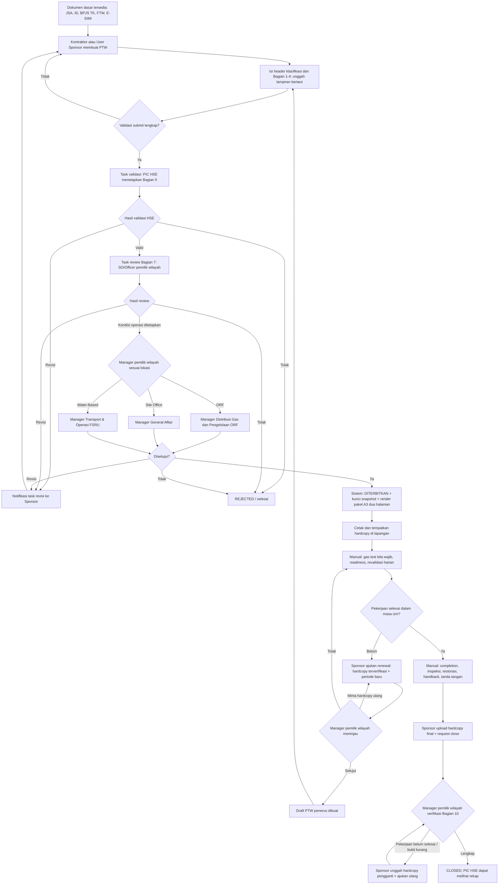

# Business Requirements Document (BRD)
## Nusantara Regas Permit to Work Online

| Atribut | Nilai |
| --- | --- |
| Produk | NR PTW Online |
| Versi | 1.8 — penyelarasan flow dengan sistem berjalan: review Bagian 7 SO/Officer, pembagian pengisian formulir, renewal dan closure berbasis hardcopy terverifikasi |
| Tanggal | 22 September 2026 |
| Status | Draft terkontrol; memerlukan persetujuan Product Owner, Operasi, HSSE, dan TI |
| Pemilik bisnis yang diusulkan | Fungsi Operasi/HSSE Nusantara Regas |
| Dokumen terkait | [PRD v1.8](PRD-NR-PTW-Online-v1.8-ID.md), [FSD v1.8](FSD-NR-PTW-Online-v1.8-ID.md) |
| Menggantikan | BRD v1.7 (16 September 2026) |

## 0. Ringkasan perubahan v1.8

Versi 1.8 tidak mengubah tujuan bisnis, tetapi menyelaraskan alur yang pada v1.7 bertolak belakang dengan sistem yang telah berjalan dan diterima pengguna. Perubahan material:

| Area | v1.7 | v1.8 |
| --- | --- | --- |
| Gate sebelum penerbitan | Validasi PIC HSE langsung diikuti approval Manager pemilik wilayah | Validasi PIC HSE → **review kondisi operasi Bagian 7 oleh SO/Officer pemilik wilayah** → approval dan penerbitan Manager pemilik wilayah |
| Pemisahan tugas | Sponsor ≠ validator HSE; Manager berbeda dari Sponsor | **Empat aktor berbeda**: Sponsor, PIC HSE, reviewer SO/Officer, Manager penerbit |
| Pengisian formulir | Sponsor mengisi Bagian 1–5/7 termasuk CLSR, SIMOPS, safety, isolasi/precaution | Sponsor mengisi **Bagian 1–4**; PIC HSE menetapkan **Bagian 5**; SO/Officer menetapkan **checklist kondisi operasi Bagian 7**; Manager mengisi baris approval Bagian 7. Tidak ada input CLSR/SIMOPS/isolasi bebas oleh Sponsor |
| Dokumen wajib | Matriks requirement terversi; JSA wajib | **JSA, ID, BPJS TK, FTW, dan E-SIMI** wajib berlampiran sebelum submit; Bagian 4 memakai 15 pilihan formulir dengan JSA wajib dan setiap pilihan berlampiran bertaut |
| Renewal | Sponsor langsung membuat draft turunan dari PTW `ISSUED`/`EXPIRED` | Sponsor mengajukan **permintaan renewal dengan hardcopy hasil verifikasi lapangan**; Manager pemilik wilayah meninjau; **draft penerus lahir hanya setelah approval** |
| Closure | Pemilik wilayah memverifikasi bukti lalu menutup | Pemilik wilayah mengisi **verifikasi Bagian 10 terstruktur**; jalur "pekerjaan belum selesai" mengunci close dan meminta hardcopy pengganti untuk paket cetak yang sama |
| Revisi | Task kembali ke pengaju | Permintaan revisi membuat **notifikasi task kepada Sponsor PTW**; submit ulang menaikkan versi PTW |
| Paket cetak | A3 boleh dipecah menjadi A4 multipage; menyertakan QR dan halaman kampanye | **Dua halaman A3 setia pada FM-001/002/003-B-002-NR-B220** (halaman 1 landscape Bagian 1–7, halaman 2 portrait Bagian 8–10); QR dan halaman kampanye keluar dari rilis awal |
| Identitas | OIDC/IdP korporat | Rilis Development memakai **akun lokal terkelola dan cookie HTTP-only**; role/scope dihitung dari assignment yang disetujui; SSO produksi tetap OPN-007 |

## 1. Ringkasan eksekutif

NR PTW Online adalah sistem internal untuk mendigitalkan proses Izin Kerja (*Permit to Work/PTW*) Nusantara Regas tanpa mengurangi kontrol keselamatan yang saat ini terdapat pada formulir manual. Sistem melengkapi E-SIMI yang telah dimiliki NR: **E-SIMI mengendalikan izin masuk instalasi, sedangkan PTW mengendalikan izin melaksanakan pekerjaan tertentu pada lokasi, periode, dan kondisi lapangan tertentu.** Persetujuan salah satunya tidak menggantikan yang lain.

Kontraktor atau User Sponsor menyusun dan mengajukan PTW beserta dokumen dasar wajib. Setiap submission divalidasi oleh **satu validator, yaitu PIC HSE**, yang sekaligus menetapkan APD/perlengkapan safety Bagian 5. Setelah validasi, **SO/Officer departemen pemilik wilayah** memverifikasi kondisi operasi Bagian 7 (isolasi, depressurized, drained, ventilated, bilas, dan lainnya) berdasarkan kondisi aktual area. Barulah **Manager departemen pemilik wilayah**, atau pejabat pengganti resmi yang masih berlaku, memberikan approval penerbitan. Sistem menetapkan status **DITERBITKAN (`ISSUED`)** secara atomik, mengunci snapshot, dan menghasilkan paket PTW siap cetak yang setia pada formulir terkontrol beserta bukti persetujuan elektronik. Departemen pemilik wilayah bukan validator HSE.

Rilis awal menggunakan model hibrida pada **tiga lokasi aktif: ORF, Site Office, dan Water-Based Activity**. Pemilik wilayah ditentukan otomatis dari lokasi: ORF dimiliki Departemen Distribusi Gas dan Pengelolaan ORF; Site Office dimiliki Departemen General Affair; dan Water-Based Activity dimiliki Departemen Transport & Operasi FSRU. Pengajuan, validasi, review kondisi operasi, approval penerbitan, pelacakan, perpanjangan, dan penutupan dikelola dalam aplikasi. Hardcopy resmi tetap ditempatkan di lapangan; gas test awal, revalidasi harian, pembukaan/penutupan harian, dan tanda tangan lapangan diisi manual pada lembar cetak. Pada akhir pekerjaan, Sponsor mengunggah hardcopy lengkap sebagai bukti, lalu pemilik wilayah memverifikasi Bagian 10 dan menutup PTW. PIC HSE tidak menjadi approver penutupan, tetapi memperoleh visibilitas dan rekap.

Solusi dibangun sebagai aplikasi modular baru. SQL Server menjadi *system of record* untuk data PTW; E-SIMI tetap menjadi *system of record* izin masuk. Pada rilis awal, keterkaitan E-SIMI dibuktikan melalui lampiran E-SIMI yang wajib diunggah sebelum submit; integrasi API/adapter tetap menjadi backlog. Target teknologi dijelaskan pada PRD dan FSD: ASP.NET Core 10/.NET 10 LTS, Angular 22, SQL Server 2025, dan Docker Compose.

## 2. Tujuan dokumen dan otoritas sumber

BRD ini menyepakati kebutuhan dan aturan bisnis. Jika sumber bertentangan, urutan otoritas yang diusulkan adalah:

1. SOP PTW NR yang berlaku dan revisi yang disahkan.
2. Keputusan tertulis Product Owner, Operasi, HSSE, dan TI.
3. Formulir PTW terkontrol FM-001/002/003-B-002-NR-B220 beserta maksud kontrol keselamatannya.
4. Perilaku sistem yang telah diterima pengguna sampai 22 September 2026 (DEC-117 sampai DEC-126).
5. Keputusan yang dikonfirmasi dari rapat progress 7 September 2026 dan rapat tindak lanjut 12 Agustus 2026.
6. BRD, PRD, dan pola operasional E-SIMI milik NR.
7. Benchmark PGE/JPO sebagai referensi, bukan kebijakan NR.

### 2.1 Sumber analisis

| Sumber | Pemanfaatan |
| --- | --- |
| Formulir terkontrol FM-001/002/003-B-002-NR-B220 | Struktur izin, tiga kelas izin, sepuluh bagian formulir, klasifikasi header, katalog Bagian 1/4/5/7, masa berlaku maksimum tujuh hari |
| Rekaman rapat 12 Agustus 2026 | Arah ruang lingkup, sponsor internal, integrasi E-SIMI, otorisasi berbasis kompetensi, gas test kondisional, validasi harian |
| Gambar alur benchmark JHSEA/PGE | Referensi create/copy/extend, review, dan jalur persetujuan berbasis risiko |
| BRD, PRD, README E-SIMI | Konteks izin masuk, data organisasi, identitas, notifikasi, audit, dan kebutuhan integrasi |
| Klarifikasi flow dan lokasi, 1 September 2026 | Kontraktor/User Sponsor dapat mengajukan; approval dan penerbitan mengikuti pemilik area |
| Klarifikasi otoritas approval, 1 September 2026 | Approval menuju penerbitan wajib dilakukan Manager pemilik area atau pejabat pengganti dengan penugasan/delegasi resmi yang aktif |
| Rekaman rapat progress 7 September 2026 | Paritas isi template, penghapusan duplikasi bahaya/kontrol, paket cetak, operasi lapangan manual, bukti hardcopy saat close, penyederhanaan approver penutupan, renewal, dan pilot ORF |
| Klarifikasi validator, 8 September 2026 | Validator tunggal PIC HSE; departemen pemilik wilayah bukan validator |
| Klarifikasi lokasi aktif dan pemilik wilayah, 16 September 2026 | ORF, Site Office, dan Water-Based Activity aktif; pemilik wilayah Site Office adalah General Affair dan Water-Based Activity adalah Transport & Operasi FSRU |
| Arahan kesetiaan template cetak, 16 September 2026 | Paket cetak wajib mereproduksi formulir terkontrol; layout digital alternatif atau template placeholder ditolak; materi kampanye tidak berlaku pada rilis awal |
| Verifikasi sistem berjalan, 22 September 2026 | Flow review Bagian 7 SO/Officer, pembagian pengisian Bagian 1–7, dokumen dasar wajib, renewal/closure berbasis hardcopy terverifikasi, notifikasi revisi, identitas lokal Development dikonfirmasi sesuai dan diadopsi sebagai baseline v1.8 |

### 2.2 Keputusan flow sampai versi 1.8

| ID | Keputusan | Status |
| --- | --- | --- |
| DEC-101 | Pengajuan dapat dibuat oleh Kontraktor atau User Sponsor. | Dikonfirmasi |
| DEC-102 | Setiap submission divalidasi oleh tepat satu validator: PIC HSE. | Dikonfirmasi |
| DEC-103 | Sistem membuat satu validation task aktif untuk PIC HSE pada setiap submission. | Dikonfirmasi v1.6 |
| DEC-104 | Approval baru dapat berjalan setelah validasi PIC HSE berstatus valid pada PermitVersion yang sama. | Diperluas DEC-118: approval juga mensyaratkan review Bagian 7 selesai pada versi yang sama |
| DEC-105 | Approval dan penerbitan PTW mengikuti departemen pemilik area. | Dikonfirmasi |
| DEC-106 | Pemetaan pemilik area awal. | Digantikan DEC-116 |
| DEC-107 | Istilah resmi setelah approval penerbitan adalah **PTW Diterbitkan** (`ISSUED`), bukan `OPEN`. Kesiapan mulai/lanjut kerja tetap dikendalikan terpisah melalui isian dan tanda tangan hardcopy. | Dikonfirmasi |
| DEC-108 | Approval pemilik area sebelum penerbitan wajib dilakukan oleh Manager departemen pemilik area atau pejabat pengganti yang ditunjuk resmi, memiliki scope yang sama, dan masih efektif. | Dikonfirmasi; jalur pengganti tetap fail-closed sampai model penugasan lengkap disahkan |
| DEC-109 | Isi kontrol pada tiga template PTW dipertahankan; tata letak digital/cetak boleh dioptimalkan. | **Digantikan DEC-117** untuk paket cetak; layar aplikasi tetap boleh dioptimalkan |
| DEC-110 | Bahaya dan pengendalian tidak diketik ulang pada form PTW; rincian bersumber dari JSA terlampir. Referensi bahaya tambahan Bagian 2 bersifat opsional dan informatif. | Dikonfirmasi |
| DEC-111 | Setelah approval penerbitan, sistem menghasilkan paket PTW siap cetak dengan bukti persetujuan dan lembar lapangan. | Dikonfirmasi |
| DEC-112 | Gas test, revalidasi harian, pembukaan/penutupan harian, dan tanda tangan lapangan tetap manual pada hardcopy. | Dikonfirmasi |
| DEC-113 | Close mewajibkan upload hardcopy lengkap; Sponsor mengajukan penutupan dan pemilik area memverifikasi. PIC HSE tidak meng-approve close, tetapi memperoleh rekap. | Diperluas DEC-122 |
| DEC-114 | Pilot difokuskan pada ORF. | Digantikan DEC-116 |
| DEC-115 | Perpanjangan dicatat sebagai PTW turunan maksimum tujuh hari, tidak overlap, memerlukan dokumen/attachment baru, dan menghasilkan paket cetak baru. | Diperluas DEC-121 |
| DEC-116 | Lokasi aktif rilis awal: ORF (Distribusi Gas dan Pengelolaan ORF), Site Office (General Affair), Water-Based Activity (Transport & Operasi FSRU). HO dan FSRU tidak aktif. | Dikonfirmasi 16 Sep 2026 |
| DEC-117 | Paket cetak resmi mereproduksi formulir terkontrol FM-001/002/003-B-002-NR-B220 sebagai dua halaman A3: halaman 1 landscape memuat Bagian 1–7 dan halaman 2 portrait dimulai pada Bagian 8. Teks, urutan item, kolom, dan kotak centang mengikuti formulir; tidak ada layout digital alternatif, template placeholder, atau pemecahan A4. | Dikonfirmasi 16 Sep 2026; diadopsi v1.8 |
| DEC-118 | Setelah validasi PIC HSE, **SO/Officer departemen pemilik wilayah** memverifikasi kondisi operasi Bagian 7 melalui satu task review. Reviewer pertama yang menyelesaikan task menang. Manager pemilik wilayah baru dapat menyetujui dan menerbitkan setelah review tersebut selesai pada versi PTW yang sama. | Dikonfirmasi 22 Sep 2026 |
| DEC-119 | Pembagian pengisian formulir: Sponsor mengisi Bagian 1–4 (klasifikasi header, jenis pekerjaan, penjelasan pekerjaan, permintaan izin kerja, dokumen pendukung); PIC HSE menetapkan Bagian 5 saat validasi; SO/Officer menetapkan checklist kondisi operasi Bagian 7; Manager mengisi baris approval Bagian 7 melalui keputusan penerbitan. Bagian 6 dan Bagian 8–10 dicetak kosong untuk pengisian lapangan. | Dikonfirmasi 22 Sep 2026 |
| DEC-120 | Sebelum submit, JSA, ID, BPJS TK, FTW, dan E-SIMI wajib memiliki lampiran bertaut. Hanya JSA yang juga menjadi item checklist Bagian 4; empat dokumen lainnya adalah evidence pengajuan dan tidak dicetak pada Bagian 4. | Dikonfirmasi 22 Sep 2026 |
| DEC-121 | Renewal tidak mengubah PTW asal. Sponsor mengajukan permintaan renewal dengan hardcopy hasil verifikasi lapangan yang cocok dengan paket cetak resmi, periode baru non-overlap maksimum tujuh hari, dan pernyataan kelanjutan. Manager pemilik wilayah dapat meminta hardcopy ulang, menolak, atau menyetujui; draft PTW penerus dibuat atomik hanya saat approval dan menjalani workflow normal dari awal. | Dikonfirmasi 22 Sep 2026 |
| DEC-122 | Penutupan diverifikasi Manager pemilik wilayah dengan isian Bagian 10 terstruktur: nama Officer pemeriksa, area diinspeksi dan bersih, pekerjaan selesai, Manager menyetujui penyelesaian, sistem yang di-inhibit dipulihkan, area di-handback dan pengaman dipulihkan, serta hardcopy terbaca. Bila pekerjaan belum selesai, close terkunci; Sponsor mengunggah hardcopy pengganti untuk paket cetak yang sama dan mengajukan ulang tanpa mengubah status. | Dikonfirmasi 22 Sep 2026 |
| DEC-123 | Permintaan revisi membatalkan task yang tertunda dan membuat notifikasi task kepada Sponsor PTW. Submit ulang menaikkan versi PTW meskipun draft tidak berubah, dan seluruh task/evidence versi lama menjadi riwayat. | Dikonfirmasi 22 Sep 2026 |
| DEC-124 | QR/reference pada lembar cetak serta halaman kampanye (10 CLSR, 8 Arahan Direksi, 9 Perilaku Wajib) tidak termasuk paket cetak rilis awal; keduanya menjadi backlog setelah OPN-011/OPN-012 disahkan. | Dikonfirmasi 16 Sep 2026 |
| DEC-125 | Rilis Development memakai akun lokal terkelola, login cookie HTTP-only, dan assignment role yang disetujui Administrator; role dan scope dihitung ulang setiap request. Spesimen tanda tangan visual berversi dicetak sebagai bukti persetujuan elektronik, bukan tanda tangan digital tersertifikasi. SSO/IdP produksi menunggu OPN-007. | Dikonfirmasi 22 Sep 2026 |
| DEC-126 | Deklarasi SIMOPS, elemen CLSR bebas, dan isolasi/precaution bebas tidak ditampilkan pada form Sponsor karena tidak terdapat pada formulir terkontrol; kondisi operasi ditetapkan SO/Officer pada Bagian 7. | Dikonfirmasi 22 Sep 2026 |

## 3. Latar belakang dan masalah bisnis

Proses kertas saat ini memiliki kontrol keselamatan yang penting, tetapi menimbulkan kelemahan operasional:

- status izin, pihak yang harus bertindak, dan masa kedaluwarsa tidak terlihat secara real time;
- kewenangan penandatangan dan masa berlaku kompetensi tidak dapat diperiksa otomatis;
- data pekerjaan, JSA, isolasi, hasil gas test, validasi harian, dan handback tersebar;
- keterkaitan dengan E-SIMI dan dokumen pendukung sulit direkonsiliasi;
- perubahan kondisi atau penangguhan berisiko hanya tercatat pada lembar fisik;
- pelaporan dan audit membutuhkan kompilasi manual;
- persetujuan administratif berpotensi disalahartikan sebagai izin mulai bekerja.

## 4. Sasaran dan indikator keberhasilan

### 4.1 Sasaran bisnis

1. Menyediakan satu rekaman PTW digital yang dapat ditelusuri dari draft sampai penutupan.
2. Menjamin kontrol dan dokumen wajib mengikuti kelas izin, formulir terkontrol, lokasi, dan kondisi pekerjaan.
3. Memastikan hanya personel dengan peran, wilayah, dan otorisasi aktif yang dapat bertindak, dengan pemisahan tugas empat aktor pada jalur penerbitan.
4. Memisahkan persetujuan rencana dari verifikasi kesiapan lapangan dan izin mulai kerja.
5. Memberikan visibilitas izin aktif, tertunda, kedaluwarsa, renewal, dan pekerjaan yang belum di-handback.
6. Mengurangi duplikasi melalui evidence E-SIMI dan, kelak, integrasi API.

### 4.2 KPI yang diusulkan

| KPI | Definisi | Target awal; dikonfirmasi PO |
| --- | --- | --- |
| Kelengkapan saat submit | Persentase submission yang lolos validasi PIC HSE pertama | ≥ 90% setelah 3 bulan |
| Waktu keputusan | Median dari submit sampai Diterbitkan, di luar waktu revisi pemohon | ≤ 1 hari kerja |
| Kepatuhan otorisasi | Aksi terkontrol oleh personel dengan otorisasi aktif | 100% |
| Ketertiban penutupan | PTW selesai yang ditutup dengan verifikasi Bagian 10 | ≥ 98% |
| Bukti revalidasi | Hardcopy final memuat validasi harian/shift yang diwajibkan dan terbaca | 100% sampel close |
| Keterlacakan audit | Transisi material dengan aktor, waktu, alasan, dan versi | 100% |
| Duplikasi data | PTW dengan evidence E-SIMI yang lengkap sebelum submit | 100% |

## 5. Ruang lingkup

### 5.1 Dalam lingkup MVP

- cakupan operasional awal untuk ORF, Site Office, dan Water-Based Activity dengan pemilik wilayah sesuai matriks Bagian 6.1;
- akun terkelola untuk pengguna internal dan Kontraktor, dengan otorisasi berbasis peran, lokasi, dan assignment yang disetujui;
- pembuatan dan pengajuan PTW oleh Kontraktor atau User Sponsor untuk Pekerjaan Panas, Pekerjaan Dingin, dan Memasuki Ruang Terbatas (CSE);
- pengisian Bagian 1–4 oleh Sponsor sesuai katalog formulir terkontrol: klasifikasi header, jenis pekerjaan, penjelasan pekerjaan dan equipment, pihak/perusahaan, dan checklist dokumen pendukung;
- dokumen dasar wajib (JSA, ID, BPJS TK, FTW, E-SIMI) sebagai lampiran terkontrol sebelum submit; JSA sebagai sumber rincian bahaya/pengendalian;
- validasi wajib oleh PIC HSE yang sekaligus menetapkan Bagian 5, termasuk revisi/penolakan/eskalasi;
- review kondisi operasi Bagian 7 oleh SO/Officer pemilik wilayah;
- approval penerbitan oleh Manager pemilik wilayah; approval yang berhasil menerbitkan PTW dan mengunci snapshot dokumen;
- generator paket PDF/cetak dua halaman A3 yang setia pada formulir terkontrol, menampilkan bukti persetujuan elektronik, dan menyediakan ruang manual Bagian 6 serta Bagian 8–10;
- penggunaan hardcopy di lapangan untuk gas test, validasi harian, pembukaan/penutupan harian, tanda tangan pelaksana, penyelesaian, inspeksi, restorasi, dan handback;
- pengajuan close oleh Sponsor dengan hardcopy final wajib dan verifikasi Bagian 10 oleh pemilik wilayah; PIC HSE memperoleh akses rekap tanpa task approval close;
- renewal berbasis review pemilik wilayah dengan nomor baru dan lineage; keputusan dan hasil pengujian tidak ikut disalin;
- notifikasi task, daftar tugas, dashboard peran, riwayat, dan audit trail;
- administrasi pengguna, assignment role, master lokasi effective-dated, dan kesiapan policy;
- deployment dengan Docker Compose.

### 5.2 Di luar lingkup MVP

- akses anonim atau registrasi mandiri publik; akses Kontraktor harus melalui onboarding dan akun terkelola;
- authoring/approval elektronik JSA, SOP, MOC, lifting plan, atau LOTO sebagai subproses tersendiri;
- pengisian gas test, validasi harian, work period, dan tanda tangan pelaksana secara online;
- integrasi otomatis alat gas detector, badge/gate, CCTV, atau sensor;
- integrasi API E-SIMI otomatis; rilis awal memakai evidence lampiran E-SIMI dan nomor referensi;
- aplikasi mobile native dan operasi offline penuh;
- penggantian atau migrasi aplikasi E-SIMI;
- aktivasi operasional HO dan FSRU pada rilis awal;
- QR/reference pada lembar cetak dan halaman kampanye keselamatan (DEC-124);
- rules engine deklaratif dan master checklist effective-dated; rilis awal memakai katalog formulir terkontrol yang ditranskripsi dari template;
- tanda tangan digital tersertifikasi PSrE, kecuali disetujui sebagai fase lanjutan.

### 5.3 Pemetaan sepuluh bagian formulir terkontrol

| Bagian formulir | Pengisi | Perlakuan digital v1.8 |
| --- | --- | --- |
| Header klasifikasi | Sponsor | HOT: satu atau lebih dari `Api Terbuka`/`Percikan Api`; COLD: tepat satu dari `Low Risk`/`High Risk`; CSE: tanpa kotak tambahan. Wajib sebelum submit. |
| 1. Jenis Pekerjaan | Sponsor | Multi-select dari katalog per kelas izin sesuai formulir; opsi `Lain-lain` mewajibkan detail maksimum 80 karakter yang ikut tercetak. |
| 2. Penjelasan Pekerjaan | Sponsor | Uraian, nomor/nama equipment, Work Order No., plant/area, masa berlaku, dan referensi bahaya tambahan opsional. Tidak ada kolom bebas bahaya/pengendalian yang menduplikasi JSA. |
| 3. Permintaan Izin Kerja | Sponsor (sistem mencetak) | Nama, jabatan, departemen, spesimen tanda tangan berversi, dan waktu submit Sponsor dicetak dari profil akun; tanda tangan Pelaksana Pekerjaan tetap manual pada hardcopy. |
| 4. Dokumen Pendukung | Sponsor | 15 pilihan sesuai formulir; JSA wajib dengan nomor/revisi/tanggal; setiap pilihan harus memiliki lampiran bertaut sebelum submit. Dokumen dasar ID, BPJS TK, FTW, dan E-SIMI wajib berlampiran tetapi tidak dicetak sebagai item Bagian 4. |
| 5. Perlengkapan Safety Tambahan/Khusus | PIC HSE | Ditetapkan saat validasi dari katalog per kelas izin (minimal satu). Sponsor tidak dapat mengisi; approval tanpa Bagian 5 ditolak dan diarahkan ke revisi. |
| 6. Gas Tes Awal | Lapangan | Dicetak kosong; Gas Tester mengisi dan menandatangani manual bila diwajibkan. |
| 7. Izin dari Bagian Operasi | SO/Officer dan Manager pemilik wilayah | Checklist kondisi operasi (`Isolasi` dengan rincian Closed/Lock Valves, Blind, Disconnect; `Depressurized`; `Drained`; `Ventilated`; `Bilas` dengan rincian N2 Purge, Water; `Lainnya` dengan penjelasan maksimum 200 karakter) ditetapkan SO/Officer. Baris keputusan SO/Officer dan Manager dicetak dengan nama, jabatan, spesimen tanda tangan, dan waktu. |
| 8. Revalidasi Izin Kerja | Lapangan | Dicetak kosong pada halaman 2 dengan ruang tulis hingga tujuh hari. |
| 9. Pekerjaan Selesai | Lapangan | Diisi/ditandatangani manual, kemudian diunggah sebagai bukti close. |
| 10. Inspeksi dan Pengembalian ke Operasi | Lapangan lalu pemilik wilayah di sistem | Diisi/ditandatangani manual pada hardcopy; Manager pemilik wilayah merekam verifikasi terstruktur Bagian 10 di sistem sebelum `CLOSED`. |

Katalog Bagian 1, 4, 5, dan 7 adalah transkripsi formulir terkontrol dan tidak boleh diubah tanpa decision record yang disahkan; pemindahannya ke master data effective-dated (OPN-003) tetap pekerjaan lanjutan.

## 6. Pemangku kepentingan dan peran

| Peran | Kode role sistem | Tanggung jawab utama | Aksi terkontrol |
| --- | --- | --- | --- |
| Product Owner | — | Menetapkan prioritas, aturan, KPI, dan acceptance | Menyetujui baseline produk |
| Kontraktor/Pengaju Eksternal | `Sponsor` (tipe pengaju `CONTRACTOR`) | Menyusun PTW untuk pekerjaan perusahaannya melalui akun terkelola | Draft, submit, perbaikan, permintaan renewal, request close, cancel sesuai kepemilikan |
| User Sponsor | `Sponsor` (tipe pengaju `USER_SPONSOR`) | Pengaju internal NR dan/atau sponsor pekerjaan kontraktor; accountable atas representasi crew | Draft, submit, perbaikan, upload hardcopy, permintaan renewal, request/resubmit close, cancel |
| Pelaksana/Performing Authority | — | Menjalankan metode kerja dan kontrol; validasi/tanda tangan lapangan | Tidak wajib mempunyai akun; tanda tangan melalui hardcopy |
| PIC HSE | `HSEValidator` | Validator tunggal yang memvalidasi kelengkapan, JSA, klasifikasi, dan menetapkan Bagian 5 | Validate, request revision, reject, escalate, suspend |
| SO/Officer Pemilik Wilayah | `AreaOwnerSeniorOfficer` (kode dipertahankan untuk kompatibilitas data) | Memverifikasi kondisi operasi aktual Bagian 7 di wilayahnya | Review area operations; request revision/reject pada task review |
| Manager Pemilik Wilayah | `AreaOwnerManager` | Manager departemen pemilik wilayah atau pejabat pengganti resmi | Approve-and-issue, request revision/reject, suspend, resolve suspension, review renewal, verifikasi dan close |
| Departemen Distribusi Gas dan Pengelolaan ORF | — | Pemilik wilayah ORF | Menyediakan SO/Officer dan Manager; bukan validator |
| Departemen General Affair | — | Pemilik wilayah Site Office | Menyediakan SO/Officer dan Manager; bukan validator |
| Departemen Transport & Operasi FSRU | — | Pemilik wilayah Water-Based Activity | Menyediakan SO/Officer dan Manager; bukan validator |
| Petugas Lapangan, Gas Tester, Isolating Authority, Site/Shift Supervisor | — | Mengisi bagian operasional pada hardcopy | Gas test/readiness/revalidasi/inspeksi/tanda tangan manual sesuai SOP |
| Administrator | `Administrator` | Mengelola akun, assignment role, master lokasi, spesimen tanda tangan, dan render ulang paket | Master data; retry render; expire manual; tidak boleh self-approve di luar Development |
| Auditor/Read-only | `Auditor` | Memeriksa bukti dan riwayat | Read/export sesuai cakupan |

Untuk approval pemilik wilayah, level Manager merupakan syarat bisnis. Aktor tetap harus memiliki assignment aktif, scope lokasi yang sesuai, dan memenuhi pemisahan tugas. Pejabat pengganti hanya dapat bertindak bila penugasan/delegasinya tercatat resmi, efektif, dan dapat diaudit; sampai model penugasan tersebut lengkap, jalur pengganti ditolak fail-closed.

### 6.1 Matriks pemilik area

| Kode lokasi | Lokasi | Departemen pemilik area | Tanggung jawab pada flow |
| --- | --- | --- | --- |
| `HO` | Head Office (HO) | Departemen General Affair | **Tidak aktif**; target rollout berikutnya |
| `ORF` | ORF | Departemen Distribusi Gas dan Pengelolaan ORF | **Aktif**; menyediakan SO/Officer reviewer Bagian 7, Manager approver, reviewer renewal, dan verifier close |
| `SITE_OFFICE` | Site Office | Departemen General Affair | **Aktif**; peran yang sama untuk Site Office |
| `FSRU` | FSRU | Departemen Transport & Operasi FSRU | **Tidak aktif**; target rollout berikutnya |
| `WATER_BASED` | Water-Based Activity | Departemen Transport & Operasi FSRU | **Aktif**; peran yang sama untuk Water-Based Activity |

Pemilik wilayah ditentukan dari lokasi utama PTW melalui konfigurasi release server-side. HO, FSRU, dan lokasi lain ditolak fail-closed saat submit. Pekerjaan lintas wilayah harus dipecah menjadi PTW terpisah.

## 7. Alur bisnis target

### 7.1 Makna status utama

| Status | Makna bisnis | Pekerjaan boleh berjalan? |
| --- | --- | --- |
| DRAFT | Sedang disusun | Tidak |
| REVISION_REQUIRED | Harus diperbaiki; Sponsor menerima notifikasi task | Tidak |
| UNDER_VALIDATION | Validasi PIC HSE berjalan | Tidak |
| AWAITING_AREA_APPROVAL | Validasi PIC HSE lengkap; menunggu review Bagian 7 SO/Officer lalu approval Manager pemilik wilayah | Tidak |
| ISSUED | Approval penerbitan selesai, snapshot terkunci, dan paket cetak resmi tersedia | Hanya setelah seluruh isian/tanda tangan lapangan yang diwajibkan pada hardcopy dinyatakan valid |
| SUSPENDED | Izin berhenti sementara | Tidak |
| CLOSURE_REQUESTED | Sponsor telah mengunggah hardcopy final dan meminta penutupan; menunggu verifikasi Bagian 10 pemilik wilayah, termasuk siklus tindak lanjut | Tidak |
| CLOSED | Inspeksi/restorasi/handback terverifikasi | Tidak; terminal |
| REJECTED/CANCELLED/EXPIRED | Terminal; `EXPIRED` masih dapat menjadi sumber permintaan renewal atau closure | Tidak |

Permintaan renewal tidak menambah status pada PTW asal; ia dicatat sebagai evidence review yang menunggu keputusan pemilik wilayah.

## 8. Kebutuhan bisnis

Prioritas: **M** Must, **S** Should, **C** Could.

### 8.1 Identitas, kewenangan, dan pemisahan tugas

| ID | Kebutuhan | P |
| --- | --- | --- |
| BR-AUT-001 | Sistem hanya dapat digunakan oleh identitas yang terverifikasi. Rilis Development memakai akun lokal terkelola dan login cookie HTTP-only; produksi memakai IdP/SSO sesuai OPN-007. | M |
| BR-AUT-002 | Setiap aksi terkontrol memvalidasi peran, cakupan lokasi, kepemilikan Sponsor, masa otorisasi, dan status PTW. Role dan scope dihitung ulang dari assignment yang disetujui dan efektif pada setiap request. | M |
| BR-AUT-003 | Pemisahan tugas pada jalur penerbitan: Sponsor, validator HSE, reviewer SO/Officer Bagian 7, dan Manager penerbit harus empat identitas berbeda. Sponsor tidak boleh memvalidasi PTW miliknya. | M |
| BR-AUT-004 | Assignment role menyimpan pengguna, role, area kewenangan bila role area-scoped, tanggal mulai, dan tanggal akhir opsional; action code dan kompetensi diturunkan sistem dari profil role, bukan input pengguna. | M |
| BR-AUT-005 | Pencabutan/berakhirnya otorisasi atau nonaktifnya akun langsung memblokir aksi baru tanpa menghapus bukti lama. | M |
| BR-AUT-006 | Kontraktor hanya dapat mengakses PTW yang ia sponsori melalui akun terverifikasi; tidak ada anonymous atau self-registration. Scope perusahaan eksplisit menunggu OPN-006. | M |
| BR-AUT-007 | Akun Kontraktor harus memiliki sponsor/penanggung jawab NR, perusahaan, masa aktif, dan proses revoke. | S |
| BR-AUT-008 | Penugasan pejabat pengganti Manager harus merekam Manager yang digantikan, penerima penugasan, dasar/nomor dokumen, departemen dan lokasi, tanggal mulai/akhir, alasan, status, serta pihak yang mengesahkan. Sampai tersedia, approval sebagai pengganti ditolak. | M |
| BR-AUT-009 | Task tidak dapat dialihkan secara ad hoc. Task yang ditujukan kepada identitas tertentu (misalnya notifikasi revisi Sponsor) terlihat oleh identitas tersebut walaupun role aktifnya berubah; task pool terlihat oleh pemegang role dengan scope lokasi yang cocok. | M |
| BR-AUT-010 | Nama dan jabatan aktor pada evidence workflow dan paket cetak berasal dari profil akun di server; username/ID tidak menjadi pengganti nama. | M |
| BR-AUT-011 | Administrator dapat mengunggah spesimen tanda tangan visual (PNG) berversi; versi lama tidak ditimpa dan versi exact dibekukan pada evidence/snapshot. | M |

### 8.2 E-SIMI dan inisiasi

| ID | Kebutuhan | P |
| --- | --- | --- |
| BR-INT-001 | PTW harus dapat ditautkan ke E-SIMI berjenis pekerjaan; rilis awal menyimpan nomor/referensi E-SIMI dan mewajibkan lampiran E-SIMI sebelum submit. | M |
| BR-INT-002 | Bila API E-SIMI tersedia, data orang, perusahaan, lokasi, tujuan, jadwal, dan nomor E-SIMI diambil otomatis. | S |
| BR-INT-003 | Kegagalan integrasi tidak boleh menghasilkan tautan semu; pengguna mendapat status dan langkah pemulihan yang jelas. | S |
| BR-INT-004 | Izin masuk yang dicabut/berakhir harus terlihat pada PTW aktif dan memicu penilaian operasional. | S |
| BR-INI-001 | Kontraktor atau User Sponsor dapat membuat draft baru atau memperoleh draft penerus melalui renewal yang disetujui pemilik wilayah. | M |
| BR-INI-002 | Draft penerus renewal menyalin data perencanaan Bagian 1–4 dengan periode yang disetujui, tetapi tidak menyalin lampiran, Bagian 5, Bagian 7, approval, atau isian lapangan. | M |
| BR-INI-003 | Sistem menyimpan jenis pengaju (`CONTRACTOR` atau `USER_SPONSOR`), perusahaan, pelaksana, dan Sponsor accountable. | M |
| BR-INI-004 | Bila pegawai HSE menjadi Sponsor pekerjaan, validation task HSE harus diputuskan oleh validator HSE lain. | M |

### 8.3 Klasifikasi, dokumen, dan formulir

| ID | Kebutuhan | P |
| --- | --- | --- |
| BR-CLS-001 | Sistem mendukung Hot Work, Cold Work, dan CSE sebagai kelas izin terkendali dengan katalog formulir masing-masing. | M |
| BR-CLS-002 | Klasifikasi header mengikuti formulir: HOT satu atau lebih `Api Terbuka`/`Percikan Api`; COLD tepat satu `Low Risk`/`High Risk`; CSE tanpa pilihan. Submit tanpa klasifikasi yang diwajibkan ditolak. | M |
| BR-CLS-003 | Kombinasi pekerjaan yang memerlukan lebih dari satu izin harus dapat saling ditautkan. | C |
| BR-RSK-001 | Klasifikasi header COLD memetakan tingkat risiko legacy; ia merepresentasikan checklist formulir, bukan matriks routing risiko OPN-002. | M |
| BR-RSK-002 | PIC HSE memvalidasi bahwa JSA, klasifikasi, jenis pekerjaan, dan dokumen konsisten, lalu menetapkan Bagian 5. | M |
| BR-DOC-001 | Dokumen dasar JSA, ID, BPJS TK, FTW, dan E-SIMI masing-masing memiliki lampiran bertaut sebelum submit; JSA diunggah dengan kategori JSA dan metadata nomor/revisi/tanggal yang cocok dengan draft. | M |
| BR-DOC-002 | Lampiran dapat ditelusuri ke pengunggah, waktu, kategori, kode dokumen, versi/lineage, hash integritas, dan status pemindaian. Hanya PDF/JPEG/PNG yang diterima. | M |
| BR-DOC-003 | Bagian 4 memakai 15 pilihan formulir; JSA wajib, lainnya opsional, dan setiap pilihan memerlukan lampiran bertaut sebelum submit. | M |
| BR-DOC-004 | Pengguna tidak dapat menghapus item standar katalog formulir; penambahan item khusus menunggu OPN-003. | M |
| BR-DOC-005 | Lampiran renewal tidak disalin otomatis; pengaju menyediakan ulang file yang masih valid pada draft penerus. | M |
| BR-DOC-006 | Lampiran yang dihapus Sponsor saat draft/revisi dipertahankan sebagai riwayat (logical removal); file yang menjadi dasar keputusan tidak dihapus. | M |

### 8.4 Review dan keputusan

| ID | Kebutuhan | P |
| --- | --- | --- |
| BR-RVW-001 | Setiap submission wajib memperoleh validasi PIC HSE sebelum review Bagian 7 dan approval pemilik wilayah. | M |
| BR-RVW-002 | Satu validation task dibuat untuk PIC HSE. PIC HSE dapat memvalidasi (dengan Bagian 5), meminta revisi, menolak, atau mengeskalasi dengan catatan wajib; eskalasi tidak mengubah status. | M |
| BR-RVW-003 | Permintaan revisi membatalkan task tertunda, menghapus evidence review versi tersebut, dan membuat satu notifikasi task kepada Sponsor PTW; submit ulang menaikkan versi PTW dan membuat task validasi baru. | M |
| BR-RVW-004 | Setelah validasi valid, sistem membuat tepat satu task review Bagian 7 untuk pool SO/Officer pemilik wilayah sesuai lokasi. Reviewer pertama yang menyelesaikannya menetapkan checklist kondisi operasi; reviewer lain tidak lagi menemukan task. | M |
| BR-RVW-005 | Reviewer SO/Officer wajib mengonfirmasi bahwa kondisi operasi relevan telah diperiksa; `Isolasi` dan `Bilas` mewajibkan minimal satu rincian; `Lainnya` mewajibkan penjelasan. | M |
| BR-RVW-006 | Task approval Manager hanya dibuat setelah review Bagian 7 selesai pada versi PTW yang sama. | M |
| BR-RVW-007 | Permintaan revisi dan penolakan dapat dilakukan PIC HSE pada task validasi, SO/Officer pada task review, dan Manager pada task approval; alasan wajib. | M |
| BR-APR-001 | Approval penerbitan dilakukan oleh Manager departemen pemilik area dengan scope lokasi yang sesuai; pengganti resmi mengikuti BR-AUT-008. | M |
| BR-APR-002 | Bukti keputusan menyimpan aktor aktual, nama dan jabatan dari profil, kapasitas Manager/pengganti, ID otorisasi, spesimen tanda tangan berversi, timestamp, versi PTW, versi ruleset/template, dan pernyataan yang disetujui. | M |
| BR-APR-003 | Approval yang berhasil mengunci PermitVersion dan secara atomik menetapkan `ISSUED`; pekerjaan belum boleh dimulai sampai prasyarat/tanda tangan lapangan dipenuhi. | M |
| BR-APR-004 | Routing lokasi aktif wajib mengikuti matriks Bagian 6.1. | M |
| BR-APR-005 | Approval tanpa evidence Bagian 5 atau Bagian 7, oleh aktor yang sama dengan Sponsor/validator/reviewer, di luar scope lokasi, atau setelah masa berlaku berakhir ditolak. | M |
| BR-APR-006 | Berakhir atau dicabutnya assignment sebelum keputusan memblokir approval tanpa menghapus riwayat. | M |
| BR-APR-007 | Paket cetak menampilkan bukti elektronik aktor Bagian 7 (SO/Officer dan Manager): nama, jabatan, spesimen tanda tangan bila ada, dan waktu; ini bukan tanda tangan digital tersertifikasi. | M |

### 8.5 Kesiapan lapangan dan pengujian gas

| ID | Kebutuhan | P |
| --- | --- | --- |
| BR-FLD-001 | Paket cetak menyediakan Bagian 6 dan Bagian 8–10 kosong dengan ruang tulis memadai; petugas mengisinya manual. | M |
| BR-GAS-001 | Bagian gas test dicetak sesuai formulir; gas test diisi dan ditandatangani manual oleh petugas kompeten. | M |
| BR-GAS-002 | Parameter, unit, alat/tester, titik, waktu, hasil, dan acceptance mengikuti formulir/SOP; sistem tidak menghitung verdict. | M |
| BR-GAS-003 | Hardcopy yang berisi gas test menjadi bagian bukti final yang wajib diunggah saat penutupan. | M |
| BR-ISS-001 | Setelah validasi PIC HSE dan review Bagian 7, Manager pemilik area menyetujui penerbitan; sistem menerbitkan PTW dan membuat snapshot cetak secara atomik. | M |
| BR-ISS-002 | Sistem memverifikasi lokasi aktif, pemilik area, scope approver, evidence Bagian 5 dan 7, masa berlaku, dan versi PTW sebelum penerbitan. | M |
| BR-ISS-003 | `ISSUED` berarti dokumen izin resmi telah diterbitkan, bukan bahwa seluruh prasyarat lapangan otomatis terpenuhi. | M |

### 8.6 Masa berlaku, suspend, renewal, dan penutupan

| ID | Kebutuhan | P |
| --- | --- | --- |
| BR-LIF-001 | Masa berlaku setiap PTW maksimum tujuh hari; basis hari kalender/hari kerja mengikuti keputusan SOP (OPN-010). | M |
| BR-LIF-002 | Pekerjaan melewati batas membutuhkan PTW baru dengan lineage dan approval baru melalui renewal yang disetujui pemilik wilayah. | M |
| BR-LIF-003 | Kedaluwarsa dicatat sebagai command eksplisit setelah masa berlaku berakhir; otomatisasi expiry oleh Worker menjadi backlog. | S |
| BR-WPR-001 | Setiap shift/hari kerja wajib direvalidasi pada hardcopy sebelum dimulai; lembar menyediakan ruang hingga batas masa berlaku. | M |
| BR-WPR-002 | Digitalisasi work period harian bukan lingkup MVP. | M |
| BR-SUS-001 | PIC HSE atau Manager pemilik wilayah dapat menangguhkan PTW Diterbitkan seketika dengan alasan; hak kerja berhenti segera. | M |
| BR-SUS-002 | Hanya Manager pemilik wilayah yang menyelesaikan penangguhan; PTW kembali `ISSUED` dan UI mengingatkan revalidasi hardcopy sebelum kerja dilanjutkan. | M |
| BR-REN-001 | Sponsor pemilik dapat mengajukan renewal dari PTW `ISSUED`/`EXPIRED` yang belum memasuki proses penutupan dan belum memiliki penerus, dengan memilih paket cetak resmi `READY`, hardcopy hasil verifikasi lapangan yang `CLEAN` dan cocok dengan paket/versi tersebut, periode baru maksimum tujuh hari yang tidak overlap, dan pernyataan kelanjutan. | M |
| BR-REN-002 | Permintaan renewal membuat satu task review untuk Manager pemilik wilayah tanpa mengubah status PTW asal; selama review tertunda, lampiran PTW asal terkunci dan closure tidak dapat diajukan. | M |
| BR-REN-003 | Manager pemilik wilayah dapat meminta hardcopy ulang (Sponsor wajib mengganti evidence), menolak, atau menyetujui setelah mengonfirmasi verifikasi lapangan dan keterbacaan hardcopy. | M |
| BR-REN-004 | Approval renewal membuat draft PTW penerus secara atomik dengan Sponsor dan lokasi yang sama, periode yang disetujui, lineage ke PTW asal, tanpa lampiran, dan menjalani submit, validasi HSE, review Bagian 7, serta approval penerbitan normal. Satu PTW asal hanya memiliki satu penerus. | M |
| BR-CLO-001 | Sponsor mengajukan close dari `ISSUED`, `SUSPENDED`, atau `EXPIRED` hanya setelah completion, pemeriksaan lokasi, restorasi, handback, dan tanda tangan manual selesai; hardcopy final `CLEAN` yang cocok dengan paket cetak resmi dan versi PTW adalah wajib. | M |
| BR-CLO-002 | `CLOSED` bersifat terminal; koreksi administratif dilakukan sebagai addendum audit. | M |
| BR-CLO-003 | Manager pemilik wilayah memverifikasi Bagian 10 secara terstruktur (nama Officer, area diinspeksi dan bersih, pekerjaan selesai, Manager menyetujui penyelesaian, sistem inhibited dipulihkan, handback dan pengaman dipulihkan, hardcopy terbaca) sebelum menetapkan `CLOSED`; PIC HSE tidak memiliki task approval close. | M |
| BR-CLO-004 | Bila pekerjaan belum selesai atau bukti kurang, Manager meminta tindak lanjut dengan alasan; close terkunci, Sponsor mengunggah hardcopy pengganti untuk paket cetak yang sama dan mengajukan ulang; status tetap `CLOSURE_REQUESTED` dan hak kerja tidak dipulihkan. | M |
| BR-CLO-005 | Sistem menyimpan hash, versi, pengunggah, waktu upload, revisi pengajuan, dan keputusan verifier terhadap hardcopy final. | M |

### 8.7 Visibilitas, notifikasi, audit, dan administrasi

| ID | Kebutuhan | P |
| --- | --- | --- |
| BR-DSH-001 | Dashboard peran menunjukkan draft, menunggu validasi, menunggu review/approval pemilik wilayah, Diterbitkan, ditangguhkan, kedaluwarsa, renewal, penutupan diminta, dan ditutup. | M |
| BR-TSK-001 | Setiap aktor mempunyai daftar tugas sesuai role, scope lokasi, dan penugasan langsung; ikon notifikasi diperbarui berkala. | M |
| BR-NOT-001 | Notifikasi in-app melalui task pada submission, revisi, review, approval, renewal, dan closure; kanal eksternal (email) menjadi backlog. | S |
| BR-NOT-002 | Kegagalan notifikasi tidak mengubah keputusan bisnis dan dapat diulang melalui outbox. | M |
| BR-AUD-001 | Semua perubahan material, keputusan, unduhan dokumen resmi, konfigurasi, dan assignment dicatat secara append-only. | M |
| BR-ADM-001 | Master lokasi dan assignment memakai maker-checker dan effective dating; Development boleh mengizinkan Administrator menyetujui pengajuannya sendiri, produksi tidak. | M |
| BR-REP-001 | Pengguna berwenang dapat melihat daftar, riwayat, dan mengunduh dokumen sesuai ruang lingkup; pencarian/ekspor lanjutan menjadi backlog. | S |
| BR-PRN-001 | Sistem membuat PDF resmi terkunci dan terversi dua halaman A3 yang memuat Bagian 1–5 dan evidence Bagian 7 dari snapshot immutable, serta Bagian 6 dan 8–10 kosong. | M |
| BR-PRN-002 | Pratinjau draft selalu ber-watermark `DRAFT / TIDAK BERLAKU` dan tidak disimpan; hanya paket `READY` yang merupakan dokumen resmi dan setiap unduhannya diaudit. | M |
| BR-PRN-003 | QR/reference dan halaman kampanye ditambahkan sebagai backlog setelah OPN-011/012 disahkan. | C |

## 9. Aturan bisnis inti

| ID | Aturan |
| --- | --- |
| RB-001 | PTW tidak valid tanpa pengaju, Sponsor accountable, judul/uraian pekerjaan, lokasi, pelaksana, perusahaan, jadwal, kelas izin, klasifikasi header yang diwajibkan, minimal satu jenis pekerjaan Bagian 1, JSA dengan nomor/revisi/tanggal, dan lampiran dokumen dasar. |
| RB-002 | Waktu mulai harus lebih kecil dari waktu selesai; durasi izin maksimum tujuh hari. |
| RB-003 | Lampiran E-SIMI wajib sebelum submit; kelayakan E-SIMI diverifikasi manual sampai adapter API tersedia. |
| RB-004 | Keputusan approval penerbitan, transisi `ISSUED`, snapshot cetak, audit, dan outbox direkam dalam satu transaksi. |
| RB-005 | Perubahan material setelah keputusan mengembalikan PTW ke jalur revisi; evidence Bagian 5 dan 7 versi lama tidak dipakai ulang. |
| RB-006 | Hanya satu versi PTW yang aktif; submit ulang selalu menaikkan versi; task terikat pada versi exact. |
| RB-007 | Gas test dan revalidasi lapangan dicatat manual pada hardcopy. |
| RB-008 | Suspend menghentikan hak kerja segera; resolve hanya kembali ke `ISSUED`. |
| RB-009 | Draft penerus renewal menyalin data perencanaan Bagian 1–4 dan periode yang disetujui; tidak menyalin lampiran, Bagian 5, Bagian 7, approval, atau isian lapangan. |
| RB-010 | Semua waktu disimpan sebagai UTC dan ditampilkan dengan zona Asia/Jakarta. |
| RB-011 | Validasi PIC HSE, review SO/Officer, dan approval Manager mengacu pada versi PTW yang sama. |
| RB-012 | Pemilik wilayah diturunkan dari lokasi dan konfigurasi release; tidak dapat dipilih bebas oleh pengaju. |
| RB-013 | Approval penerbitan dilakukan oleh Manager pemilik area; sistem menerbitkan PDF resmi dari snapshot yang disetujui. |
| RB-014 | `ISSUED` menyatakan dokumen izin telah diterbitkan; hak bekerja ditentukan oleh masa berlaku, isian hardcopy, dan kondisi aktual. |
| RB-015 | Tidak ada kolom bebas bahaya/pengendalian, CLSR, SIMOPS, atau isolasi pada form Sponsor; kondisi operasi ditetapkan SO/Officer pada Bagian 7. |
| RB-016 | Hanya hardcopy `SIGNED_FIELD_COPY` yang `CLEAN`, bermetadata lengkap, tidak superseded, dan cocok dengan paket cetak `READY` serta versi PTW yang sama yang dapat menjadi evidence closure atau renewal. |
| RB-017 | Close hanya dapat disahkan Manager pemilik area setelah seluruh konfirmasi Bagian 10 terpenuhi; PIC HSE menerima rekap tanpa task approval close. |
| RB-018 | Rilis awal hanya menerima `ORF`, `SITE_OFFICE`, dan `WATER_BASED`; lokasi lain gagal aman. |
| RB-019 | Renewal dan closure saling eksklusif: permintaan renewal ditolak setelah closure dimulai, dan closure ditolak selama review renewal aktif atau setelah penerus dibuat. |
| RB-020 | Cancel hanya oleh Sponsor pemilik dari `DRAFT`, `UNDER_VALIDATION`, atau `REVISION_REQUIRED`; seluruh task tertunda dibatalkan. |

## 10. Informasi, laporan, dan retensi

### 10.1 Objek informasi utama

PTW dan versinya, referensi E-SIMI, Sponsor/pelaksana/perusahaan, lokasi dan pemilik wilayah, klasifikasi header, jenis pekerjaan, dokumen pendukung, lampiran dan lineage, evidence validasi HSE (termasuk Bagian 5), evidence review Bagian 7, evidence approval, snapshot cetak dan dokumen yang dihasilkan, hardcopy final, permintaan dan keputusan closure, permintaan dan keputusan renewal, suspension, task workflow, akun pengguna, assignment role, spesimen tanda tangan berversi, master lokasi, dan audit event. Gas test, revalidasi harian, completion, serta handback berada pada hardcopy yang diunggah.

### 10.2 Laporan minimum

- PTW berdasarkan status, kelas, lokasi, sponsor, dan periode;
- PTW Diterbitkan/ditangguhkan/akan berakhir/kedaluwarsa, renewal tertunda, penutupan diminta, dan keterlambatan close;
- frekuensi revisi/penolakan beserta sebab;
- kejadian suspend dan penyelesaiannya;
- penggunaan otorisasi dan jejak perubahan konfigurasi.

Retensi PTW, lampiran, audit, dan bukti elektronik harus ditetapkan Records Management/Legal (OPN-008). Sampai kebijakan disahkan, data tidak boleh dihapus permanen oleh pengguna aplikasi.

## 11. Kebutuhan nonfungsional bisnis

| Area | Kebutuhan |
| --- | --- |
| Ketersediaan | Target awal 99,5% pada jam operasional yang disepakati; jadwal pemeliharaan diumumkan. |
| Respons | 95% operasi layar biasa ≤ 3 detik dan pencarian ≤ 5 detik pada beban rencana. |
| Keamanan | Least privilege, cookie HTTP-only, TLS, enkripsi storage/backup, kontrol lampiran dengan pemindaian malware, dan audit. |
| Keandalan | Perintah idempotent; kegagalan render/notifikasi tidak merusak state PTW. |
| Pemulihan | Target awal RPO 15 menit dan RTO 4 jam; harus divalidasi TI. |
| Aksesibilitas | Target WCAG 2.2 AA untuk fungsi utama dan dapat digunakan keyboard. |
| Perangkat | Responsive untuk desktop/tablet dan perangkat lapangan yang disetujui; offline penuh bukan MVP. |
| Auditabilitas | Rekonstruksi siapa melakukan apa, kapan, atas versi mana, dari sumber mana, dan dengan alasan apa. |

## 12. Ketergantungan, asumsi, dan risiko

| Jenis | Pernyataan / mitigasi |
| --- | --- |
| Ketergantungan | IdP/SSO NR untuk produksi, malware scanner produksi, adapter E-SIMI, master lokasi dan personel, infrastruktur container, backup, dan monitoring. |
| Asumsi | Kontraktor/User Sponsor memiliki konektivitas dan akun; SO/Officer dan Manager setiap wilayah dapat dimasterkan; SOP menerima bukti elektronik. |
| Risiko | Matriks OPN-002 belum disahkan → profil role Development bukan matriks produksi; production tetap fail-closed. |
| Risiko | Pengguna menganggap `ISSUED` = boleh langsung mulai → banner, instruksi cetak, training. |
| Risiko | Hardcopy final tidak terbaca/tidak lengkap → jalur tindak lanjut Bagian 10 dan hak Manager meminta hardcopy pengganti. |
| Risiko | Bukti persetujuan visual disalahartikan sebagai tanda tangan digital tersertifikasi → label yang tepat, audit trail, keputusan Legal (OPN-008). |
| Risiko | Katalog formulir statis tertinggal dari revisi formulir → perubahan hanya lewat decision record dan kenaikan versi renderer. |
| Risiko | Docker Compose satu host menjadi SPOF → backup/restore, capacity plan; HA keputusan terpisah. |

## 13. Keputusan yang masih terbuka

| ID | Keputusan yang dibutuhkan | Pemilik |
| --- | --- | --- |
| OPN-001 | Struktur sublokasi/equipment untuk lokasi aktif; detail HO dan FSRU sebelum rollout berikutnya | Operasi/General Affair/Transport & Operasi FSRU |
| OPN-002 | Nama posisi SO/Officer, Manager, dan verifier close per pemilik wilayah, format penugasan pengganti, batas risiko, dan aturan SoD produksi | HSSE/Operasi/General Affair/Transport & Operasi FSRU/HC |
| OPN-003 | Pengesahan katalog Bagian 1/4/5/7 sebagai master checklist effective-dated dan item khusus pekerjaan | HSSE/Operasi |
| OPN-004 | Aturan gas test per kelas, parameter, unit, frekuensi, retest, dan kompetensi penanda tangan | HSSE |
| OPN-005 | SLA PIC HSE/SO/Manager, eskalasi, dan reminder | PO/HSSE/Operasi |
| OPN-006 | Onboarding, scope perusahaan, expiry, dan acknowledgement akun Kontraktor | Legal/HSSE/Operasi/TI |
| OPN-007 | IdP/SSO produksi, kontrak API E-SIMI, dan fallback nomor E-SIMI | TI |
| OPN-008 | Retensi, status hukum bukti persetujuan/tanda tangan visual, PSrE, klasifikasi data, RPO/RTO | Legal/Records/TI |
| OPN-009 | Topologi produksi single host Compose atau platform HA; akses VPN | TI |
| OPN-010 | Definisi tujuh hari, awal masa berlaku, dan batas jumlah renewal berantai | HSSE/Operasi |
| OPN-011 | File resmi materi 10 CLSR, 8 Arahan Direksi, dan 9 Perilaku Wajib untuk backlog halaman kampanye | HSSE/Corporate Communication |
| OPN-012 | Resolusi QR/reference dan kualitas scan minimum hardcopy | HSSE/Operasi/TI |

## 14. Estimasi dan tahapan delivery

Increment pengajuan, validasi, review Bagian 7, penerbitan, paket cetak, renewal, dan closure telah tersedia pada baseline Development. Tahapan tersisa:

| Tahap | Durasi |
| --- | --- |
| Pengesahan OPN-002/003 dan konfigurasi assignment produksi tiga wilayah | 2–3 minggu |
| Identitas produksi (SSO), malware scanner produksi, dan scope Kontraktor | 3–4 minggu |
| Expiry otomatis, notifikasi eksternal, laporan/ekspor | 2–3 minggu |
| UAT operasional tiga lokasi, hardening, dan pilot terkontrol | 3–4 minggu |

Integrasi E-SIMI penuh, halaman kampanye/QR, dan rollout HO/FSRU dijadwalkan setelah pilot.

## 15. Kriteria penerimaan dan sign-off BRD

BRD dapat disahkan bila:

1. tiga lokasi aktif dan routing pemilik wilayahnya beserta peran SO/Officer dan Manager per wilayah disepakati;
2. alur hibrida dari draft sampai close, termasuk review Bagian 7, hardcopy lapangan, renewal berbasis review, dan verifikasi Bagian 10 diterima Operasi/HSSE;
3. makna Diterbitkan serta kewajiban gas test/revalidasi/tanda tangan hardcopy diterima dan masuk SOP/training;
4. pembagian pengisian Bagian 1–7 dan katalog formulir terkontrol disahkan HSSE;
5. KPI, retensi, RPO/RTO, dan acceptance UAT disepakati;
6. Product Owner, Operasi, HSSE, General Affair, Transport & Operasi FSRU, TI, dan governance menandatangani baseline.

## 16. Matriks ketertelusuran tingkat tinggi

| Sasaran | Kebutuhan BRD | Area PRD/FSD |
| --- | --- | --- |
| Kelengkapan formulir | BR-CLS, BR-RSK, BR-DOC | PRD form/katalog/JSA; FSD Permit & katalog modules |
| Otorisasi dan SoD | BR-AUT, BR-APR | PRD RBAC; FSD Identity/Authorization |
| Review Bagian 7 dan penerbitan | BR-RVW-004..007, BR-APR, BR-ISS, BR-PRN | PRD lifecycle/print; FSD state machine/rendering |
| Keselamatan lapangan hibrida | BR-FLD, BR-GAS, BR-WPR, BR-REN, BR-CLO | PRD hardcopy flow; FSD evidence/renewal/closure |
| Audit dan visibilitas | BR-AUD, BR-DSH, BR-TSK | PRD dashboard/task; FSD audit/read models |
| Integrasi | BR-INT | PRD E-SIMI; FSD evidence dan adapter backlog |

---

**Catatan pengendalian:** seluruh item berlabel usulan atau terbuka bukan kebijakan operasional sampai disahkan. Sistem tidak boleh mengkompensasi SOP yang belum jelas dengan asumsi teknis tersembunyi.
