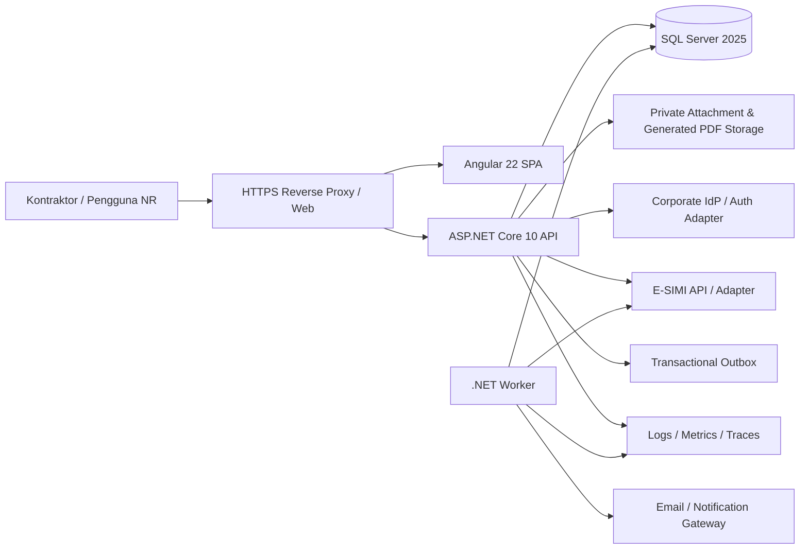
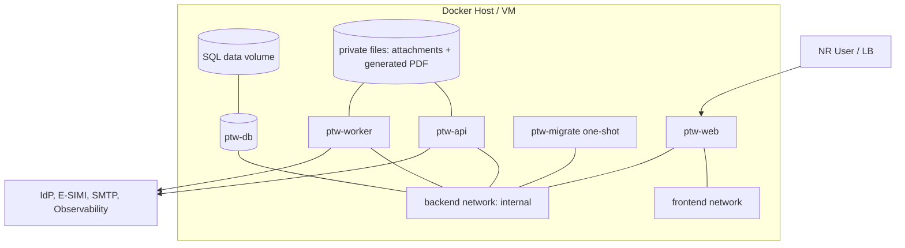

# Functional Specification Document (FSD)
## Nusantara Regas Permit to Work Online

| Atribut | Nilai |
| --- | --- |
| Versi | 1.7 — tiga lokasi aktif dan pembaruan pemilik wilayah |
| Tanggal | 16 September 2026 |
| Status | Draft untuk review Arsitektur, Security, Operasi, HSSE, dan Delivery |
| Input | [BRD v1.7](BRD-NR-PTW-Online-v1.7-ID.md), [PRD v1.7](PRD-NR-PTW-Online-v1.7-ID.md) |
| Arsitektur | Modular monolith, REST API, SPA, asynchronous worker |
| Platform | ASP.NET Core 10 / .NET 10 LTS; Angular 22; SQL Server 2025; Docker Compose V2 |

## 1. Tujuan dan batas spesifikasi

FSD ini menjelaskan bagaimana requirement PTW diwujudkan secara fungsional dan teknis. Dokumen ini bukan pengganti SOP dan tidak menetapkan nilai ambang keselamatan yang belum disahkan. Pada rilis awal ORF, Site Office, dan Water-Based Activity, sistem mengelola pengajuan sampai penerbitan serta penutupan, sedangkan gas test, revalidasi harian, dan tanda tangan lapangan dilakukan pada hardcopy yang dihasilkan sistem. Template, checklist, requirement dokumen, SLA, retensi, otoritas, dan configuration bundle dimodelkan secara berversi per lokasi.

## 2. Keputusan arsitektur

| ADR | Keputusan | Alasan / konsekuensi |
| --- | --- | --- |
| ADR-001 | Modular monolith | Scope NR lebih kecil; transaksi lintas domain dan operasi lebih sederhana daripada microservices. Batas modul tetap ditegakkan agar dapat diekstrak kelak. |
| ADR-002 | Angular SPA + ASP.NET Core API | Pemisahan UI/API, responsive field UX, kontrak OpenAPI, dan integrasi yang jelas. |
| ADR-003 | SQL Server sebagai source of truth PTW | Konsistensi transaksi, referential integrity, temporal/concurrency support, dan teknologi pilihan pengguna. |
| ADR-004 | Integrasi E-SIMI melalui adapter/API | Menghindari coupling ke Laravel/MySQL dan shared database. Snapshot referensi tetap disimpan untuk audit. |
| ADR-005 | Synchronous core, asynchronous side effects | State+audit+outbox commit atomik; email/webhook/report berat diproses Worker. |
| ADR-006 | Explicit state machine | Tidak ada perubahan status generik; setiap command memiliki guard, policy, transaction, audit, dan event. |
| ADR-007 | Docker Compose Specification | Environment konsisten. Produksi single-host harus menerima batas HA; multi-host memerlukan keputusan platform lain. |
| ADR-008 | Configuration-as-versioned-data | Requirements, checklist, authority, print template, dan campaign assets dapat berubah tanpa kehilangan interpretasi historis. |
| ADR-009 | Hybrid digital-to-paper field execution | Bagian pengajuan/keputusan digital; gas test, revalidasi harian, dan completion/handback pada hardcopy. Close merekonsiliasi scan/foto ke print package resmi. |
| ADR-010 | Immutable print snapshot + asynchronous rendering | Approval penerbitan mengunci snapshot dalam transaksi; Worker merender PDF. Kegagalan renderer dapat diulang tanpa mengubah keputusan. |
| ADR-011 | Location release feature flag | ORF, Site Office, dan Water-Based Activity merupakan tiga lokasi rilis awal. Setiap lokasi hanya menerima submission setelah configuration bundle-nya disahkan dan `LocationRelease` berstatus `PILOT` atau `ACTIVE`; HO dan FSRU default `DISABLED`. |

## 3. System context dan container



### 3.1 Container responsibility

| Container/service | Tanggung jawab | Scale awal |
| --- | --- | --- |
| `ptw-web` | Build Angular, serve static assets, reverse proxy `/api`, TLS terminasi bila tidak ada LB eksternal | 1 |
| `ptw-api` | REST API, authorization, domain commands/queries, upload/download, OpenAPI, health | 1–2 |
| `ptw-worker` | Outbox dispatch, notification, E-SIMI polling, reminders, expiry, maintenance jobs | 1 dengan distributed lock |
| `ptw-db` | SQL Server 2025 persistent database | 1; HA di luar baseline Compose |
| `ptw-migrate` | One-shot schema migration dan seed minimum | Per deployment |
| observability eksternal/opsional | Collector/log/metrics sesuai standar TI NR | Ditentukan TI |

## 4. Struktur solusi dan modul

```text
src/
  Ptw.Api/                    HTTP, auth middleware, OpenAPI, health
  Ptw.Worker/                 outbox, PDF rendering, reminders, integration jobs
  Ptw.Application/            use cases, commands, queries, policies
  Ptw.Domain/                 aggregates, value objects, state machine, rules contracts
  Ptw.Infrastructure/         EF Core, SQL Server, storage, IdP, E-SIMI, messaging
  Ptw.Contracts/              API DTOs and integration contracts
  web/                        Angular workspace
tests/
  Unit/ Integration/ Architecture/ E2E/
deploy/
  compose/ nginx/ scripts/ monitoring/
```

Functional modules:

1. Identity, Contractor Access & Authorization
2. Permit Management
3. Classification, Checklist & Requirements
4. Documents, Print Package & Field Evidence
5. Workflow & Decisions
6. Renewal, Suspension & Closure
7. E-SIMI Integration
8. Notification & Scheduler
9. Dashboard, Reporting & Print
10. Administration & Audit

Modul berkomunikasi melalui application interfaces/domain events, bukan query langsung ke tabel milik modul lain dari controller.

## 5. Spesifikasi state machine

### 5.1 Transition matrix

| Command | Dari | Ke | Aktor | Guard utama |
| --- | --- | --- | --- | --- |
| `SubmitPermit` | DRAFT/REVISION_REQUIRED | UNDER_VALIDATION | Kontraktor/User Sponsor | Lokasi termasuk `ORF`/`SITE_OFFICE`/`WATER_BASED` dan configuration bundle aktif, versi terkini, JSA/requirement lengkap, E-SIMI policy lulus, dokumen aman; membuat satu task validasi HSE |
| `ValidateSubmission` | UNDER_VALIDATION | AWAITING_AREA_APPROVAL | PIC HSE | Task aktif; hasil valid pada versi sama → Awaiting Area Approval |
| `RequestRevision` | UNDER_VALIDATION/AWAITING_AREA_APPROVAL | REVISION_REQUIRED | PIC/Area Approver | Task aktif, komentar dan reason code |
| `RejectPermit` | UNDER_VALIDATION/AWAITING_AREA_APPROVAL | REJECTED | PIC/Area Approver sesuai policy | Otorisasi dan alasan |
| `ApproveAndIssuePermit` | AWAITING_AREA_APPROVAL | ISSUED | Manager pemilik wilayah atau pengganti resmi | Validasi HSE valid; Manager/acting assignment aktif; owner mapping sesuai lokasi, location release/bundle aktif, SoD, current version, JSA/requirements, validity; commit decision+issue+print snapshot |
| `SuspendPermit` | ISSUED | SUSPENDED | Authorized actor/system | Reason; instruksi pencatatan hardcopy tetap ditampilkan |
| `ResolveSuspension` | SUSPENDED | ISSUED | Authority sesuai sebab | Resolution tercatat; revalidasi hardcopy diwajibkan sebelum kerja dilanjutkan |
| `CreateRenewal` | ISSUED/EXPIRED | DRAFT | Kontraktor/User Sponsor | Lineage, periode baru ≤7 hari, no-overlap; tidak menyalin attachment/decision/field evidence |
| `RequestClosure` | ISSUED/EXPIRED/SUSPENDED | CLOSURE_REQUESTED | User Sponsor | `SIGNED_FIELD_COPY` clean dan current; completion acknowledgement; tidak ada closure task aktif |
| `RequestClosureEvidenceReplacement` | CLOSURE_REQUESTED | CLOSURE_REQUESTED | Pemilik area | Catatan/alasan wajib; task kembali ke Sponsor, file lama tidak dihapus |
| `ClosePermit` | CLOSURE_REQUESTED | CLOSED | Pemilik area | Evidence current/clean/readable, print-package match, handback/completion confirmed |
| `CancelPermit` | DRAFT/UNDER_VALIDATION/REVISION_REQUIRED | CANCELLED | Pengaju/authorized authority | Reason, tidak ada work aktif |
| `ExpirePermit` | ISSUED/SUSPENDED | EXPIRED | Worker | `validUntil <= now`; tidak menghapus hak untuk mengajukan closure/renewal sesuai policy |

### 5.2 Invariant domain

- satu Permit mempunyai satu current version;
- official permit number unik dan tidak berubah;
- version yang sudah menjadi dasar keputusan tidak diedit in-place;
- Closed, Rejected, dan Cancelled bersifat terminal. Expired tidak dapat kembali bekerja, tetapi tetap dapat menjadi sumber renewal atau masuk proses closure sesuai policy;
- setiap transition dan audit event memakai transaction yang sama;
- command wajib membawa expected `rowVersion` dan idempotency key;
- submit selalu membuat tepat satu validation task untuk PIC HSE yang langsung aktif pada PermitVersion yang sama;
- status hanya menjadi AWAITING_AREA_APPROVAL bila validation task PIC HSE berkeputusan `VALID` pada current PermitVersion;
- jika PIC HSE meminta revisi atau menolak, approval task tidak dibuat dan seluruh hasil tetap diaudit;
- `AreaOwnerDepartmentId` diturunkan dari master lokasi efektif, bukan input bebas pengaju;
- Area Approver harus merupakan Manager pada departemen pemilik area atau acting approver dengan penugasan resmi yang masih efektif dan menunjuk Manager principal yang digantikan;
- `ApproveAndIssuePermit` hanya dapat dijalankan Manager pemilik area/pengganti resmi; tidak ada task digital `IssuePermit` terpisah pada pilot;
- task approval tidak dapat dialihkan secara ad hoc; expiry/revocation acting assignment sebelum command memblokir keputusan dan memicu reroute;
- hanya location code `ORF`, `SITE_OFFICE`, dan `WATER_BASED` yang dapat submit pada rilis awal; masing-masing `LocationRelease` harus `PILOT` atau `ACTIVE` dan menunjuk configuration bundle yang disahkan; `HO`, `FSRU`, serta lokasi lain diblokir sampai activation decision tersedia;
- tidak ada penerbitan apabila current time/validity, E-SIMI policy, mandatory requirement, authorization, SoD, atau current version gagal;
- status `ISSUED` tidak merepresentasikan revalidasi harian; izin bekerja saat itu masih memerlukan isian/tanda tangan hardcopy dan kondisi aman;
- `PrintPackageSnapshot` memakai exact PermitVersion, keputusan, template version, requirement evaluation, dan campaign asset version pada saat issuance;
- PDF official tidak dapat dirender dari Draft atau version non-current; preview harus ber-watermark `DRAFT/TIDAK BERLAKU`;
- renewal selalu Permit baru dengan `parentPermitId`/`renewedFromId`, periode tidak overlap, dan tidak menyalin attachment/approval/evidence;
- close hanya terjadi setelah evidence hardcopy current terhubung ke `PrintPackageId`; PIC HSE tidak memiliki closure approval task.

## 6. Desain use case utama

### UC-01 Membuat dan submit PTW

**Precondition:** Kontraktor/User Sponsor authenticated dan memiliki scope; untuk Kontraktor, company assignment, Sponsor NR, serta masa akses valid; lokasi termasuk ORF, Site Office, atau Water-Based Activity dan configuration bundle lokasi aktif; referensi E-SIMI tersedia sesuai mode integrasi.

1. UI mencari E-SIMI bila adapter tersedia; fallback meminta nomor E-SIMI dan memberi label `MANUAL_VERIFIED` setelah pemeriksaan yang ditetapkan.
2. API menyimpan external reference/snapshot atau manual verification evidence lalu membuat Draft pada salah satu lokasi aktif dan menurunkan `AreaOwnerDepartmentId` dari master efektif.
3. Kontraktor/User Sponsor mengisi wizard Bagian 1-5/7: pekerjaan, pihak, kelas/jenis, CLSR/SIMOPS, safety equipment, JSA/dokumen, isolation/precaution. Tidak ada authoring bahaya/pengendalian yang menduplikasi JSA.
4. API mengevaluasi requirement matrix dan mengembalikan missing checklist/documents serta route proyeksi. Item tambahan boleh dibuat dengan alasan; item standar tidak dapat dihapus.
5. Pada submit, API mengulang validasi, mengalokasikan nomor, membekukan PermitVersion, menyimpan requirement/route/owner snapshot, lalu membuat tepat satu task validasi untuk PIC HSE dalam transaksi yang sama.
6. Respons `202/200` berisi status UNDER_VALIDATION, nomor, version, validation summary, dan ETag.

**Failure:** 409 version conflict/rule conflict, 422 validation, 403 scope, 503 dependency hanya bila link belum pernah divalidasi dan tidak dapat diverifikasi.

### UC-02 Validasi HSE, revisi, dan approval

Satu validation task aktif untuk PIC HSE setelah submit. PIC HSE membuka task, memperoleh decision context dan diff, lalu memilih Validate, Request Revision, Reject, atau Escalate. Command mengunci task secara logis, memeriksa assignment/authority, dan mencatat evidence. Setelah hasil `VALID` pada version yang sama, sistem membuat Area Approval task berdasarkan `AreaOwnerDepartmentId`. Task ditujukan kepada Manager aktif atau acting approver yang penugasannya sah. Revisi membuat version baru dan menginvalidasi hasil validasi sebelumnya. Approval hanya berlaku pada exact current version, route snapshot, pemilik wilayah, serta assignment Manager/pengganti yang efektif saat keputusan. Routing wajib mengikuti lokasi: ORF ke Departemen Distribusi Gas dan Pengelolaan ORF; Site Office ke Departemen General Affair; Water-Based Activity ke Departemen Transport & Operasi FSRU. Tidak satu pun departemen pemilik wilayah tersebut menjadi validator HSE.

```mermaid
sequenceDiagram
    actor P as Kontraktor/User Sponsor
    participant API as PTW API
    participant R as Location Owner Resolver
    actor H as PIC HSE
    actor A as Manager pemilik wilayah / pengganti resmi
    P->>API: Submit PTW
    API->>R: Resolve active location + effective owner
    R-->>API: ORF→Distribusi Gas ORF / Site Office→GA / Water-Based→Transport & Operasi FSRU
    API-->>H: Task validasi HSE
    H->>API: VALID / REVISION / REJECT
    alt Hasil VALID pada versi sama
        API-->>A: Area approval task sesuai lokasi dan assignment
        A->>API: Approve & issue + capacity/acting assignment
        API->>API: Commit ISSUED + immutable print snapshot
        API-->>P: DITERBITKAN; PDF diproses Worker
    else Revisi atau menolak
        API-->>P: Perbaiki pengajuan / proses ditolak
    end
```

### UC-03 Approval penerbitan dan paket cetak

`ApproveAndIssuePermit` menjalankan seluruh guard server-side dan dalam satu transaction menyimpan Decision, status `ISSUED`, `PrintPackageSnapshot`, AuditEvent, dan OutboxMessage. Worker merender paket menggunakan exact snapshot dan template version: halaman Bagian 1-7 yang terisi, bukti persetujuan elektronik, lembar gas test/revalidasi/completion/handback manual, QR/reference, serta campaign asset. Kegagalan render tidak mengembalikan status izin; worker melakukan retry dan Support melihat error. Sebelum mengunduh, UI menjelaskan bahwa gas test/readiness/revalidasi/tanda tangan hardcopy tetap wajib sebelum kerja.

### UC-04 Suspend dan resume

Suspend adalah command prioritas: merekam reason/source/time, mengubah state, audit, dan outbox dalam transaksi. Petugas tetap mengikuti pencatatan/penandaan hardcopy sesuai SOP. `ResolveSuspension` mengembalikan PTW ke `ISSUED`, tetapi UI mewajibkan acknowledgement bahwa revalidasi hardcopy dilakukan sebelum pekerjaan dilanjutkan.

### UC-05 Renewal

`CreateRenewal` membuat Permit baru dengan lineage, periode baru maksimum tujuh hari, dan no-overlap guard. Hanya allowlist field dasar yang dapat dicopy; daftar attachment kosong. Renewal harus melalui submit, validasi PIC HSE, approval penerbitan, dan paket cetak baru. Jumlah maksimum renewal serta definisi hari kalender/kerja adalah konfigurasi yang belum boleh di-hardcode sebelum keputusan OPN-010.

### UC-06 Upload hardcopy dan close

Sponsor memilih paket cetak yang menjadi sumber, mengunggah `SIGNED_FIELD_COPY`, melihat preview semua halaman, mengisi completion acknowledgement, lalu `RequestClosure`. Malware/type/size/file status dan reference match diperiksa. Pemilik area membuka task, membandingkan metadata dengan hardcopy, lalu `RequestClosureEvidenceReplacement` atau `ClosePermit`. Keputusan close menyimpan aktor, waktu, statement, file IDs+hash, dan PermitVersion. PIC HSE tidak diberi task keputusan, tetapi read model dan rekap memperlihatkan hasil sesuai scope.

## 7. Rules engine dan otorisasi

### 7.1 Input dan output rule

Input adalah normalized facts dari current PermitVersion: permit class, work type, location attributes, applicable CLSR, SIMOPS, schedule, contractor type, equipment, energy sources, JSA metadata, dan user action. Output: requirement codes, document/checklist, safety equipment, kebutuhan lembar gas test, review route, authority policy, print template/campaign asset, SoD, expiry, dan explanation. Rincian bahaya/pengendalian tidak direka ulang di domain PTW; JSA menjadi dokumen sumber.

Rules menggunakan model keputusan deklaratif tersimpan dalam database (condition groups + operators allowlist), bukan kode script bebas. Publish melakukan compile/validation, overlap/conflict detection, sample simulation, approval, checksum, dan effective dating. `RuleEvaluationSnapshot` menyimpan input hash, outputs, matched rule IDs, version, dan waktu.

### 7.2 Policy authorization

Keputusan akses:

```text
allow = authenticated
     AND role permits action
     AND contractor company/sponsor assignment permits record when external
     AND location scope covers permit
     AND department scope equals area owner for approve-and-issue/close
     AND (approve-and-issue implies manager principal OR active formal acting assignment)
     AND acting assignment, when used, names the manager principal and covers department/location/risk
     AND permit class/risk within authorization
     AND authorization and competency active at command time
     AND state allows command
     AND separation-of-duty passes
     AND expected record version matches
```

Tambahan SoD: aktor yang menjadi Sponsor tidak boleh menyelesaikan validation task HSE pada permit yang sama. Khusus pegawai HSE yang menjadi Sponsor, sistem mencari validator HSE alternatif; task tidak boleh dilewati atau self-validated.

Frontend boleh menyembunyikan aksi untuk UX tetapi API selalu mengevaluasi ulang. Query memakai row-level scope filter; attachment memeriksa parent permit.

Untuk `ApproveAndIssuePermit`, policy menghasilkan `ApprovalCapacity = MANAGER | ACTING_FOR_MANAGER`. Pada kapasitas `ACTING_FOR_MANAGER`, command wajib membawa `ActingAssignmentId`; server memuat ulang assignment, memverifikasi principal Manager, dasar penugasan, maker-checker, effective dates, status, scope, dan SoD. Nama principal, aktor aktual, posisi, serta ID penugasan disimpan sebagai snapshot keputusan dan paket cetak. Forward task atau perubahan assignee tidak pernah cukup untuk memberi authority.

### 7.3 Resolver pemilik area

| LocationCode | Nama lokasi | AreaOwnerDepartmentCode | Nama departemen |
| --- | --- | --- | --- |
| `HO` | HO | `GENERAL_AFFAIR` | Departemen General Affair — `DISABLED`, target rollout |
| `ORF` | ORF | `DISTRIBUSI_GAS_ORF` | Departemen Distribusi Gas dan Pengelolaan ORF — **aktif** |
| `SITE_OFFICE` | Site Office | `GENERAL_AFFAIR` | Departemen General Affair — **aktif** |
| `FSRU` | FSRU | `TRANSPORT_OPERASI_FSRU` | Departemen Transport & Operasi FSRU — `DISABLED`, target rollout |
| `WATER_BASED` | Water-Based Activity | `TRANSPORT_OPERASI_FSRU` | Departemen Transport & Operasi FSRU — **aktif** |

Resolver menggunakan master efektif pada waktu submit dan menyimpan snapshot pada PermitVersion. Selain owner mapping, `cfg.LocationRelease` harus `PILOT` atau `ACTIVE` dan memiliki approved configuration bundle. Seed rilis awal memberi status `PILOT` pada ORF, Site Office, dan Water-Based Activity; HO dan FSRU tetap `DISABLED`. Setiap bundle berdiri sendiri agar satu lokasi dapat dinonaktifkan tanpa membuka akses lokasi lain. Perubahan lokasi setelah submit adalah perubahan material: route dan validasi/approval terdampak diulang. Lokasi multi-area tidak menggunakan default owner; submission diblokir sampai dipecah atau aturan multi-area disahkan.

## 8. Desain API

### 8.1 Konvensi

- Base path `/api/v1`; JSON camelCase; UTC ISO-8601.
- Bearer OIDC atau secure HttpOnly BFF cookie sesuai hasil security design.
- `X-Correlation-ID`, `Idempotency-Key`, `ETag`/`If-Match`.
- Error `application/problem+json`: `type`, `title`, `status`, `code`, `detail`, `traceId`, `errors`, `failedGuards`.
- Semua list server-paged, sort/filter allowlist, default limit 25, maksimum 200.
- OpenAPI dipublikasikan hanya sesuai policy environment.

### 8.2 Endpoint inti

| Method/path | Fungsi |
| --- | --- |
| `GET /me` | Identitas, role, scope, authorization |
| `GET /esimi/search` | Cari izin masuk eligible bila adapter aktif |
| `POST /esimi/manual-verifications` | Catat verifikasi referensi E-SIMI fallback sesuai policy |
| `POST /permits` | Buat draft |
| `GET /permits/{id}` | Detail scoped |
| `PATCH /permits/{id}/draft` | Simpan bagian draft dengan If-Match |
| `POST /permits/{id}/evaluate` | Preview rules/missing requirement |
| `POST /permits/{id}/submit` | Submit/resubmit |
| `POST /permits/{id}/copy` | Copy aman |
| `POST /permits/{id}/renew` | Renewal dengan lineage |
| `POST /tasks/{taskId}/validate` | Validasi oleh PIC HSE; hasil valid membuat task approval pemilik area |
| `POST /tasks/{taskId}/revision` | Minta revisi |
| `POST /tasks/{taskId}/reject` | Tolak |
| `POST /tasks/{taskId}/approve-and-issue` | Approval Manager/pengganti + penerbitan + print snapshot atomik |
| `POST /permits/{id}/suspensions` | Suspend |
| `POST /permits/{id}/suspensions/{sid}/resolve` | Selesaikan sebab suspend |
| `POST /permits/{id}/closure-requests` | Sponsor request close dengan field-copy IDs dan acknowledgement |
| `POST /closure-tasks/{taskId}/request-evidence` | Pemilik area meminta bukti ulang |
| `POST /closure-tasks/{taskId}/close` | Pemilik area memverifikasi dan menutup PTW |
| `POST /permits/{id}/attachments` | Upload evidence |
| `GET /permits/{id}/attachments/{aid}/content` | Authorized download |
| `GET /tasks` | My task queue |
| `GET /operations/board` | Operational board |
| `GET /reports/permits` | Search/report |
| `GET /permits/{id}/print-packages` | Daftar paket cetak dan status render |
| `GET /permits/{id}/print-packages/{pid}/content` | Authorized official PDF download |
| `POST /permits/{id}/print-packages/{pid}/retry` | Retry render oleh Support berwenang, idempotent |
| `/admin/v1/...` | Master, rules, authorization, integration ops |

### 8.3 Idempotency

`Idempotency-Key` unik per caller+operation. Server menyimpan request hash, status, response reference, dan expiry. Key sama+payload sama mengembalikan hasil pertama; payload berbeda mengembalikan 409. Transition tidak boleh dijalankan ulang walau client timeout.

## 9. Desain data SQL Server

### 9.1 Schema ownership

| Schema | Isi |
| --- | --- |
| `ptw` | permit, version, work classification, parties, checklist/CLSR, lifecycle/renewal |
| `wf` | tasks, reviews, decisions, route snapshot |
| `ops` | suspension, closure request/evidence/decision; data lapangan rinci berada pada hardcopy pilot |
| `doc` | immutable print snapshot, generated PDF metadata, template-bound evidence |
| `cfg` | master, requirements, checklists, location release, print/campaign templates |
| `sec` | user reference, role/scope, competency, authorization, delegation |
| `intg` | E-SIMI link/snapshot, inbox, outbox, sync status |
| `audit` | append-only events, access/export log |

### 9.2 Tabel utama

| Tabel | Kolom penting / constraint |
| --- | --- |
| `ptw.Permit` | `Id uniqueidentifier`, `PermitNo`, `Status`, `CurrentVersionId`, `ValidFrom/Until datetimeoffset`, `LocationId`, `AreaOwnerDepartmentId`, submitter type/user/company/sponsor IDs, `ParentPermitId/RenewedFromId`, `RowVersion`; unique PermitNo |
| `ptw.PermitVersion` | PermitId, VersionNo, IsCurrent, content fields, RequirementSetVersionId, PrintTemplateVersionId, `AreaOwnerDepartmentSnapshotId`, ContentHash, CreatedBy/At; unique PermitId+VersionNo; satu current filtered index |
| `ptw.PermitParty` | VersionId, PartyType, external/person/company refs, name snapshot, acknowledgement flags |
| `ptw.WorkClassification` | VersionId, PermitClassCode, WorkTypeCode; unique pair |
| `ptw.ChecklistResponse` | VersionId, ChecklistItemVersionId, response (`YES/NO/NA`), remark; standard item tidak dapat dihapus |
| `ptw.CustomChecklistItem` | VersionId, category, description, reason, createdBy/At; hanya menambah kontrol |
| `ptw.ClsrApplicability` | VersionId, ClsrElementVersionId, applicable, note; unique pair |
| `ptw.SimopsDeclaration` | VersionId, hasSimops, relatedWork/Permit refs, coordination note |
| `ptw.Attachment` | VersionId/ClosureRequestId nullable, category termasuk `JSA`/`SIGNED_FIELD_COPY`, metadata nomor/revisi/tanggal, storage key, safe name, MIME, bytes, SHA-256, malware status, version lineage |
| `ptw.AttachmentRequirementEvaluation` | VersionId, RequirementVersionId, status (`MISSING/SATISFIED/NA`), attachmentId, explanation snapshot |
| `wf.Task` | PermitId, PermitVersionId, TaskType (`HSE_VALIDATION`, `AREA_APPROVE_AND_ISSUE`, `AREA_CLOSE_VERIFICATION`), status, assignee/role/department scope, dueAt, claimedAt, RowVersion. Implementasi yang masih memakai identifier legacy `HSSE_VALIDATION` harus memetakannya ke PIC HSE; tidak boleh membuat task validator kedua. |
| `wf.Decision` | TaskId, decision, reason, statement version, actor aktual, ApprovalCapacity, ActingForUserId/Position snapshot nullable, AuthorizationId, ActingAssignmentId nullable, decidedAt, data hash; append-only |
| `doc.PrintPackageSnapshot` | PermitId, PermitVersionId, decisionId, template/checklist/requirement/campaign version IDs, canonical snapshot JSON, snapshot hash, createdAt; immutable |
| `doc.GeneratedDocument` | PrintPackageId, storage key, MIME, bytes, SHA-256, render status/attempt/error, generatedAt; official flag |
| `ops.Suspension` | PermitId, reason/source, suspended/resolved actor/time, resolution, status |
| `ops.ClosureRequest` | PermitId, PermitVersionId, PrintPackageId, SponsorId, statement/checklist snapshot, status, requestedAt, RowVersion |
| `ops.ClosureEvidence` | ClosureRequestId, AttachmentId, evidence sequence, current flag, linked package hash, submittedAt |
| `ops.ClosureDecision` | ClosureRequestId, task/decision, actor/department, statement/reason, evidence hash set, decidedAt; append-only |
| `cfg.RequirementSet/Requirement` | version/state/effective dates; condition allowlist; type `DOCUMENT/CHECKLIST/PRINT_SECTION/CAMPAIGN_ASSET`; mandatory/NA policy; checksum/maker/checker |
| `cfg.PrintTemplateVersion` | permit class/location, layout/paper size, template asset checksum, field schema version, state/effective dates, maker/checker |
| `cfg.CampaignAssetVersion` | code (`CLSR_10`, `ARAHAN_DIREKSI`, `PERILAKU_WAJIB`), storage key/checksum, version/effective dates, approvedBy |
| `cfg.Location` | code/name, parent, `AreaOwnerDepartmentId`, effective dates, active; satu owner efektif per tanggal |
| `cfg.LocationRelease` | LocationId, status (`DISABLED/PILOT/ACTIVE`), ConfigurationBundleId, effective dates, approvedBy/At; seed ORF/Site Office/Water-Based Activity=`PILOT`, HO/FSRU=`DISABLED` |
| `cfg.Department` | code/name; General Affair, Distribusi Gas dan Pengelolaan ORF, Transport & Operasi FSRU serta master terkendali lain |
| `sec.ExternalUserCompany` | UserId, CompanyId, NrSponsorUserId, effective dates, verification/revocation state |
| `sec.UserAuthorization` | UserId, role/action, location/department, class, max risk, competency ref, effective dates, issuer, state |
| `sec.ActingAssignment` | PrincipalManagerUserId/PositionId, ActingUserId, document no/reference, department/location/risk scope, effectiveFrom/Until, reason, issuedBy, checkedBy, state, revokedBy/At; tidak boleh overlap konflik untuk scope yang sama |
| `intg.ESimiLink` | PermitId, external ID/no, status snapshot, payload hash, lastCheckedAt, sync state |
| `intg.OutboxMessage` | event ID/type, aggregate, payload, occurredAt, attempts, nextAttempt, processedAt, error |
| `intg.InboxMessage` | source/message ID unique, payload hash, received/processedAt, result |
| `audit.AuditEvent` | sequence, permit, event type, actor, timestamp, before/after hash or safe diff, correlation; append-only |

### 9.3 Data rules

- primary key GUID v7/sequential GUID untuk mengurangi fragmentasi; nomor bisnis terpisah;
- `datetimeoffset` disimpan UTC; UI mengubah ke Asia/Jakarta;
- `rowversion` untuk optimistic concurrency;
- foreign keys dan check constraints aktif; soft-delete/effective dating untuk referenced master;
- filtered indexes pada current version, task yang masih aktif, current closure evidence, dan unprocessed outbox;
- unique logical constraint mencegah lebih dari satu task aktif untuk kombinasi PermitVersion + mandatory validation type;
- publication master Location gagal jika terdapat gap/overlap owner efektif; permit menyimpan snapshot owner agar perubahan master tidak merutekan ulang keputusan historis;
- index pencarian pada PermitNo, ESIMI No, status, location, sponsor, valid dates;
- lampiran berada di private storage, bukan `varbinary(max)` kecuali hasil arsitektur infrastruktur menentukan lain;
- SQL Server temporal tables dapat dipakai untuk tabel mutable, tetapi tidak menggantikan domain audit append-only;
- application user tidak memiliki `db_owner`; migration user terpisah dan hanya digunakan deployment.

### 9.4 Transaksi kritis

Setiap command transition menulis aggregate, task/decision, audit, dan outbox dalam satu database transaction dengan isolation default Read Committed Snapshot. `ApproveAndIssuePermit` juga menulis immutable `PrintPackageSnapshot` pada transaksi yang sama; file PDF dirender di luar transaction. Locking/serializable lokal atau unique constraint digunakan untuk mencegah alokasi nomor ganda, duplicate approval, duplicate closure task, serta renewal overlap. External call tidak dilakukan di dalam transaksi.

## 10. Integrasi E-SIMI

### 10.1 Kontrak minimum yang dibutuhkan

| Operasi | Data |
| --- | --- |
| Cari/get E-SIMI | external ID, nomor, type/purpose, status, dates, installation/location, requester/sponsor, company/person list |
| Validate eligibility | validity, cancellation/revocation, scope/location/person match |
| Optional status callback | PTW number/current state/link untuk ditampilkan E-SIMI |
| Event/webhook | created/updated/approved/visited/cancelled/expired atau status yang dipetakan |

Adapter menerjemahkan status legacy—termasuk ejaan internal—ke canonical integration status tanpa membocorkannya ke domain PTW. Pada pilot sebelum API tersedia, `ManualESimiVerification` menyimpan nomor, metode cek, verifier, waktu, dan statement; UI memberi label jelas bahwa data tidak tersinkron otomatis. Ketika adapter aktif, snapshot tidak dianggap data hidup; eligibility dicek lagi sebelum submit/penerbitan dan secara berkala untuk izin aktif. Timeout, circuit breaker, limited retry, correlation ID, service credential, dan allowlisted TLS endpoint wajib.

Untuk pengaju Kontraktor, adapter atau identity provisioning harus membuktikan hubungan pengguna–perusahaan–E-SIMI dan Sponsor NR. Klaim dari browser tidak boleh dianggap bukti tanpa validasi server.

### 10.2 Konsistensi dan failure handling

- request synchronous hanya untuk pencarian/validasi yang dibutuhkan pengguna;
- event/polling masuk melalui inbox idempotent;
- update balik melalui outbox Worker;
- E-SIMI unavailable tidak membatalkan transaksi PTW yang sudah committed;
- penerbitan gagal aman bila live validation diwajibkan dan cache freshness melewati policy; mode manual hanya diizinkan oleh configuration policy dan audit;
- admin melihat sync state dan dapat reprocess tanpa mengedit domain state langsung.

## 11. Attachments, print package, dan field-copy evidence

Alur upload: temporary quarantine → size/type/signature validation → SHA-256 → malware scan → private permanent key → metadata commit. File `Pending/Rejected` tidak memenuhi requirement. Nama storage random, Content-Disposition aman, no execute, range/download limits, authorization parent, dan audit. Retensi/orphan cleanup dilakukan Worker. JSA wajib membawa metadata nomor/revisi/tanggal atau identitas versi ekuivalen.

Pipeline paket cetak:

1. `ApproveAndIssuePermit` membuat `PrintPackageSnapshot` immutable dari exact PermitVersion, Decision, requirement/checklist response, owner mapping, dan template/campaign versions.
2. Outbox memicu Worker; Worker mengambil hanya snapshot, bukan tabel mutable terkini.
3. Renderer menghasilkan PDF/A bila library dan kebijakan arsip mendukung, menyematkan font, nomor/QR, hash pendek, watermark/status, serta bukti elektronik.
4. Paket memuat bagian digital form dan lembar manual gas test, revalidasi harian, completion, inspeksi/restorasi/handback, serta halaman 10 CLSR/8 Arahan Direksi/9 Perilaku Wajib dari asset terkontrol.
5. Worker menghitung SHA-256, menyimpan file secara privat, dan menandai `READY`; retry harus menghasilkan output deterministik atau merekam renderer version.
6. QR membuka status live setelah autentikasi; QR saja bukan bukti izin masih berlaku.

Preview Draft memakai template yang sama tetapi selalu diberi watermark `DRAFT/TIDAK BERLAKU`. Bukti approval pada PDF menampilkan nama, jabatan/peran, kapasitas Manager/pengganti, principal yang diwakili, keputusan, dan waktu. Ini disebut **bukti persetujuan elektronik**, bukan tanda tangan digital tersertifikasi, sampai Legal menyetujui mekanisme PSrE.

Field-copy close upload wajib dikaitkan dengan `PrintPackageId`. UI menampilkan preview seluruh halaman dan meminta quality acknowledgement. Pemilik area dapat menolak file tidak lengkap/tidak terbaca dengan reason code; file lama tetap immutable dan evidence baru menjadi current melalui lineage.

## 12. Frontend Angular 22

### 12.1 Struktur

- standalone components dan lazy feature routes;
- Signals untuk state UI lokal; RxJS untuk stream HTTP/asynchronous;
- generated typed API client dari OpenAPI atau kontrak yang dikunci;
- route guards hanya UX; backend tetap authority;
- design system Angular Material/CDK atau sistem NR yang disetujui, dengan theme logo/warna NR;
- reactive forms, stepper/wizard, autosave debounce, offline detection (tanpa menjanjikan offline transaction);
- centralized ProblemDetails mapping, correlation display, toast + inline error;
- CSP-compatible build tanpa inline script tidak terkontrol.

### 12.2 Halaman minimum

Login/landing, My PTW, create wizard sesuai template, JSA/document requirement, detail/timeline, task list/detail, validation dialog, approve-and-issue dialog, print package status/view, renewal wizard, upload/preview hardcopy, closure verification, operations board, search/report, requirement/template simulation, authorization/master administration, integration/notification/render operations.

## 13. Backend ASP.NET Core 10

- controllers/minimal APIs dikelompokkan per feature; application command/query handlers;
- EF Core 10 SQL Server provider; migration terkontrol;
- built-in ProblemDetails, rate limiting, output caching hanya untuk safe reference data;
- policy-based authorization + custom requirement handlers;
- validation domain/application, tidak mengandalkan data annotations saja;
- background Worker terpisah dari API agar restart/scale tidak menggandakan scheduler;
- OpenTelemetry instrumentation dan structured logging;
- `/health/live` hanya process liveness; `/health/ready` memeriksa dependency esensial dengan timeout;
- graceful shutdown, request size/time limit, cancellation tokens, dan bounded concurrency.

## 14. Keamanan

### 14.1 Identity/session

OIDC Authorization Code + PKCE direkomendasikan. Pilihan akhir:

- **token SPA:** access token pendek di memory, strict CORS, refresh sesuai IdP;
- **BFF cookie:** secure HttpOnly SameSite cookie + anti-forgery, token tidak terekspos JS.

BFF lebih disukai bila infrastruktur dan SSO mendukung. Jangan menyimpan token di `localStorage`. MFA mengikuti IdP untuk aksi sensitif bila tersedia.

Akun Kontraktor menggunakan identity realm/federation atau managed account yang disetujui TI. Provisioning harus mengikat user ke perusahaan, Sponsor NR, masa aktif, dan scope E-SIMI/PTW; deprovisioning otomatis/terjadwal memblokir akses setelah kontrak/assignment berakhir. Kontraktor tidak boleh memperoleh role PIC, Area Approver/Issuer, Closure Verifier, atau Administrator melalui claim eksternal.

### 14.2 Controls

- TLS 1.2+; HSTS, CSP, frame-ancestors, nosniff, referrer policy;
- input allowlist, parameterized EF query, output encoding, no dynamic SQL tanpa allowlist;
- rate limit login/search/export/upload dan command sensitif;
- secrets tidak di-commit, tidak muncul di log, dan dirotasi;
- database network tidak dipublish ke user network kecuali admin path terkendali;
- container non-root bila image mendukung, read-only filesystem untuk web/API, drop capabilities, resource limits;
- image/SBOM/dependency scan, signed artifact bila pipeline mendukung;
- admin maker-checker dan break-glass terpisah, dengan alert/audit;
- audit log append-only dan diekspor ke log platform/SIEM bila tersedia.

Threat model wajib mencakup IDOR, privilege escalation, forged approval, stale/concurrent command, file upload, SSRF melalui integration, replay/idempotency, rule tampering, log injection, secret exposure, and denial of service.

## 15. Docker Compose dan deployment

### 15.1 Topologi



### 15.2 Compose skeleton

Contoh ini kontrak deployment, bukan file produksi siap pakai. Tag/digest dan secret diisi pipeline/infrastructure repository.

```yaml
name: nr-ptw

services:
  web:
    image: ${PTW_WEB_IMAGE:?set-a-pinned-image}
    ports:
      - "${PTW_HTTPS_PORT:-8443}:8443"
    depends_on:
      api:
        condition: service_healthy
    networks: [frontend, backend]
    restart: unless-stopped

  api:
    image: ${PTW_API_IMAGE:?set-a-pinned-image}
    environment:
      ASPNETCORE_ENVIRONMENT: ${PTW_ENVIRONMENT:-Production}
      ConnectionStrings__PtwDb: ${PTW_DB_CONNECTION:?inject-securely}
    depends_on:
      migrate:
        condition: service_completed_successfully
    volumes:
      - private-files:/app/private-files
    healthcheck:
      test: ["CMD", "wget", "--spider", "-q", "http://localhost:8080/health/ready"]
      interval: 30s
      timeout: 5s
      retries: 5
      start_period: 30s
    networks: [backend]
    restart: unless-stopped

  worker:
    image: ${PTW_WORKER_IMAGE:?set-a-pinned-image}
    environment:
      ConnectionStrings__PtwDb: ${PTW_DB_CONNECTION:?inject-securely}
    depends_on:
      migrate:
        condition: service_completed_successfully
    volumes:
      - private-files:/app/private-files
    networks: [backend]
    restart: unless-stopped

  migrate:
    image: ${PTW_MIGRATOR_IMAGE:?set-a-pinned-image}
    environment:
      ConnectionStrings__PtwDb: ${PTW_MIGRATION_CONNECTION:?inject-securely}
    depends_on:
      db:
        condition: service_healthy
    networks: [backend]
    restart: "no"

  db:
    image: ${PTW_SQL_IMAGE:?pin-sqlserver-2025-cu-and-digest}
    environment:
      ACCEPT_EULA: "Y"
      MSSQL_PID: ${PTW_SQL_EDITION:-Standard}
      MSSQL_SA_PASSWORD: ${PTW_SQL_BOOTSTRAP_PASSWORD:?development-only-or-secure-bootstrap}
    volumes:
      - sql-data:/var/opt/mssql
    networks: [backend]
    restart: unless-stopped
    healthcheck:
      test: ["CMD-SHELL", "/opt/mssql-tools18/bin/sqlcmd -C -S localhost -U sa -P \"$$MSSQL_SA_PASSWORD\" -Q \"SELECT 1\" -b -o /dev/null"]
      interval: 15s
      timeout: 10s
      retries: 10
      start_period: 60s

networks:
  frontend: {}
  backend:
    internal: true

volumes:
  sql-data: {}
  private-files: {}
```

Catatan:

- pastikan utility healthcheck benar-benar tersedia pada tag SQL image yang dipilih; verifikasi di CI;
- jangan expose port 1433 di produksi kecuali kebutuhan administrasi terkendali;
- password environment pada skeleton bukan pola secret produksi. Gunakan secret manager/pipeline injection/Compose secret dengan entrypoint yang telah direview; jangan commit `.env`;
- aplikasi tidak memakai `sa`; bootstrap membuat login migration dan application yang least-privilege, lalu SA dinonaktifkan/dibatasi sesuai prosedur DBA;
- `service_healthy` dan `service_completed_successfully` mengatur urutan startup, bukan menjamin runtime availability;
- named volume harus dipetakan ke storage persisten dan dicakup backup; attachment/PDF idealnya storage/object share terproteksi. Pada multi-host, jangan memakai local volume yang tidak dibagi;
- image Worker wajib memuat font resmi/template renderer yang dipin dan diuji; asset logo/kampanye tidak diambil dari internet saat render;
- Compose produksi memakai override terkontrol untuk resource limits, TLS certificate/config, logs, secrets, dan monitoring;
- pin image ke patch/CU/digest. `mcr.microsoft.com/mssql/server:2025-latest` boleh untuk eksplorasi, bukan produksi.

### 15.3 Pipeline dan release

1. lint/build/test backend dan frontend;
2. SAST, SCA, secret scan, container/IaC scan, SBOM;
3. build immutable images dengan commit/version labels dan non-root runtime;
4. integration/E2E menggunakan Compose dan SQL Server 2025;
5. publish image ke private registry, sign/pin digest;
6. backup/check compatibility; jalankan migrator one-shot;
7. deploy web/API/worker, readiness/smoke test;
8. progressive rollout/maintenance window dan rollback application image;
9. database memakai forward-fix/expand-contract; destructive migration dilarang dalam satu langkah.

## 16. Observability dan operasi

### 16.1 Telemetry

- structured JSON logs: timestamp, severity, service, environment, trace/correlation, user pseudonymous ID, permit ID, action, outcome, duration; tanpa secret/PII/file content;
- metrics: request rate/error/latency, DB pool/query, active tasks, outbox age/failure, E-SIMI latency/error, notification failure, PTW issued/suspended/expiring/closure-pending, print render latency/failure/retry, dan field-copy upload rejection;
- distributed traces untuk API→DB dan API/Worker→E-SIMI/notification;
- business alerts: issuance tanpa validasi HSE/decision (seharusnya mustahil), official PDF gagal dirender, expiry imminent, stuck validation/closure, unresolved suspend, outbox backlog, dan backup failure.

### 16.2 Runbook minimum

Start/stop/restart, deployment/rollback, migration failure, E-SIMI outage, notification backlog, disk/volume full, certificate/secret rotation, user access incident, rules rollback via new version, backup/restore, suspected audit tampering, dan contingency paper reconciliation.

## 17. Backup, DR, dan kapasitas

- SQL full + differential/log backup sesuai target RPO; backup dienkripsi, off-host, retention tervalidasi;
- private attachment storage dibackup konsisten dengan metadata;
- restore drill ke isolated environment sebelum go-live dan berkala;
- target awal RPO 15 menit/RTO 4 jam, dikonfirmasi TI;
- monitor CPU, memory, IOPS, DB/log growth, attachment growth, connection pool, and container restarts;
- baseline load: 200 concurrent users, 50.000 PTW/tahun, 10 attachment/PTW; sizing final berdasarkan pilot;
- Compose satu host tidak memenuhi HA terhadap kegagalan host. Jika availability mengharuskan failover, gunakan SQL HA/managed database dan orchestrator/LB yang disetujui di luar baseline ini.

## 18. Testing specification

| Lapisan | Cakupan |
| --- | --- |
| Unit | aggregate invariants, transition guards, requirement evaluator, renewal overlap, print snapshot, authorization policies |
| Architecture | dependency direction, module boundaries, no forbidden data access |
| Integration | ASP.NET API + SQL Server container, transactions, concurrency, migrations, outbox/inbox |
| Contract | OpenAPI compatibility dan E-SIMI provider/consumer fixtures |
| Frontend | Angular components/forms, state, error, accessibility |
| Document | golden-file/visual regression tiga kelas izin, QR, approval block, A4/A3 pagination, field-writing space, fonts/logo/campaign assets |
| E2E | Playwright untuk UAT scenarios PRD |
| Security | auth matrix, IDOR, CSRF/CORS, upload, injection, replay, rate limit, admin/SoD |
| Performance | load, soak, large search/export/upload, worker backlog |
| Resilience | DB restart, E-SIMI timeout, duplicate webhook, SMTP fail, worker restart, disk threshold |
| DR | backup restore, image rollback, forward migration recovery |

Quality gate: semua Must acceptance lulus; critical/high security issue ditutup atau diterima formal; coverage risk-critical domain ditargetkan ≥ 90% branch; tidak ada state transition tanpa negative tests.

Test wajib tambahan untuk flow v1.7: submit membuat tepat satu task validasi HSE; hasil valid pada versi sama membuat tepat satu approve-and-issue task; pegawai HSE yang menjadi Sponsor tidak dapat self-validate; revisi/penolakan menghentikan gate; retry tidak menggandakan task; perubahan JSA/versi membatalkan validasi terdampak; ORF/Site Office/Water-Based Activity diterima hanya dengan bundle aktif; HO/FSRU/lokasi lain ditolak; routing owner ORF→Distribusi Gas dan Pengelolaan ORF, Site Office→General Affair, Water-Based Activity→Transport & Operasi FSRU diuji positif dan negatif; Manager dapat approve-and-issue; pengganti resmi dapat bertindak atas nama principal; delegasi informal/tidak efektif/expired/revoked/scope salah/risk limit kurang ditolak; decision+ISSUED+PrintPackageSnapshot atomik; render failure dapat diretry; PDF memuat seluruh section dan controlled campaign asset; renewal tidak overlap/tidak menyalin file; field copy salah versi/malware/tidak terbaca ditolak; close hanya oleh pemilik wilayah setelah evidence current; HSE tidak memperoleh closure approval task tetapi dapat membaca rekap; serta `ISSUED` selalu menampilkan peringatan kontrol hardcopy.

## 19. Migration dan data awal

MVP tidak harus memigrasikan seluruh kertas historis. Opsi disarankan:

1. master data ORF, Site Office, dan Water-Based Activity beserta owner mapping, otorisasi, requirement/checklist, template cetak, dan campaign assets diimpor dengan maker-checker; HO dan FSRU diimpor sebagai `DISABLED` bila diperlukan untuk rollout berikutnya;
2. PTW kertas yang masih aktif dimasukkan sebagai controlled opening balance dengan scan dan label `MIGRATED_ACTIVE` setelah verifikasi;
3. histori lama tetap arsip records atau diindeks metadata minimal, bukan direkayasa seolah-olah memiliki digital audit;
4. setiap import menghasilkan dry-run, error report, source checksum, batch ID, actor, dan reconciliation total.

## 20. Matriks traceability implementasi

| BRD | PRD | Komponen/tabel/API | Test utama |
| --- | --- | --- | --- |
| BR-AUT | FR-AUT | Authorization policies; `sec.ExternalUserCompany`, `sec.UserAuthorization`; `/me` | contractor isolation, authorization matrix/IDOR |
| BR-INT | FR-INT | E-SIMI Adapter; `intg.ESimiLink/Inbox/Outbox` | contract, timeout, duplicate event |
| BR-INI/CLS/RSK | FR-PTW/RUL | Permit & Requirements; `ptw.PermitVersion/ChecklistResponse`, `cfg.Requirement*` | wizard/requirement conflict/version/JSA |
| BR-DOC | FR-DOC | Attachment service/table/private storage | malware/type/access/version |
| BR-RVW/APR | FR-RVW/APR | Single HSE validation gate; `wf.Task/Decision`; Location owner resolver | single-task gate, owner routing, SoD, stale version, revision impact |
| BR-APR/ISS/PRN | FR-APR/ISS/PRN | `ApproveAndIssuePermit`; `doc.PrintPackageSnapshot/GeneratedDocument` | authority, atomic issue, PDF/golden file, retry |
| BR-FLD/LIF/WPR/SUS/CLO | FR-FLD/REN/SUS/CLO | `ops.Suspension/Closure*`; renewal/closure APIs; field-copy storage | no-overlap, no-copy, evidence quality/version, close authority |
| BR-DSH/REP | FR-DSH/REP | Query/read models/report API | scope/filter/count/export |
| BR-NOT/AUD | FR-NOT/AUD | Worker/outbox/audit tables | retry, atomicity, immutable history |

## 21. Keputusan sebelum development

Tidak boleh mengunci konfigurasi atau membangun journey final sebelum keputusan BRD OPN-001–012 yang relevan memiliki owner dan decision record. Paling kritis: template/checklist dan configuration bundle ORF/Site Office/Water-Based Activity, Manager/pengganti dan verifier close pada masing-masing departemen pemilik wilayah, definisi tujuh hari/renewal, exact campaign assets, format cetak, status hukum bukti persetujuan, E-SIMI fallback/API, dan akses VPN. Development fondasi dapat berjalan paralel untuk identity abstraction, skeleton modules, Compose, CI, audit/outbox, master framework, renderer spike, dan prototype E-SIMI contract.

## 22. Checklist kesiapan produksi

- SOP/STK untuk ORF, Site Office, dan Water-Based Activity, mapping Bagian 1-10, checklist/document matrix, gas-test field, template print, serta campaign assets disahkan per lokasi;
- threat model, security test, privacy/retention, dan access recertification disetujui;
- E-SIMI contract atau manual-verification fallback, timeout, credential, dan support owner diuji;
- image/tag/digest, license SQL Server, CPU/RAM/storage, TLS/DNS, backup/restore siap;
- monitoring, alert, runbook, on-call, incident dan contingency paper process siap;
- UAT tiga kelas izin, PDF/hardcopy lapangan, renewal, close upload, dan negative paths disetujui HSSE/Operasi;
- training menegaskan `ISSUED` tidak menghapus gas test/revalidasi/tanda tangan hardcopy, serta prosedur suspend/handback/upload close;
- hanya ORF, Site Office, dan Water-Based Activity aktif; HO dan FSRU tetap `DISABLED`; pilot terkontrol, hypercare, KPI baseline, serta rollback decision per lokasi dibuat.

## 23. Referensi resmi teknologi

- [.NET support policy](https://dotnet.microsoft.com/en-us/platform/support/policy/dotnet-core) — .NET 10 LTS aktif dan mencakup ASP.NET Core/EF Core dalam lifecycle .NET.
- [Angular version compatibility](https://angular.dev/reference/versions) dan [release lifecycle](https://angular.dev/reference/releases) — Angular 22 menjadi baseline major dokumen ini.
- [Microsoft SQL Server 2025 Linux container](https://learn.microsoft.com/en-us/sql/linux/quickstart-install-connect-docker?view=sql-server-ver17) dan [container overview](https://learn.microsoft.com/en-us/sql/linux/containers/overview?view=sql-server-ver17).
- [Docker Compose Specification](https://docs.docker.com/compose/compose-file/) dan [startup order/health conditions](https://docs.docker.com/compose/how-tos/startup-order/).

**Versi yang berlaku:** dokumen mengunci major baseline, bukan patch selamanya. .NET patch, Angular patch/minor yang kompatibel, SQL Server CU, base image, dan Compose CLI harus diperbarui melalui dependency policy, regression/security test, dan change management. Produksi tidak menggunakan preview, EOL, atau floating `latest` tag.
