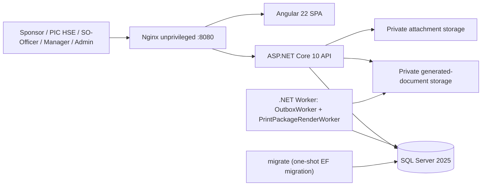
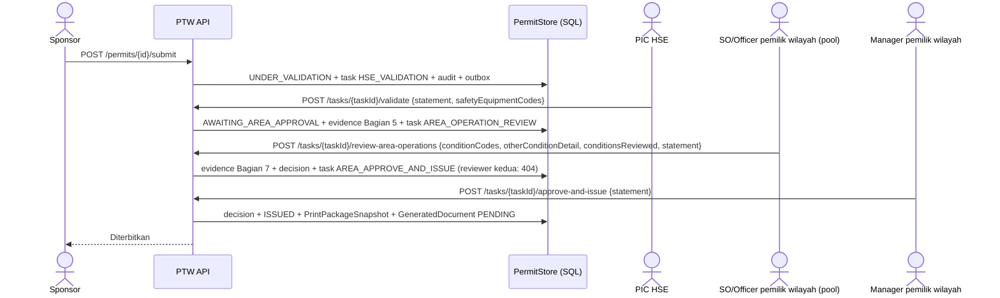
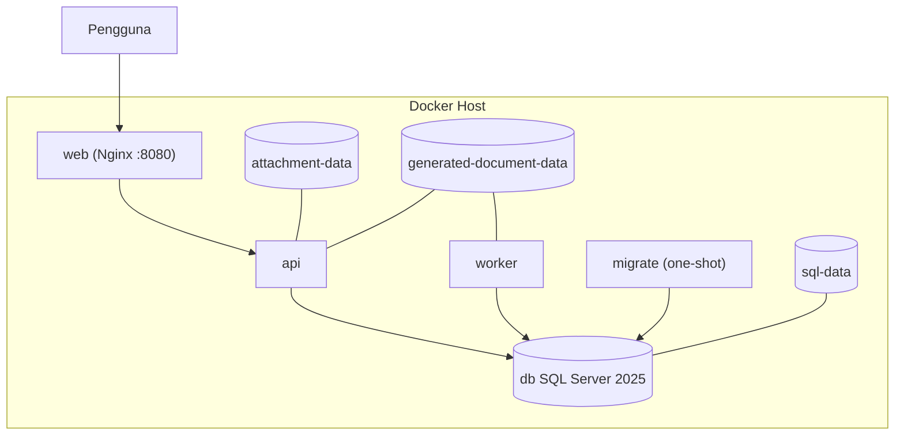

# Functional Specification Document (FSD)
## Nusantara Regas Permit to Work Online

| Atribut | Nilai |
| --- | --- |
| Versi | 1.8 — penyelarasan flow dengan sistem berjalan: review Bagian 7 SO/Officer, pembagian pengisian formulir, renewal dan closure berbasis hardcopy terverifikasi |
| Tanggal | 22 September 2026 |
| Status | Draft untuk review Arsitektur, Security, Operasi, HSSE, dan Delivery |
| Input | [BRD v1.8](BRD-NR-PTW-Online-v1.8-ID.md), [PRD v1.8](PRD-NR-PTW-Online-v1.8-ID.md) |
| Menggantikan | FSD v1.7 (16 September 2026) |
| Arsitektur | Modular monolith, REST API, SPA, asynchronous worker |
| Platform | ASP.NET Core 10 / .NET 10 LTS; Angular 22; SQL Server 2025; Docker Compose V2 |

## 0. Ringkasan perubahan v1.8

| Area FSD | Perubahan |
| --- | --- |
| State machine (Bagian 5) | Command `ReviewAreaOperations` (task `AREA_OPERATION_REVIEW`) ditambahkan di antara `ValidateSubmission` dan `ApproveAndIssuePermit`; `RequestRenewal` tidak lagi membuat draft, tetapi evidence review pada PTW asal; `ApproveRenewal` membuat draft penerus; `ResubmitClosure` dan verifikasi Bagian 10 pada `ClosePermit`; `EscalateValidation` tanpa transisi. |
| Task workflow | Tipe task resmi: `HSE_VALIDATION`, `SPONSOR_REVISION`, `AREA_OPERATION_REVIEW`, `AREA_APPROVE_AND_ISSUE`, `AREA_RENEWAL_REVIEW`, `AREA_CLOSE_VERIFICATION`. Task terikat versi PTW exact; `AssignedActorId` untuk penugasan langsung. |
| Domain formulir | Katalog terkontrol `PermitHeaderClassificationCatalog`, `PermitWorkTypeCatalog`, `PermitSupportingDocumentCatalog`, `PermitMandatoryDocumentCatalog`, `PermitSafetyEquipmentCatalog`, `PermitOperationalConditionCatalog`; evidence `PermitValidationEvidence` (Bagian 5), `AreaOperationsReviewEvidence` (Bagian 7), `PermitApprovalEvidence`. |
| Identitas | Akun lokal (`sec.UserAccount`, `sec.UserCredential`, `sec.UserSignatureVersion`), cookie HTTP-only Development, profil role `UserAuthorizationRoleProfiles`, assignment langsung dengan action code turunan server. |
| Paket cetak | Renderer PDFsharp dua halaman A3 di atas template vektor FM-001/002/003-B-002-NR-B220; `SponsorPrintEvidence` dan `VisualSignatureEvidence` dibekukan ke snapshot; QR/kampanye keluar dari scope. |
| API | Endpoint aktual `/api/v1` (Bagian 8.2) menggantikan daftar endpoint rencana v1.7. |
| Data | Schema aktual (`ptw`, `wf`, `doc`, `sec`, `cfg`, `intg`, `audit`) dan migration additive sampai `BackfillSponsorRevisionTasks`. |

## 1. Tujuan dan batas spesifikasi

FSD ini menjelaskan bagaimana requirement PTW diwujudkan secara fungsional dan teknis pada sistem yang berjalan, serta menandai bagian yang masih backlog. Dokumen ini bukan pengganti SOP dan tidak menetapkan nilai ambang keselamatan yang belum disahkan. Pada rilis awal ORF, Site Office, dan Water-Based Activity, sistem mengelola pengajuan sampai penerbitan, renewal, dan penutupan, sedangkan gas test, revalidasi harian, dan tanda tangan lapangan dilakukan pada hardcopy yang dihasilkan sistem.

## 2. Keputusan arsitektur

| ADR | Keputusan | Alasan / konsekuensi |
| --- | --- | --- |
| ADR-001 | Modular monolith | Scope NR lebih kecil; transaksi lintas domain lebih sederhana. Batas modul ditegakkan lewat arah dependency `Api`/`Worker` → `Application` → `Domain`/`Contracts`; `Infrastructure` mengimplementasikan port. |
| ADR-002 | Angular SPA + ASP.NET Core API | Pemisahan UI/API, ProblemDetails, dan kontrak OpenAPI Development. |
| ADR-003 | SQL Server sebagai source of truth PTW | Konsistensi transaksi, rowversion, referential integrity. |
| ADR-004 | Integrasi E-SIMI melalui adapter/API (backlog) | Rilis awal memakai evidence lampiran E-SIMI; tidak ada shared database. |
| ADR-005 | Synchronous core, asynchronous side effects | State + task + audit + outbox + idempotency commit atomik; render PDF diproses Worker. |
| ADR-006 | Explicit state machine | Tidak ada perubahan status generik; setiap command memiliki guard, policy, transaksi, audit, dan event. |
| ADR-007 | Docker Compose Specification | Environment konsisten; produksi single-host menerima batas HA. |
| ADR-008 | Katalog formulir terkontrol sebagai transkripsi template | Katalog statis di `Ptw.Domain` menjadi otoritas isi Bagian 1/4/5/7 sampai master effective-dated OPN-003 disahkan; perubahan hanya via decision record. |
| ADR-009 | Hybrid digital-to-paper field execution | Bagian pengajuan/keputusan digital; Bagian 6 dan 8–10 pada hardcopy; renewal dan close merekonsiliasi hardcopy ke paket cetak resmi. |
| ADR-010 | Immutable print snapshot + asynchronous rendering | Approval mengunci snapshot; Worker merender; retry tidak mengubah keputusan; paket `READY` immutable. |
| ADR-011 | Location release server-side | Konfigurasi `LocationRelease:AreaOwnerDepartments` menentukan lokasi aktif dan departemen pemilik; lokasi lain fail-closed. |
| ADR-012 | Empat gate berurutan dengan SoD | `HSE_VALIDATION` → `AREA_OPERATION_REVIEW` → `AREA_APPROVE_AND_ISSUE`, masing-masing pada versi PTW exact dan oleh identitas berbeda dari Sponsor. |
| ADR-013 | Identitas lokal Development, SSO produksi tertunda | Akun lokal dan cookie HTTP-only hanya Development; role/scope dihitung ulang per request dari assignment approved/effective. |

## 3. System context dan container



### 3.1 Container responsibility

| Container/service | Tanggung jawab | Scale awal |
| --- | --- | --- |
| `web` | Nginx unprivileged: static SPA, reverse proxy `/api` dan `/health`, header keamanan/CSP, cache `index.html` revalidasi, aset hash immutable, chunk hilang `404` | 1 |
| `api` | REST API, authentication (cookie lokal/dev header), authorization, domain commands/queries, upload/download, health, OpenAPI Development | 1 |
| `worker` | `OutboxWorker` (dispatch outbox, idle 5 detik) dan `PrintPackageRenderWorker` (claim job `PENDING`/`RETRYING`, render, backoff eksponensial 2^n menit maksimum 30, `FAILED` setelah `MaxRenderAttempts`) | 1 |
| `db` | SQL Server 2025 | 1 |
| `migrate` | One-shot EF Core migration sebelum `api`/`worker` | Per deployment |

## 4. Struktur solusi dan modul

```text
src/Ptw.Domain          Permit aggregate, PermitStatus, katalog formulir, evidence records, UserAccount, UserAuthorizationAssignment, LocationMasterEntry
src/Ptw.Contracts       DTO request/response
src/Ptw.Application     PermitService, PermitAttachmentService, PrintPackageService, UserAuthorizationService, UserDirectoryService, LocationMasterService, OperationalPolicy, ports
src/Ptw.Infrastructure  PtwDbContext + stores, AttachmentStorage, GeneratedDocumentStorage, Printing/ (PtwFormRenderer, PrintTemplateDescriptor, overlay template PDF, font embedded)
src/Ptw.Api             Controllers tipis, ApiExceptionHandler, Security/ (DevelopmentAuthenticationHandler, HttpActorContext), rate limiter
src/Ptw.Worker          OutboxWorker, PrintPackageRenderWorker
src/web                 Angular: core/*-api.ts + features/{login,dashboard,permits,tasks,admin}
tests/                  Ptw.Domain.Tests, Ptw.Api.IntegrationTests (Testcontainers), Ptw.Printing.Tests
```

Modul fungsional: (1) Identity & Authorization, (2) Permit & katalog formulir, (3) Attachments & evidence, (4) Workflow tasks & decisions, (5) Issuance & print package, (6) Suspension, renewal, closure, (7) Location master & policy readiness, (8) Audit & outbox.

## 5. Spesifikasi state machine

### 5.1 Transition matrix

| Command | Dari | Ke | Aktor (role) | Guard utama |
| --- | --- | --- | --- | --- |
| `CreateDraft` | — | DRAFT | `Sponsor`/`Administrator` | Field wajib; tipe pengaju `CONTRACTOR`/`USER_SPONSOR`; validity ≤ 7 hari; katalog jenis pekerjaan valid; payload Bagian 5 ditolak |
| `UpdateDraft` | DRAFT/REVISION_REQUIRED | sama | Sponsor pemilik | `If-Match`; normalisasi katalog; versi naik |
| `AddAttachment`/`RemoveAttachment` | DRAFT/REVISION_REQUIRED (`SIGNED_FIELD_COPY`: ISSUED/SUSPENDED/EXPIRED/tindak lanjut closure) | sama | Sponsor pemilik | Kategori, kode dokumen, metadata, scan; terkunci saat review renewal `PENDING` |
| `SubmitPermit` | DRAFT/REVISION_REQUIRED | UNDER_VALIDATION | Sponsor pemilik | Lokasi released; header klasifikasi lengkap; detail `Lain-lain`; JSA dipilih; evidence JSA/ID/BPJS TK/FTW/E-SIMI dan setiap pilihan Bagian 4; metadata JSA cocok; nomor resmi dialokasikan; evidence review dihapus; resubmit menaikkan versi; membuat satu task `HSE_VALIDATION`; menyelesaikan `SPONSOR_REVISION` |
| `ValidateSubmission` | UNDER_VALIDATION | AWAITING_AREA_APPROVAL | `HSEValidator` | Task `HSE_VALIDATION` aktif pada versi sama; aktor ≠ Sponsor; pernyataan; ≥ 1 kode Bagian 5 valid per kelas; membuat satu task `AREA_OPERATION_REVIEW` |
| `EscalateValidation` | UNDER_VALIDATION | UNDER_VALIDATION | `HSEValidator` | Catatan wajib; audit/event tanpa perubahan status |
| `RequestRevision` | UNDER_VALIDATION/AWAITING_AREA_APPROVAL | REVISION_REQUIRED | Role sesuai task aktif (`HSEValidator`, `AreaOwnerSeniorOfficer`, `AreaOwnerManager`) | Alasan; evidence Bagian 5/7/approval dihapus; task tertunda dibatalkan; satu task `SPONSOR_REVISION` dengan `AssignedActorId` = Sponsor |
| `RejectPermit` | UNDER_VALIDATION/AWAITING_AREA_APPROVAL | REJECTED | Role sesuai task aktif | Alasan; task tertunda dibatalkan |
| `ReviewAreaOperations` | AWAITING_AREA_APPROVAL | AWAITING_AREA_APPROVAL | `AreaOwnerSeniorOfficer` dengan scope lokasi | Task `AREA_OPERATION_REVIEW` aktif; validasi HSE ada; belum direview; aktor ≠ Sponsor/validator; `ConditionsReviewed=true`; kode Bagian 7 valid (parent/child, detail `Lainnya` ≤ 200); assignment terverifikasi; nama/jabatan dari profil; decision `AREA_OPERATION_REVIEW`; membuat satu task `AREA_APPROVE_AND_ISSUE` |
| `ApproveAndIssuePermit` | AWAITING_AREA_APPROVAL | ISSUED | `AreaOwnerManager` dengan scope lokasi | Task `AREA_APPROVE_AND_ISSUE` aktif; validasi HSE + Bagian 5 + review Bagian 7 ada; aktor ≠ Sponsor/validator/reviewer; `IssuancePolicy` ready; `ActingAssignmentId` ditolak; assignment terverifikasi; `now ≤ ValidUntil`; commit decision + `ISSUED` + `PrintPackageSnapshot` + `GeneratedDocument PENDING` |
| `SuspendPermit` | ISSUED | SUSPENDED | `HSEValidator`/`AreaOwnerManager`/`Administrator` | Alasan; scope lokasi |
| `ResolveSuspension` | SUSPENDED | ISSUED | `AreaOwnerManager`/`Administrator` | Resolusi; event menandai `RequiresHardcopyRevalidation` |
| `RequestRenewal` | ISSUED/EXPIRED | sama | Sponsor pemilik | Belum ada closure; belum ada penerus; tidak ada review `PENDING`; evidence berbeda bila sebelumnya `RevisionRequired`; PrintPackage `READY` milik PTW; `SIGNED_FIELD_COPY` `CLEAN`, aktif, tidak superseded, bermetadata, cocok versi/paket; `ValidFrom ≥ ValidUntil asal`; durasi ≤ 7 hari; versi naik; membuat task `AREA_RENEWAL_REVIEW` |
| `RequestRenewalEvidenceReplacement` | ISSUED/EXPIRED | sama | `AreaOwnerManager` | Review `PENDING`; alasan; status review → `RevisionRequired`; task selesai |
| `RejectRenewal` | ISSUED/EXPIRED | sama | `AreaOwnerManager` | Review `PENDING`; alasan; status review → `Rejected` |
| `ApproveRenewal` | ISSUED/EXPIRED | sama (+ penerus DRAFT) | `AreaOwnerManager` | Review `PENDING`; `FieldVerificationConfirmed` dan `EvidenceReadable`; evidence dicek ulang; draft penerus dibuat atomik dengan Sponsor/lokasi sama, periode yang diminta, tanpa lampiran/Bagian 5; `RenewalPermitId` diisi |
| `RequestClosure` | ISSUED/SUSPENDED/EXPIRED | CLOSURE_REQUESTED | Sponsor pemilik | Tidak ada penerus atau review renewal aktif; PrintPackage `READY`; `SIGNED_FIELD_COPY` valid seperti renewal; pernyataan penyelesaian; membuat task `AREA_CLOSE_VERIFICATION` |
| `RequestClosureEvidenceReplacement` | CLOSURE_REQUESTED | CLOSURE_REQUESTED | `AreaOwnerManager` | Belum ada tindak lanjut tertunda; alasan; revisi naik; task selesai |
| `ResubmitClosure` | CLOSURE_REQUESTED | CLOSURE_REQUESTED | Sponsor pemilik | Tindak lanjut sedang diminta; PrintPackage sama; evidence berbeda dan valid; task `AREA_CLOSE_VERIFICATION` baru mengikuti versi |
| `ClosePermit` | CLOSURE_REQUESTED | CLOSED | `AreaOwnerManager` | Tidak ada tindak lanjut tertunda; nama Officer ≤ 100; enam konfirmasi Bagian 10 `true`; pernyataan |
| `CancelPermit` | DRAFT/UNDER_VALIDATION/REVISION_REQUIRED | CANCELLED | Sponsor pemilik | Alasan; task tertunda dibatalkan |
| `ExpirePermit` | ISSUED/SUSPENDED | EXPIRED | `Administrator` (manual) | `now ≥ ValidUntil`; otomatisasi Worker backlog |

### 5.2 Invariant domain

- satu Permit mempunyai satu versi aktif; setiap submit ulang menaikkan versi;
- nomor resmi dialokasikan saat submit pertama dan tidak berubah;
- `CLOSED`, `REJECTED`, `CANCELLED`, `EXPIRED` terminal; `EXPIRED` masih dapat menjadi sumber renewal/closure;
- setiap transition, task, decision, audit event, outbox message, dan idempotency receipt berada dalam satu transaksi;
- command wajib membawa `If-Match` dan `Idempotency-Key`;
- submit membuat tepat satu `HSE_VALIDATION`; validasi membuat tepat satu `AREA_OPERATION_REVIEW`; review membuat tepat satu `AREA_APPROVE_AND_ISSUE`; unique index `(PermitId, PermitVersion, Type)` mencegah duplikasi;
- `RequestRevision` menghapus `HseValidation`, `AreaOperationsReview`, `Approval`, dan Bagian 5;
- Sponsor tidak dapat memvalidasi; Sponsor/validator tidak dapat mereview; Manager penerbit berbeda dari ketiganya;
- Bagian 5 hanya melalui `ValidateSubmission`; payload draft yang membawa Bagian 5 ditolak (`permit.safety_equipment.hse_owned`);
- Bagian 7 hanya melalui `ReviewAreaOperations`; approval tanpa review ditolak (`permit.area_operations.review_required`);
- pemilik wilayah diturunkan dari `LocationRelease`; lokasi tanpa release ditolak (`permit.location.not_released`);
- `PrintPackageSnapshot` memakai versi PTW exact, decision, `RuleVersion`, `PrintTemplateVersion`, `CampaignAssetVersion`, dan `SponsorPrintEvidence`; unique per `(PermitId, PermitVersion)`;
- paket `READY` immutable; preview selalu ber-watermark dan tidak disimpan;
- renewal dan closure saling eksklusif (`permit.renewal.closure_conflict`, `permit.closure.renewal_conflict`); satu PTW asal hanya satu penerus (`permit.renewal.already_requested`);
- `SIGNED_FIELD_COPY` untuk renewal/closure harus `CLEAN`, aktif, tidak superseded, bermetadata lengkap, dan cocok `TargetPermitVersion`/`PrintPackageId` dengan paket `READY`;
- `ISSUED` tidak merepresentasikan revalidasi harian.

## 6. Desain use case utama

### UC-01 Membuat dan submit PTW

**Precondition:** Sponsor authenticated dengan scope lokasi; lokasi termasuk release aktif.

1. Sponsor membuat draft: judul, uraian, lokasi, kelas izin, tipe pengaju, perusahaan, pelaksana, masa berlaku, referensi E-SIMI, klasifikasi header, jenis pekerjaan Bagian 1 (+ detail `Lain-lain`), Bagian 2 (equipment tag/nama, Work Order No., plant/area, referensi bahaya tambahan), pilihan Bagian 4, dan metadata JSA. Sponsor aktif diambil dari `/api/v1/me`.
2. Sponsor mengunggah lampiran multipart dengan `category` (`SUPPORTING`/`JSA`) dan `supportingDocumentCode` (`JSA`, `ID`, `BPJS_TK`, `FTW`, `ESIMI`, atau kode Bagian 4). JSA membawa nomor/revisi/tanggal. Halaman lampiran menampilkan kesiapan dokumen dasar dan pilihan Bagian 4.
3. Pada submit, API memverifikasi release lokasi, kelengkapan katalog, evidence per dokumen, kecocokan metadata JSA, dan status scan; mengalokasikan nomor; menghapus evidence review; menaikkan versi bila resubmit; membuat `HSE_VALIDATION`; menyelesaikan `SPONSOR_REVISION` bila ada.
4. Respons berisi status `UNDER_VALIDATION`, nomor, versi, dan ETag baru.

**Failure:** `409` versi/idempotency, `422` validasi katalog/evidence (`permit.mandatory_document.evidence_required`, `permit.supporting_document.jsa_metadata_mismatch`, `permit.header_classification_required`), `403` scope/kepemilikan.

### UC-02 Validasi HSE, review Bagian 7, dan approval



Task pool dirutekan berdasarkan `RequiredRole` dan scope lokasi aktor; task dengan `AssignedActorId` terlihat oleh identitas tersebut. Nama dan jabatan aktor pada evidence diambil dari `UserDirectoryStore` (profil akun aktif); jabatan default per lokasi hanya dipakai bila profil tidak memuat jabatan. Spesimen tanda tangan aktif dibekukan (`VisualSignatureEvidence`: versi, media type, byte, SHA-256).

### UC-03 Approval penerbitan dan paket cetak

`ApproveAndIssuePermit` menjalankan seluruh guard dan dalam satu transaksi menyimpan `wf.Decision`, status `ISSUED`, `doc.PrintPackageSnapshot` (JSON `PrintPackageSnapshotPayload` termasuk draft, Bagian 5, Bagian 7, approval, `SponsorPrintEvidence`), `doc.GeneratedDocument` `PENDING`, audit, dan outbox. `PrintPackageRenderWorker` mengklaim job, merender dua halaman A3 dari snapshot, menyimpan file privat, dan menandai `READY` dengan SHA-256 dan `RendererVersion`. Kegagalan memberi `RETRYING` dengan backoff atau `FAILED`; Administrator dapat `POST .../retry` idempotent. Unduhan hanya untuk `READY` dan menghasilkan audit event.

### UC-04 Suspend dan resume

`SuspendPermit` oleh PIC HSE/Manager/Administrator merekam alasan, aktor, waktu. `ResolveSuspension` oleh Manager/Administrator mengembalikan `ISSUED` dengan event `RequiresHardcopyRevalidation=true`; UI menampilkan peringatan revalidasi hardcopy.

### UC-05 Renewal berbasis review pemilik wilayah

1. Sponsor mengunggah `SIGNED_FIELD_COPY` hasil verifikasi lapangan dengan `printPackageId`, nomor/revisi/tanggal.
2. `POST /permits/{id}/renew` dengan `printPackageId`, `signedFieldCopyAttachmentIds`, `continuationStatement`, `validFrom`, `validUntil`. Domain menyimpan `PermitRenewalRequestEvidence` (`Pending`, revisi ke-n), menaikkan versi, dan store membuat task `AREA_RENEWAL_REVIEW` untuk `AreaOwnerManager`.
3. Manager: `request-evidence` (status `RevisionRequired`; Sponsor wajib mengajukan lagi dengan evidence berbeda), `reject` (`Rejected`), atau `approve` (`fieldVerificationConfirmed`, `evidenceReadable`, `statement`).
4. Pada approve, service memverifikasi ulang evidence, membuat `Permit.CreateRenewal` dari draft asal dengan periode yang diminta dan Bagian 5 kosong, memanggil `ApproveRenewal` (memeriksa Sponsor/lokasi/periode cocok), lalu `AddRenewalAsync` menyimpan PTW asal dan penerus atomik. Respons memuat versi/ETag PTW asal dan detail penerus.
5. Penerus `DRAFT` menjalani UC-01 sampai UC-03.

### UC-06 Upload hardcopy dan close

1. Sponsor mengunggah `SIGNED_FIELD_COPY` untuk paket `READY`, lalu `POST /permits/{id}/closure-requests` dengan `printPackageId`, `signedFieldCopyAttachmentIds`, `completionStatement`. Status `CLOSURE_REQUESTED`; task `AREA_CLOSE_VERIFICATION`.
2. Manager membuka task, membandingkan evidence dengan paket cetak, lalu:
   - `close` dengan `officerName`, `workAreaInspectedAndClean`, `workCompleted`, `managerAgreesWorkCompleted`, `inhibitedSystemsRestored`, `areaHandedBackAndSafeguardsRestored`, `evidenceReadable`, `statement` → `CLOSED`; atau
   - `request-evidence` dengan alasan → `ReplacementReason` terisi, revisi naik, close terkunci.
3. Sponsor mengunggah hardcopy pengganti (kategori `SIGNED_FIELD_COPY` diizinkan saat tindak lanjut diminta) dan `POST /permits/{id}/closure-requests/resubmit` dengan paket yang sama dan attachment berbeda; task `AREA_CLOSE_VERIFICATION` baru mengikuti versi; status tetap `CLOSURE_REQUESTED`.
4. PIC HSE tidak memiliki task; read model menampilkan hasil sesuai scope.

## 7. Katalog formulir dan otorisasi

### 7.1 Katalog formulir terkontrol (Ptw.Domain)

| Katalog | Isi | Aturan |
| --- | --- | --- |
| `PermitHeaderClassificationCatalog` | HOT: `HOT_OPEN_FLAME` Api Terbuka, `HOT_SPARK` Percikan Api; COLD: `COLD_LOW_RISK`, `COLD_HIGH_RISK`; CSE: kosong | HOT multiple, COLD exclusive (tepat satu; memetakan `RiskLevel` legacy), CSE none; wajib saat submit |
| `PermitWorkTypeCatalog` | Item Bagian 1 per kelas sesuai formulir (HOT 18 item, COLD 23 item, CSE 22 item) dengan indeks posisi template | Minimal satu; `*_OTHER` mewajibkan detail ≤ 80 karakter |
| `PermitSupportingDocumentCatalog` | 15 item Bagian 4 (JSA, Check List Inspeksi Alat Berat, Isolation/De-isolation, Prosedur Pekerjaan, P&ID/Plot Plan, MOC, Clearance Penggalian, Emergency Response Plan, Sertifikat Sea Survival, Ijin Penon-aktifan Sistem Pengaman, Sertifikat Peralatan, Sertifikat Pekerjaan, Lifting Plan, Penutupan jalan, MSDS) | JSA wajib dan bermetadata; setiap pilihan butuh lampiran bertaut |
| `PermitMandatoryDocumentCatalog` | JSA, ID, BPJS TK, FTW, E-SIMI | Evidence submit; hanya JSA dicetak di Bagian 4 |
| `PermitSafetyEquipmentCatalog` | Item Bagian 5 per kelas (21 item umum; HOT + Whipcheck; CSE + Watch man, Ventilator) | Minimal satu; hanya PIC HSE |
| `PermitOperationalConditionCatalog` | `OPS_ISOLATION` (+ `CLOSED_LOCK_VALVES`, `BLIND`, `DISCONNECT`), `OPS_DEPRESSURIZED`, `OPS_DRAINED`, `OPS_VENTILATED`, `OPS_FLUSHING` (+ `N2_PURGE`, `WATER`), `OPS_OTHER` | Parent wajib bila child dipilih; `Isolasi`/`Bilas` mewajibkan ≥ 1 child; `Lainnya` mewajibkan detail ≤ 200 |

Katalog dibaca klien dari `GET /api/v1/reference-data/{header-classifications|work-types|supporting-documents|mandatory-documents|safety-equipment|operational-conditions}` dan divalidasi ulang server. Rules engine deklaratif dan `RuleEvaluationSnapshot` adalah backlog OPN-003.

### 7.2 Policy authorization

```text
allow = authenticated
     AND role (dari assignment approved/effective) permits command
     AND location scope covers permit ("*" atau LocationId)
     AND (Sponsor commands ⇒ actor == Draft.SponsorId, kecuali Administrator)
     AND task command ⇒ task pending, type sesuai, versi == permit.Version,
         (AssignedActorId == actor OR RequiredRole ∈ roles)
     AND OperationalPolicy gate (Development: profil role; produksi: EnforceMasterAuthorization)
     AND separation-of-duty (Sponsor ≠ HSE ≠ SO/Officer ≠ Manager)
     AND expected ETag matches
```

Profil role (`UserAuthorizationRoleProfiles`) di server menurunkan action code:

| Role | `LocationRequired` | Action code |
| --- | --- | --- |
| `Administrator` | tidak | `admin.manage` |
| `Sponsor` | tidak | `permit.create`, `permit.update`, `permit.submit`, `permit.renewal.request`, `permit.closure.request`, `permit.cancel` |
| `HSEValidator` | tidak | `permit.validate`, `permit.validation.revision`, `permit.validation.reject`, `permit.validation.escalate`, `permit.suspend` |
| `AreaOwnerSeniorOfficer` | ya | `permit.area-operations.review` |
| `AreaOwnerManager` | ya | `permit.approve-and-issue`, `permit.suspend`, `permit.suspension.resolve`, `permit.renewal.review`, `permit.closure.review` |
| `Auditor` | tidak | `permit.read`, `audit.read` |

Profil ini konfigurasi Development untuk UX/UAT, bukan matriks OPN-002; tanpa profil terkonfigurasi, assignment langsung fail-closed. Frontend hanya menyembunyikan aksi; API selalu mengevaluasi ulang. Query memakai filter scope; attachment dan print package memeriksa parent permit.

`ApproveAndIssuePermit` saat ini hanya menerima kapasitas `Manager`; `ActingAssignmentId` menghasilkan `authorization.acting_assignment_not_ready`. Model `ActingAssignment` lengkap adalah backlog OPN-002.

### 7.3 Resolver pemilik area

| LocationCode | Nama lokasi | Departemen pemilik (Development) | Status |
| --- | --- | --- | --- |
| `ORF` | ORF | Departemen Distribusi Gas dan Pengelolaan ORF | aktif |
| `SITE_OFFICE` | Site Office | Departemen General Affair | aktif |
| `WATER_BASED` | Water-Based Activity | Departemen Transport & Operasi FSRU | aktif |
| `HO`, `FSRU`, lainnya | — | — | `permit.location.not_released` |

Konfigurasi produksi (`appsettings.json`) tidak merilis lokasi apa pun. Master lokasi effective-dated (`cfg.LocationMaster*`) tersedia dengan maker-checker, tetapi routing task memakai scope lokasi assignment; `LocationRelease`/`ConfigurationBundle` sebagai tabel adalah backlog.

## 8. Desain API

### 8.1 Konvensi

- Base path `/api/v1`; JSON camelCase; UTC ISO-8601.
- Authentication: cookie HTTP-only dari `POST /api/v1/auth/login` (Development) atau header identitas Development; produksi menunggu OPN-007.
- `X-Correlation-ID`, `Idempotency-Key` (wajib pada command, ≤ 200 karakter), `ETag`/`If-Match`.
- Error `application/problem+json` dengan `code` bertitik (`permit.*`, `attachment.*`, `authorization.*`, `task.*`) dari `ApiExceptionHandler`.
- List terpaginasi `offset`/`limit` (1–100).
- Rate limiter fixed window global; OpenAPI (`/openapi/v1.json`) hanya Development.

### 8.2 Endpoint inti (aktual)

| Method/path | Fungsi |
| --- | --- |
| `POST /auth/login`, `POST /auth/logout` | Login/logout akun lokal (Development) |
| `GET /me` | Identitas, role efektif, scope lokasi |
| `GET /locations` | Lokasi yang dapat dipilih |
| `GET /reference-data/*` | Katalog formulir (Bagian 7.1) |
| `GET /permits`, `GET /permits/{id}` | Daftar/detail scoped |
| `GET /permits/{id}/activity`, `GET /permits/{id}/versions` | Riwayat audit dan versi |
| `POST /permits` | Buat draft |
| `PATCH /permits/{id}/draft` | Simpan draft dengan `If-Match` |
| `GET/POST /permits/{id}/attachments`, `GET .../{aid}/content`, `POST .../{aid}/remove` | Lampiran multipart dengan kategori dan kode dokumen; unduh hanya `CLEAN`; penghapusan logis |
| `POST /permits/{id}/submit` | Submit/resubmit |
| `GET /tasks` | Daftar task (pool + penugasan langsung) |
| `POST /tasks/{taskId}/validate` | Validasi PIC HSE + Bagian 5 |
| `POST /tasks/{taskId}/escalate` | Eskalasi HSE dengan catatan |
| `POST /tasks/{taskId}/review-area-operations` | Review Bagian 7 SO/Officer |
| `POST /tasks/{taskId}/revision`, `POST /tasks/{taskId}/reject` | Revisi/penolakan sesuai role task |
| `POST /tasks/{taskId}/approve-and-issue` | Approval Manager + penerbitan + snapshot atomik |
| `POST /permits/{id}/suspensions`, `POST /permits/{id}/suspensions/resolve` | Suspend / resolve |
| `POST /permits/{id}/renew` | Permintaan renewal Sponsor |
| `POST /renewal-tasks/{taskId}/request-evidence`, `/reject`, `/approve` | Keputusan Manager; approve membuat draft penerus |
| `POST /permits/{id}/closure-requests`, `POST /permits/{id}/closure-requests/resubmit` | Permintaan/pengajuan ulang closure Sponsor |
| `POST /closure-tasks/{taskId}/request-evidence`, `POST /closure-tasks/{taskId}/close` | Tindak lanjut / close dengan verifikasi Bagian 10 |
| `POST /permits/{id}/cancel` | Cancel Sponsor |
| `POST /permits/{id}/expire` | Expire manual Administrator |
| `GET /permits/{id}/print-packages` | Daftar paket dan status render |
| `GET /permits/{id}/print-packages/preview` | Pratinjau ber-watermark, tidak disimpan |
| `GET /permits/{id}/print-packages/{pid}/content` | Unduh PDF resmi `READY` dengan audit |
| `POST /permits/{id}/print-packages/{pid}/retry` | Render ulang Administrator, idempotent |
| `/admin/users`, `/admin/users/{subjectId}/{active|password|signature}` | Akun lokal dan spesimen tanda tangan |
| `/admin/authorizations`, `/admin/authorizations/direct`, `/admin/authorizations/direct-role-options` | Assignment maker-checker dan assignment langsung |
| `/admin/locations` | Master lokasi effective-dated |
| `/admin/policy-readiness`, `/admin/policy-simulations`, `/admin/policy-uat-suites` | Kesiapan policy, simulasi, dan suite UAT |
| `/health/live`, `/health/ready` | Health |

Backlog: `/esimi/*`, `/permits/{id}/evaluate`, `/permits/{id}/copy`, `/operations/board`, `/reports/permits`.

### 8.3 Idempotency

`intg.Idempotency` menyimpan `ActorId`, `Operation`, `Key`, `RequestHash`, `PermitId`, `ExpiresAt`. Key sama + payload sama mengembalikan hasil pertama; payload berbeda `409`. Receipt terpisah untuk attachment, authorization, location, dan policy UAT.

## 9. Desain data SQL Server

### 9.1 Schema ownership

| Schema | Isi |
| --- | --- |
| `ptw` | `Permit`, `PermitVersion`, `PermitAttachment` |
| `wf` | `PermitTask`, `Decision` |
| `doc` | `PrintPackageSnapshot`, `GeneratedDocument` |
| `sec` | `UserAccount`, `UserCredential`, `UserSignatureVersion`, `UserAuthorization`, `UserAuthorizationVersion` |
| `cfg` | `LocationMaster`, `LocationMasterVersion`, `PolicyUatSuite`, `PolicyUatRun` |
| `intg` | `OutboxMessage`, `Idempotency`, `*CommandReceipt` |
| `audit` | `AuditEvent`, `ConfigurationAuditEvent` |

### 9.2 Tabel utama

| Tabel | Kolom penting / constraint |
| --- | --- |
| `ptw.Permit` | `Id`, `PermitNumber` unique nullable, `Status`, `Version`, `LocationId`, `SponsorId`, `ValidFrom/Until datetimeoffset`, `DraftJson`, `WorkflowEvidenceJson` (HSE validation, review Bagian 7, approval, suspension, renewal request, closure request/decision), `RenewedFromPermitId` FK + unique filtered, `SuspensionReason`, `ActiveWorkPeriodId` (legacy, tidak dipakai), `RowVersion` |
| `ptw.PermitVersion` | `PermitId`, `Version`, `ContentJson`, `ContentHash`, `CreatedBy/At`; unique `(PermitId, Version)` |
| `ptw.PermitAttachment` | `PermitId`, `Category` (`SUPPORTING`/`JSA`/`SIGNED_FIELD_COPY`), `SupportingDocumentCode`, `DocumentNumber/Revision/Date`, `TargetPermitVersion`, `PrintPackageId`, `SupersedesAttachmentId`, `StorageKey`, `SafeFileName`, `MediaType`, `SizeBytes > 0`, `Sha256`, `ScanStatus` (`PENDING`/`CLEAN`/…), `ScanEvidenceReference`, `ScannedAt`, `IsActive`; check `CLEAN` mewajibkan evidence; index aktif per permit/kode |
| `wf.PermitTask` | `PermitId`, `PermitVersion`, `Type`, `Label`, `RequiredRole`, `AssignedActorId`, `Status` (`PENDING`/`COMPLETED`/`CANCELLED`), `CreatedAt`, `CompletedAt/By`, `CancelledAt`; unique `(PermitId, PermitVersion, Type)`; index `(Status, RequiredRole, AssignedActorId, CreatedAt)` |
| `wf.Decision` | `PermitId`, `PermitVersion`, `TaskId`, `Decision`, `ActorId`, `ActorPosition`, `ApprovalCapacity`, `PrincipalManagerUserId`, `PrincipalPosition`, `AuthorizationId`, `ActingAssignmentId`, `Statement`, `DecidedAt`, `EvidenceHash`; unique `(PermitId, PermitVersion, Decision)`; append-only |
| `doc.PrintPackageSnapshot` | `PermitId`, `PermitVersion`, `DecisionId`, `RuleVersion`, `PrintTemplateVersion`, `CampaignAssetVersion`, `SnapshotJson`, `SnapshotHash`, `RenderStatus`, `CreatedAt`; unique `(PermitId, PermitVersion)`; immutable |
| `doc.GeneratedDocument` | `PrintPackageSnapshotId` unique, `StorageKey`, `MediaType`, `Sha256`, `RenderStatus` check `PENDING/RETRYING/READY/FAILED`, `Attempts`, `NextAttemptAt`, `LastError`, `RendererVersion`, `RowVersion`; index `(RenderStatus, NextAttemptAt)` |
| `sec.UserAccount` / `UserCredential` / `UserSignatureVersion` | Profil (nama, jabatan, departemen, aktif), hash password, spesimen PNG berversi dengan hash; versi lama tidak ditimpa |
| `sec.UserAuthorization` / `UserAuthorizationVersion` | Assignment role: user, role, lokasi, action codes, kompetensi, `EffectiveFrom/Until` (null = tanpa akhir), status draft/submitted/approved, maker/checker |
| `cfg.LocationMaster` / `LocationMasterVersion` | Master lokasi effective-dated dengan maker-checker |
| `intg.OutboxMessage` | `AggregateId`, `EventType`, `PayloadJson`, `OccurredAt`, `ProcessedAt`, `Attempts`, `NextAttemptAt`, `LastError` |
| `intg.Idempotency` | lihat 8.3 |
| `audit.AuditEvent` | `Sequence`, `PermitId`, `EventType`, `ActorId`, `OccurredAt`, `PayloadJson`, `CorrelationId`; append-only |

Backlog tabel v1.7 yang belum ada: `ptw.ChecklistResponse`, `ptw.ClsrApplicability`, `ptw.SimopsDeclaration`, `cfg.RequirementSet`, `cfg.PrintTemplateVersion`, `cfg.CampaignAssetVersion`, `cfg.LocationRelease`, `sec.ExternalUserCompany`, `sec.ActingAssignment`, `intg.ESimiLink`, `intg.InboxMessage`, `ops.*` (evidence closure/renewal saat ini di `WorkflowEvidenceJson`).

### 9.3 Data rules

- primary key GUID v7; nomor bisnis terpisah;
- `datetimeoffset` disimpan UTC; UI menampilkan Asia/Jakarta;
- `rowversion` untuk optimistic concurrency (`If-Match`);
- foreign keys dan check constraints aktif; lampiran dan generated document di private storage;
- migration additive/expand-contract; tidak ada `EnsureCreated`; migration data-only boleh `migrationBuilder.Sql` untuk backfill additive dengan audit dan outbox (`BackfillSponsorRevisionTasks`);
- application user tidak `db_owner`; migration dijalankan container `migrate`.

### 9.4 Transaksi kritis

Setiap command menulis aggregate, task/decision, audit, outbox, dan idempotency receipt dalam satu `SaveChanges` transaction. `ApproveAndIssuePermit` juga menulis `PrintPackageSnapshot` dan `GeneratedDocument PENDING`; render di luar transaksi. `ApproveRenewal` menulis PTW asal dan penerus dalam satu transaksi. Tidak ada HTTP eksternal di dalam transaksi.

## 10. E-SIMI

Rilis awal: draft menyimpan `ESimiExternalId`/`ESimiNumber`; submit mewajibkan lampiran berkode `ESIMI`. Adapter API, `ManualESimiVerification`, inbox/outbox integrasi, dan pemeriksaan kelayakan otomatis adalah backlog OPN-007. Tidak ada shared database dengan E-SIMI.

## 11. Attachments, print package, dan field-copy evidence

Alur upload: validasi ukuran/ekstensi/signature (PDF/JPEG/PNG) → SHA-256 → simpan privat → malware scan → commit metadata. Development dengan `RequireMalwareScan=false` mendaftarkan `DevelopmentUploadTrustScanner` yang memberi evidence internal `CLEAN`; selain itu `UnavailableMalwareScanner` fail-closed (`attachment.scanner_required`). File selain `CLEAN` tidak dapat diunduh. Penghapusan logis mempertahankan file dasar keputusan.

Pipeline paket cetak:

1. `ApproveAndIssuePermit` membuat `PrintPackageSnapshot` dari versi PTW exact, decision, evidence Bagian 5/7, approval, dan `SponsorPrintEvidence` (nama, jabatan, departemen, waktu submit, spesimen tanda tangan berversi).
2. `PrintPackageRenderWorker` mengklaim job `PENDING`/`RETRYING` yang jatuh tempo.
3. `PtwFormRenderer` (PDFsharp, versi `ptw-form-renderer/3.4.0`) menggambar template vektor formulir sesuai kelas izin sebagai dua halaman A3 (halaman 1 landscape sampai Bagian 7; halaman 2 portrait mulai Bagian 8), lalu meng-overlay: klasifikasi header, Bagian 1 (+ detail `Lain-lain`), Bagian 2, Bagian 3 Sponsor, Bagian 4, Bagian 5, masa berlaku dan checklist kondisi operasi Bagian 7, baris SO/Officer dan Manager dengan nama/jabatan/spesimen/waktu WIB. Bagian 6 dan 8–10 kosong. Font dan logo embedded agar deterministik.
4. Worker menghitung SHA-256, menyimpan privat, dan menandai `READY`; retry idempotent; `FAILED` setelah `MaxRenderAttempts`.
5. Perubahan output menaikkan `RendererVersion` dan disertai regresi di `tests/Ptw.Printing.Tests`.

Preview draft (`GET .../print-packages/preview`) memakai renderer yang sama dengan watermark `DRAFT / TIDAK BERLAKU` dan tidak disimpan. Bukti persetujuan pada PDF disebut **bukti persetujuan elektronik**, bukan tanda tangan digital tersertifikasi. QR/reference dan halaman kampanye adalah backlog (DEC-124).

`SIGNED_FIELD_COPY` untuk renewal/closure wajib merujuk `PrintPackageId` `READY`, `TargetPermitVersion` yang sama, `CLEAN`, aktif, tidak superseded, dan bermetadata nomor/revisi/tanggal.

## 12. Frontend Angular 22

### 12.1 Struktur

- standalone components, lazy feature routes: `login`, `''` (dashboard), `permits`, `permits/new`, `permits/:id`, `tasks`, `operations`, `reports`, `admin/users`, `admin/authorizations`, `admin/policy`, `admin/policy-uat`, `admin`;
- HTTP terisolasi di `core/*-api.ts` dengan spec `HttpTestingController`;
- Signals untuk state UI lokal; RxJS untuk stream HTTP; `takeUntilDestroyed`;
- reactive forms dengan asosiasi error dan ringkasan; selector katalog responsif;
- route guard authentication hanya UX; backend authority;
- `chunk-load-recovery.ts`: satu reload per menit saat lazy chunk basi;
- shell memuat ulang task setiap 30 detik untuk ikon lonceng;
- tidak menyimpan token di `localStorage`.

### 12.2 Halaman

Login (akun lokal / mode demo eksplisit Development), dashboard peran, daftar PTW, buat PTW (Bagian 1–4 + header), detail PTW (ringkasan, progres workflow dengan nama profil, aksi per role: validasi + Bagian 5, review Bagian 7, approve-and-issue, revisi/tolak, suspend/resolve, renewal, closure/resubmit, cancel), lampiran (kesiapan dokumen dasar dan Bagian 4, upload, unduh), paket cetak (status, unduh, preview, retry), riwayat, daftar tugas, administrasi pengguna/spesimen, otorisasi, master lokasi, kesiapan policy, UAT policy. `operations` dan `reports` masih placeholder.

## 13. Backend ASP.NET Core 10

- controllers tipis per resource; `PermitService` dan service lain sebagai use case;
- EF Core 10 SQL Server; migration terkontrol;
- ProblemDetails via `ApiExceptionHandler`; rate limiter fixed window; OpenAPI Development;
- `TreatWarningsAsErrors`, `AnalysisLevel=latest-recommended`; `LoggerMessage.Define` dengan `EventId`;
- Worker terpisah dari API; job idempotent dan bounded;
- `/health/live` dan `/health/ready`.

## 14. Keamanan

### 14.1 Identity/session

Development: `POST /auth/login` memverifikasi akun lokal dan menerbitkan cookie HTTP-only; `DevelopmentAuthenticationHandler` (header identitas) hanya aktif pada `Development`. Role dan scope dihitung ulang dari assignment approved/effective pada setiap request; cookie bukan authority. Login lokal ditolak di luar Development. Produksi: OIDC/BFF sesuai OPN-007. Kontraktor tidak memperoleh role internal secara implisit.

### 14.2 Controls

- header keamanan dan CSP di Nginx (`default-src 'self'`, `frame-ancestors 'none'`, nosniff, `X-Frame-Options DENY`);
- input allowlist katalog, EF parameterized, output encoding;
- rate limit global; upload limit ukuran/jumlah file;
- secrets tidak di-commit; `.env` diabaikan Git;
- database tidak dipublish di produksi;
- container non-root untuk web/API/worker;
- maker-checker assignment/master; Development boleh self-approval Administrator, produksi tidak;
- audit append-only.

Threat model mencakup IDOR (scope filter + parent check), forged approval (assignment terverifikasi + SoD), stale/concurrent command (`If-Match` + idempotency), upload (signature + scan + private storage), replay, log injection, dan secret exposure.

## 15. Docker Compose dan deployment

### 15.1 Topologi

`deploy/compose/compose.dev.yaml` (production-like): `db`, `migrate`, `api`, `worker`, `web`; network `frontend`/`backend` (internal); volume `sql-data`, `attachment-data`, `generated-document-data`. `compose.hotreload.yaml`: bind mount + `dotnet watch` + `ng serve`, project/volume yang sama, tidak dijalankan bersamaan.



### 15.2 Catatan deployment

- `service_healthy`/`service_completed_successfully` mengatur urutan startup;
- jangan `docker compose down --volumes` kecuali sengaja menghapus data; jangan mengganti password saat volume SQL lama masih dipakai;
- image produksi dipin ke digest; `2025-latest` hanya development;
- Worker memuat font/template embedded; tidak mengambil asset dari internet;
- Compose produksi memakai override untuk resource limit, TLS, secret, monitoring.

### 15.3 Pipeline dan release

CI (`.github/workflows/ci.yml`): build/test backend, build/test frontend, `compose config`. Gate lokal wajib: `dotnet format --verify-no-changes`, `dotnet list package --vulnerable`, `prettier --check`, `npm audit --audit-level=high`. Migration forward-only; destructive migration dilarang dalam satu langkah.

## 16. Observability dan operasi

- structured log dengan `EventId`, correlation ID, tanpa secret/PII/isi dokumen;
- metrik minimum: render latency/failure/retry, outbox backlog, task pending per role;
- alert bisnis: paket `FAILED`, outbox backlog, expiry imminent (backlog otomatisasi);
- runbook: start/stop, migration failure, render retry, backup/restore, contingency paper reconciliation.

## 17. Backup, DR, dan kapasitas

- SQL full + differential/log backup sesuai target RPO; backup off-host terenkripsi;
- volume lampiran dan paket cetak dibackup konsisten dengan metadata;
- target awal RPO 15 menit/RTO 4 jam, dikonfirmasi TI (OPN-008);
- baseline load 200 concurrent users, 50.000 PTW/tahun, 20 lampiran/PTW;
- Compose satu host bukan HA (OPN-009).

## 18. Testing specification

| Lapisan | Cakupan aktual |
| --- | --- |
| Unit (`Ptw.Domain.Tests`) | State machine, katalog, SoD, Bagian 5/7, renewal, closure, user invariant |
| Integration (`Ptw.Api.IntegrationTests`, Testcontainers) | Submit/validate/review/approve-and-issue atomik, idempotency/ETag, routing lokasi, attachment (signature, mismatch, quarantine), renewal, closure (authorization, concurrency, replacement), login/assignment, print package |
| Document (`Ptw.Printing.Tests`) | Regresi visual tiga kelas, Bagian 3/5/7 terisi, dua halaman A3, signed/unsigned deterministik |
| Frontend (Vitest) | API spec per `*-api.ts`, komponen flow, guard, chunk recovery |
| Security | Authorization matrix, IDOR, upload, replay (sebagian dalam integration) |
| E2E Playwright, performance, resilience, DR | Backlog |

Test wajib flow v1.8: submit membuat tepat satu `HSE_VALIDATION`; validasi membuat tepat satu `AREA_OPERATION_REVIEW`; review membuat tepat satu `AREA_APPROVE_AND_ISSUE`; Sponsor tidak self-validate; Sponsor/validator tidak mereview; Manager ≠ Sponsor/validator/reviewer; reviewer kedua `404`; approval tanpa Bagian 5/7 ditolak; revisi dari tiap gate membuat `SPONSOR_REVISION` dan resubmit menaikkan versi; HO/FSRU ditolak; decision + `ISSUED` + snapshot atomik; render retry; renewal evidence invalid/overlap ditolak, minta-evidence/tolak/setujui, draft penerus hanya setelah approve; closure evidence invalid ditolak, verifikasi Bagian 10 wajib, tindak lanjut + resubmit mempertahankan `CLOSURE_REQUESTED`; renewal/closure eksklusif; assignment langsung mengabaikan action code klien; `ISSUED` selalu menampilkan peringatan hardcopy.

## 19. Migration dan data awal

Migration additive sampai `20260921190541_BackfillSponsorRevisionTasks`. Data awal Development: akun lokal dan assignment dibuat Administrator melalui UI; release lokasi dari konfigurasi. Produksi: master lokasi, assignment SO/Officer dan Manager per wilayah, dan policy penerbitan diimpor dengan maker-checker setelah OPN-001/002 disahkan; PTW kertas aktif dapat dimasukkan sebagai opening balance terkontrol.

## 20. Matriks traceability implementasi

| BRD | PRD | Komponen/tabel/API | Test utama |
| --- | --- | --- | --- |
| BR-AUT | FR-AUT | `UserAccount`, `UserAuthorizationAssignment`, `UserAuthorizationRoleProfiles`, cookie auth, `/me`, `/admin/*` | login, assignment terkontrol, SoD, scope |
| BR-CLS/DOC | FR-PTW/RUL/DOC | Katalog `Ptw.Domain`, `PermitAttachmentService`, `/reference-data/*`, `/attachments` | katalog negative/positive, evidence submit, metadata JSA |
| BR-RVW/APR | FR-RVW/APR | `Permit.ValidateSubmission/ReviewAreaOperations/ApproveAndIssue`, `wf.PermitTask/Decision` | single-task gates, reviewer pertama, SoD, stale version |
| BR-ISS/PRN | FR-ISS/PRN | `PrintPackageService`, `PtwFormRenderer`, `doc.*` | atomic issue, retry, regresi cetak |
| BR-SUS/REN/CLO | FR-SUS/REN/CLO | `Permit.Suspend/RequestRenewal/ApproveRenewal/RequestClosure/ResubmitClosure/Close`, `/renewal-tasks`, `/closure-tasks` | evidence exact package/version, eksklusivitas, Bagian 10 |
| BR-TSK/DSH/AUD | FR-TSK/DSH/AUD | `PermitStore` task read model, dashboard, `audit.AuditEvent` | visibility task, audit append-only |

## 21. Keputusan sebelum aktivasi produksi

OPN-001–012 harus memiliki decision record sebelum aktivasi produksi. Paling kritis: posisi SO/Officer dan Manager per wilayah dan assignment effective-dated (OPN-002), pengesahan katalog formulir (OPN-003), SSO dan E-SIMI (OPN-007), malware scanner produksi, status hukum bukti persetujuan visual (OPN-008), definisi tujuh hari dan renewal berantai (OPN-010).

## 22. Checklist kesiapan produksi

- SOP/STK tiga lokasi aktif, mapping Bagian 1–10, dan katalog formulir disahkan;
- threat model, security test, privacy/retention, dan access recertification disetujui;
- IdP/SSO produksi, malware scanner produksi, dan scope Kontraktor tersedia;
- image/tag/digest, lisensi SQL Server, kapasitas, TLS/DNS, backup/restore siap;
- monitoring, alert, runbook, on-call, dan contingency paper process siap;
- UAT tiga kelas izin, hardcopy lapangan, review Bagian 7, renewal, closure Bagian 10, dan negative paths disetujui HSSE/Operasi;
- training menegaskan `ISSUED` tidak menghapus gas test/revalidasi/tanda tangan hardcopy;
- hanya ORF, Site Office, dan Water-Based Activity aktif; HO dan FSRU tetap nonaktif.

## 23. Referensi resmi teknologi

- [.NET support policy](https://dotnet.microsoft.com/en-us/platform/support/policy/dotnet-core)
- [Angular version compatibility](https://angular.dev/reference/versions) dan [release lifecycle](https://angular.dev/reference/releases)
- [Microsoft SQL Server 2025 Linux container](https://learn.microsoft.com/en-us/sql/linux/quickstart-install-connect-docker?view=sql-server-ver17)
- [Docker Compose Specification](https://docs.docker.com/compose/compose-file/) dan [startup order](https://docs.docker.com/compose/how-tos/startup-order/)

**Versi yang berlaku:** dokumen mengunci major baseline. Patch, CU, base image, dan Compose CLI diperbarui melalui dependency policy, regression/security test, dan change management. Produksi tidak menggunakan preview, EOL, atau floating `latest` tag.
