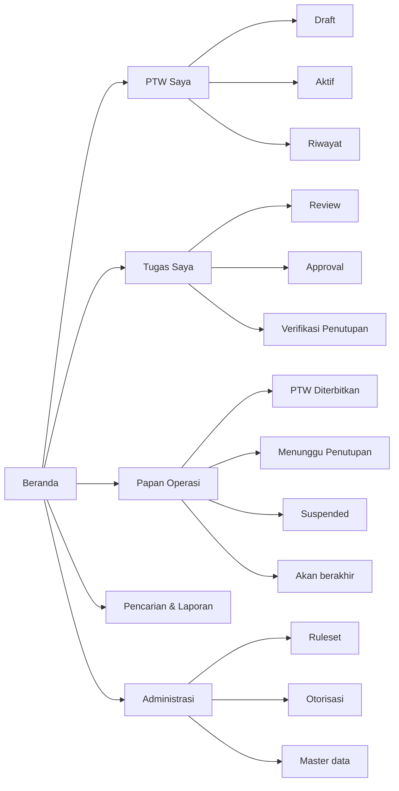
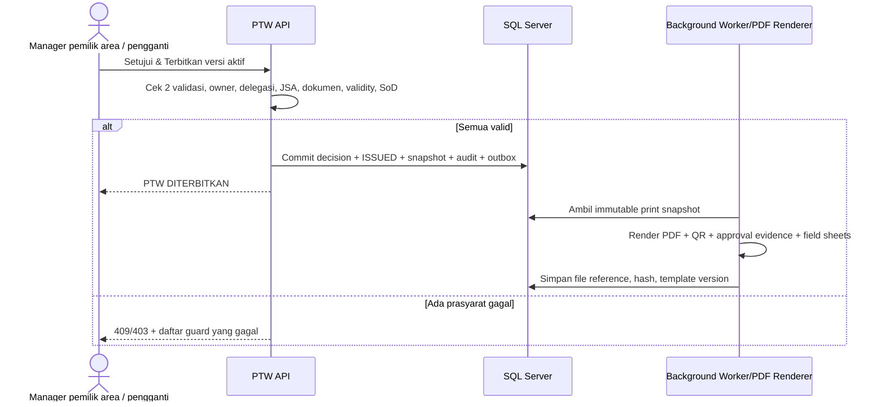
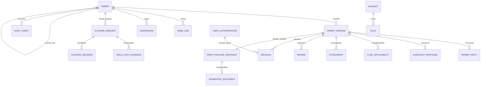

# Product Requirements Document (PRD)
## Nusantara Regas Permit to Work Online

| Atribut | Nilai |
| --- | --- |
| Versi | 1.6 — klarifikasi validator tunggal PIC HSE; pilot ORF dan alur hibrida |
| Tanggal | 8 September 2026 |
| Status | Draft untuk validasi Product Owner dan SME |
| Acuan bisnis | [BRD v1.6](BRD-NR-PTW-Online-v1.6-ID.md) |
| Acuan desain | [FSD v1.6](FSD-NR-PTW-Online-v1.6-ID.md) |
| Baseline platform | .NET 10 LTS / ASP.NET Core 10, Angular 22, SQL Server 2025 (17.x), Docker Compose Specification |

## 1. Definisi produk

NR PTW Online adalah aplikasi web terkontrol untuk Kontraktor dan pengguna internal NR. Kontraktor atau User Sponsor dapat mengajukan PTW; setiap submission divalidasi oleh tepat satu validator, yaitu PIC HSE. Setelah validasi HSE dinyatakan valid pada versi yang sama, Manager departemen pemilik area atau pengganti resmi memberikan approval penerbitan. Sistem secara atomik menetapkan **DITERBITKAN (`ISSUED`)**, mengunci snapshot, dan menghasilkan paket PDF resmi. Distribusi Gas & Pengelolaan ORF merupakan pemilik area ORF/Site Office, bukan validator.

Pilot difokuskan pada ORF dan menggunakan proses hibrida. Data pengajuan dan keputusan berada di aplikasi, sedangkan gas test, revalidasi harian, pembukaan/penutupan harian, serta tanda tangan lapangan berada pada hardcopy yang dicetak dari sistem. Sponsor mengunggah hardcopy final sebagai evidence close; pemilik area memverifikasi penutupan dan PIC HSE memperoleh rekap tanpa approval close. E-SIMI tetap mengendalikan izin masuk, sedangkan PTW mengendalikan izin kerja. Status `ISSUED` tidak menghapus kewajiban prasyarat lapangan pada hardcopy.

### 1.1 Prinsip produk

1. Keselamatan direpresentasikan sebagai state digital dan kontrol hardcopy yang eksplisit; batas keduanya tidak boleh ambigu.
2. Server, bukan UI, menjadi otoritas untuk seluruh transisi.
3. Approval pemilik area mensyaratkan level Manager; bila diwakilkan, pengganti harus memiliki penugasan/delegasi resmi yang aktif, scope yang sama, dan jejak audit lengkap.
4. Bukti lapangan pilot dicatat pada hardcopy bernomor/ber-QR dan direkonsiliasi ke PermitVersion yang sama saat close.
5. Satu PTW memiliki sejarah lengkap; renewal membuat nomor baru dan lineage.
6. Template, checklist, requirement dokumen, dan aturan routing berversi agar keputusan historis selalu dapat dijelaskan.
7. Integrasi menggunakan kontrak API; tidak berbagi database dengan E-SIMI.
8. Modular monolith dipilih untuk scope NR; bukan microservices prematur.

## 2. Sasaran, non-sasaran, dan asumsi produk

### 2.1 Sasaran

- pengguna dapat menyusun PTW lengkap dengan panduan kontekstual;
- sistem menentukan checklist/dokumen berdasarkan kelas, lokasi, dan jenis kerja tanpa menduplikasi rincian bahaya/pengendalian JSA;
- task tiba pada orang yang benar dan keputusan dapat diaudit;
- approval penerbitan hanya dapat dilakukan setelah validasi PIC HSE lengkap dan menghasilkan paket cetak yang konsisten dengan template;
- dashboard menampilkan state digital dan mengingatkan bahwa kontrol harian berada pada hardcopy;
- deployment konsisten untuk dev, test, UAT, dan produksi melalui Docker Compose.

### 2.2 Non-sasaran MVP

Registrasi kontraktor secara anonim/mandiri, authoring JSA/MOC/LOTO, pengisian gas test/revalidasi harian secara online, integrasi sensor/gate, microservices, penggantian E-SIMI, rollout lokasi selain ORF pada pilot, dan tanda tangan tersertifikasi PSrE.

### 2.3 Personas

Kontraktor/Pengaju Eksternal, User Sponsor, Performing Authority/crew, PIC HSE, Manager Area Owner/pengganti, verifier close pemilik area, petugas lapangan/Gas Tester, Administrator, Auditor, dan Support TI mengikuti definisi pada BRD. Departemen Distribusi Gas & Pengelolaan ORF hadir sebagai pemilik area ORF/Site Office, bukan sebagai validator. Crew tidak wajib memiliki akun pada pilot; Sponsor menjadi representasi accountable di sistem, sementara tanda tangan crew tetap ada pada hardcopy.

### 2.4 Routing pemilik area

| Lokasi | Departemen pemilik area | Status rilis |
| --- | --- | --- |
| HO | Departemen General Affair | Target rollout; belum aktif pilot |
| ORF | Departemen Distribusi Gas & Pengelolaan ORF | **Aktif pilot/MVP** |
| Site Office | Departemen Distribusi Gas & Pengelolaan ORF | Target rollout; belum aktif pilot |
| FSRU | Departemen Transportasi & FSRU Operation | Target rollout; belum aktif pilot |
| Water-Based Activity | Departemen Transportasi & FSRU Operation | Target rollout; belum aktif pilot |

Pada pilot, `Area Approver` adalah Manager pemilik area atau pejabat pengganti resminya. Keputusan approval menerbitkan snapshot PTW; tidak ada task penerbitan digital kedua. Penggantian tidak boleh dilakukan hanya dengan meneruskan task atau memilih nama secara bebas. Aktivasi lokasi selain ORF memerlukan konfigurasi dan sign-off pemilik area, template, checklist, serta posisi berwenang.

## 3. Arsitektur informasi dan navigasi



Detail PTW menggunakan tab: Ringkasan, Pekerjaan & Pihak, Klasifikasi/CLSR/SIMOPS, Perlengkapan Safety, Dokumen/JSA, Review/Approval, Paket Cetak, Penutupan & Hardcopy, dan Riwayat. Tidak ada tab authoring bahaya/pengendalian yang menduplikasi JSA pada pilot.

## 4. Lifecycle produk

```mermaid
stateDiagram-v2
    [*] --> Draft
    Draft --> UnderValidation: submit + create one HSE validation task
    UnderValidation --> RevisionRequired: PIC HSE requests revision
    RevisionRequired --> UnderValidation: resubmit + recreate HSE task
    UnderValidation --> Rejected: PIC HSE rejects
    UnderValidation --> AwaitingAreaApproval: PIC HSE validates same version
    AwaitingAreaApproval --> Rejected: area owner rejects
    AwaitingAreaApproval --> Issued: Manager approves issuance + PDF generated
    Issued --> Suspended: unsafe/change/stop
    Suspended --> Issued: authorized resume; field controls still apply
    Issued --> ClosureRequested: Sponsor uploads signed hardcopy + requests close
    ClosureRequested --> ClosureRequested: area owner requests evidence replacement
    ClosureRequested --> Closed: area owner verifies hardcopy/handback
    Issued --> RenewalDraft: work not complete / next period required
    RenewalDraft --> UnderValidation: submit linked permit, no copied attachments
    Draft --> Cancelled: cancel
    UnderValidation --> Cancelled: authorized cancel
    Issued --> Expired: validity ends
    Suspended --> Expired: validity ends
    Expired --> RenewalDraft: create linked permit; work remains stopped
    Expired --> ClosureRequested: upload final field copy and request close
```



Tidak ada state digital `APPROVED`, `READY_FOR_ISSUE`, atau `WORK_PERIOD_ACTIVE` pada pilot. Approval penerbitan dan transisi `ISSUED` dilakukan dalam satu transaksi, lalu PDF dibuat dari snapshot yang sama. `ISSUED` tidak otomatis berarti pekerjaan sedang berjalan: pekerjaan baru boleh dimulai/diteruskan setelah gas test, readiness, dan revalidasi harian yang diwajibkan pada hardcopy telah diisi dan ditandatangani oleh pihak berwenang.

Transisi yang persis diterapkan harus mengikuti tabel pada FSD. Tidak ada endpoint generik `setStatus`.

## 5. Epic dan kebutuhan fungsional

### 5.1 Epic A — Identitas dan otorisasi

| ID | Requirement / acceptance utama |
| --- | --- |
| FR-AUT-001 | Login menggunakan IdP korporat/OIDC bila tersedia; fallback E-SIMI/LDAP hanya melalui adapter yang disetujui. |
| FR-AUT-002 | UI menampilkan identitas, peran efektif, lokasi, dan masa berlaku otorisasi. |
| FR-AUT-003 | API mengevaluasi RBAC + ABAC pada setiap query dan command. |
| FR-AUT-004 | Session/token kedaluwarsa aman; reauthentication tidak mengulang command sebelumnya. |
| FR-AUT-005 | Administrator dapat mengelola assignment/delegasi dengan maker-checker dan effective dates. |
| FR-AUT-006 | Assignment pengganti Manager wajib memuat principal Manager, acting user, dasar/nomor dokumen, department/location scope, risk limit, effectiveFrom/effectiveUntil, issuer/approver, alasan, dan status. |
| FR-AUT-007 | API menolak penggunaan delegasi yang belum efektif, kedaluwarsa, dicabut, tidak sesuai scope, atau dibuat tanpa maker-checker. |
| FR-AUT-009 | Pengguna tanpa scope tidak dapat menemukan data melalui URL, pencarian, export, atau attachment. |
| FR-AUT-010 | Akun Kontraktor terkait satu atau lebih perusahaan/assignment terverifikasi, Sponsor NR, dan masa aktif; scope query dan command dibatasi hubungan tersebut. |
| FR-AUT-011 | Sistem mendukung identity realm/policy berbeda untuk internal dan Kontraktor tanpa memberikan role internal secara implisit. |
| FR-AUT-012 | Jika pegawai HSE menjadi Sponsor, ia tidak dapat memvalidasi task HSE untuk PTW tersebut; task tetap dialokasikan kepada validator HSE lain. |

### 5.2 Epic B — Integrasi E-SIMI

| ID | Requirement / acceptance utama |
| --- | --- |
| FR-INT-001 | Pilot menerima nomor E-SIMI yang dimasukkan/dipilih pengguna dan memvalidasi format serta uniqueness dalam scope PTW. |
| FR-INT-002 | Saat API tersedia, Kontraktor/User Sponsor mencari E-SIMI dalam scope dan sistem mengisi otomatis nomor, status, orang/perusahaan, lokasi, tujuan, serta periode. |
| FR-INT-003 | PTW menampilkan mode tautan (`MANUAL_VERIFIED`/`API_SYNCED`), status sinkronisasi, dan waktu cek terakhir. |
| FR-INT-004 | Jika E-SIMI berubah material, PTW diberi flag; PTW `ISSUED` memicu alert dan evaluasi suspend/cancel sesuai SOP. |
| FR-INT-005 | Webhook/event diproses idempotent; polling terjadwal menjadi fallback bila integrasi real-time tersedia. |
| FR-INT-006 | Tidak ada penulisan langsung dari PTW ke tabel E-SIMI; update menggunakan API yang diotorisasi. |

### 5.3 Epic C — Penyusunan PTW

| ID | Requirement / acceptance utama |
| --- | --- |
| FR-PTW-001 | Wizard memungkinkan Kontraktor atau User Sponsor membuat draft dari E-SIMI atau secara mandiri jika kebijakan mengizinkan, lalu mewajibkan link sebelum submit/penerbitan. |
| FR-PTW-002 | Bagian digital minimum mengikuti template PTW: jenis/kelas pekerjaan, penjelasan dan equipment/tag, Sponsor/pelaksana/perusahaan, dokumen/JSA, elemen CLSR, SIMOPS, perlengkapan safety/APD, isolasi/precaution, dan data izin Operasi. |
| FR-PTW-003 | Draft autosave dengan indikator saved/unsaved/error dan optimistic concurrency. |
| FR-PTW-004 | Nomor resmi baru dibuat saat submit; draft memakai ID internal/non-authoritative. |
| FR-PTW-005 | Validity maksimum tujuh hari divalidasi server. |
| FR-PTW-006 | Preview sebelum submit menampilkan requirement lengkap, kekurangan, dan jalur approval yang diproyeksikan. |
| FR-PTW-007 | Copy/renewal hanya menyalin allowlist persiapan dan menampilkan perbedaan dengan sumber. |
| FR-PTW-008 | Perubahan material membuat versi baru dan menginvalidasi keputusan terdampak. |
| FR-PTW-009 | Draft menyimpan submitter type, contractor company, dan accountable NR Sponsor sesuai policy onboarding. |
| FR-PTW-010 | Form tidak menyediakan kolom bebas bahaya/pengendalian yang menduplikasi JSA; pengguna melihat identitas/revisi JSA dan dapat membuka lampirannya. |
| FR-PTW-011 | Sponsor merekam identitas crew/pelaksana secukupnya dan mengakui bahwa ia mewakili mereka pada sistem; tanda tangan pelaksana tetap disediakan pada hardcopy. |
| FR-PTW-012 | Pilot menolak submit selain lokasi ORF dengan pesan bahwa lokasi belum diaktifkan, kecuali feature flag dan konfigurasi telah disahkan. |

### 5.4 Epic D — Klasifikasi dan rules engine

| ID | Requirement / acceptance utama |
| --- | --- |
| FR-RUL-001 | Ruleset mengevaluasi permit class, work type, location, CLSR, SIMOPS, schedule, party, dan metadata JSA. |
| FR-RUL-002 | Output rule: checklist template, dokumen, perlengkapan safety, lembar gas test, review route, authority, SoD, dan template cetak. |
| FR-RUL-003 | Hasil evaluasi menyimpan rule version dan explanation per output. |
| FR-RUL-004 | Admin dapat draft, simulasi terhadap sample/historical cases, submit for approval, publish future-effective, dan retire ruleset. |
| FR-RUL-005 | Published ruleset immutable; koreksi menghasilkan versi baru. |
| FR-RUL-006 | Jika tidak ada rule valid atau rule conflict, submit/penerbitan gagal aman dan membuat alert konfigurasi. |

### 5.5 Epic E — Dokumen dan bukti

| ID | Requirement / acceptance utama |
| --- | --- |
| FR-DOC-001 | Upload PDF/JPEG/PNG dan jenis tambahan yang disetujui dengan batas ukuran konfigurabel. |
| FR-DOC-002 | Server memeriksa MIME, ekstensi, ukuran, nama aman, hash, malware status, dan authorization parent. |
| FR-DOC-003 | Dokumen memiliki kategori, nomor/revisi/tanggal berlaku bila relevan, uploader, timestamp, dan version lineage. |
| FR-DOC-004 | File tidak diberikan lewat public path; download memakai authorized endpoint dan audit. |
| FR-DOC-005 | Penggantian file tidak menghapus versi yang menjadi dasar keputusan sebelumnya. |
| FR-DOC-006 | Setiap submit mewajibkan JSA dengan nomor/revisi/tanggal atau metadata setara; matriks requirement menentukan dokumen lain yang wajib/opsional/tidak berlaku. |
| FR-DOC-007 | Pengaju boleh menambah attachment/checklist khusus dengan uraian dan alasan, tetapi tidak dapat menghapus requirement standar. |
| FR-DOC-008 | Renewal tidak menyalin file; UI menampilkan daftar requirement kosong dan referensi sumber hanya untuk membantu pengaju mengunggah ulang dokumen yang masih sah. |
| FR-DOC-009 | Upload hardcopy final memakai kategori khusus `SIGNED_FIELD_COPY`; file wajib lolos preview, malware scan, tipe/ukuran, dan quality acknowledgement sebelum request close. |

### 5.6 Epic F — Review dan persetujuan

| ID | Requirement / acceptance utama |
| --- | --- |
| FR-RVW-001 | Submit membuat tepat satu validation task pada PermitVersion yang sama untuk PIC HSE; task langsung dapat dikerjakan. |
| FR-RVW-002 | PIC HSE melihat ringkasan risiko, rule explanation, perubahan versi, checklist, dokumen, dan riwayat keputusan terdahulu. |
| FR-RVW-003 | Validate, request revision, reject, dan escalate meminta komentar; alasan menggunakan kategori + free text. |
| FR-RVW-004 | Request revision mengembalikan task ke Kontraktor/User Sponsor dan menandai bagian terdampak. |
| FR-RVW-005 | Resubmit menampilkan diff; validasi diulang berdasarkan impact matrix. |
| FR-RVW-006 | Approval task belum dibuat/diaktifkan sebelum validation task PIC HSE selesai dengan keputusan valid pada PermitVersion yang sama. |
| FR-APR-001 | Final approver harus merupakan Manager departemen pemilik area atau pejabat pengganti resmi yang cocok dengan authority snapshot pada waktu command. |
| FR-APR-002 | Approval menyimpan statement, actor aktual, actingFor Manager bila berlaku, assignment/delegation ID, authorization ID, record version, ruleset, waktu, dan IP/device metadata yang diizinkan. |
| FR-APR-003 | Approval yang berhasil membuat event keputusan dan `PERMIT_ISSUED` dalam satu transaksi serta memicu pembuatan paket PDF dari PermitVersion yang disetujui. |
| FR-APR-004 | Routing pemilik area diturunkan dari master Location→AreaOwnerDepartment dan tidak dapat diubah bebas oleh pengaju. |
| FR-APR-005 | Task approval ditujukan ke Manager aktif; jika terdapat acting assignment yang sah, UI menampilkan “Mewakili [Manager/posisi]” dan dasar penugasannya sebelum konfirmasi. |
| FR-APR-006 | Expiry/revocation assignment sebelum submit keputusan menghasilkan 403/guard failure dan task dirutekan ulang kepada authority yang saat itu sah. |
| FR-APR-007 | UI/PDF menampilkan bukti elektronik: nama aktor, jabatan, kapasitas Manager/pengganti, principal yang diwakili, waktu, dan status; label tidak boleh menyatakan PSrE bila belum tersertifikasi. |

```mermaid
sequenceDiagram
    actor S as Kontraktor/User Sponsor
    participant UI as Angular
    participant API as PTW API
    participant R as Rules/Workflow
    actor H as PIC HSE
    actor A as Manager pemilik area / pengganti resmi
    S->>UI: Submit PTW
    UI->>API: POST /permits/{id}/submit + Idempotency-Key
    API->>R: Validate + evaluate rules
    R-->>API: Route snapshot + requirements
    API-->>S: UNDER_VALIDATION
    H->>API: Validate versi PTW
    API->>R: Check validasi HSE pada versi yang sama
    R-->>A: Create approval task
    A->>API: Approve current version + capacity/assignment
    API->>API: Commit decision + ISSUED + print snapshot
    API-->>S: DITERBITKAN; paket PDF disiapkan
```

### 5.7 Epic G — Penerbitan dan paket kerja lapangan

| ID | Requirement / acceptance utama |
| --- | --- |
| FR-ISS-001 | Aksi **Setujui & Terbitkan PTW** hanya tersedia bagi Manager pemilik area atau pengganti resmi setelah validasi PIC HSE lulus pada PermitVersion yang sama. |
| FR-ISS-002 | API mengulang guard lokasi ORF, owner, assignment, SoD, validity, JSA, attachment/checklist, dan versi; mismatch menghasilkan 403/409. |
| FR-ISS-003 | Keputusan, state `ISSUED`, audit, outbox, dan `PrintPackageSnapshot` dicommit atomik. Kegagalan renderer setelah commit memberi status paket `RETRYING`, bukan membatalkan keputusan. |
| FR-PRN-001 | PDF memuat data digital yang relevan dari Bagian 1-7, nomor/QR/version, bukti persetujuan elektronik, watermark status, dan hash/reference paket. |
| FR-PRN-002 | PDF menyediakan lembar kosong yang mudah ditulis untuk gas test, revalidasi harian sampai tujuh hari, completion, inspeksi/restorasi, handback, dan tanda tangan manual. |
| FR-PRN-003 | PDF menyertakan halaman kampanye dari asset terkontrol: 10 CLSR, 8 Arahan Direksi, dan 9 Perilaku Wajib; exact asset/version ditampilkan pada metadata paket. |
| FR-PRN-004 | Isi wajib sama dengan template/STK; layout boleh A4 multipage atau A3 berdasarkan template version yang disahkan. |
| FR-PRN-005 | Hanya paket dari PermitVersion `ISSUED` yang berlabel dokumen resmi; preview sebelum approval diberi watermark `DRAFT/TIDAK BERLAKU`. |



### 5.8 Epic H — Operasi hardcopy, renewal, suspend, dan close

| ID | Requirement / acceptance utama |
| --- | --- |
| FR-FLD-001 | Setelah paket dicetak, gas test/readiness/revalidasi harian/shift diisi manual pada hardcopy; UI menampilkan instruksi bahwa `ISSUED` belum menghapus kewajiban tersebut. |
| FR-FLD-002 | Sistem tidak mewajibkan akses aplikasi setiap hari pada pilot; bukti lapangan direkonsiliasi melalui hardcopy final. |
| FR-SUS-001 | Pengguna berwenang dapat mencatat suspend/cancel segera dengan kategori/alasan; status dan notifikasi tampil walaupun catatan lapangan tetap harus dilakukan sesuai SOP. |
| FR-SUS-002 | Resume digital mencatat penyelesaian sebab dan aktor berwenang; kewajiban revalidasi hardcopy tetap berlaku. |
| FR-REN-001 | Sponsor/Kontraktor dapat memulai renewal dari PTW `ISSUED`/`EXPIRED` sesuai policy; sistem membuat permit/nomor baru dengan `ParentPermitId` dan rencana periode baru maksimum tujuh hari. |
| FR-REN-002 | Periode renewal tidak boleh overlap dengan permit asal atau sibling aktif untuk pekerjaan/lokasi yang sama sesuai rule. |
| FR-REN-003 | Tidak ada attachment, approval, tanda tangan, gas test, atau revalidasi yang disalin. UI hanya menampilkan sumber dan daftar requirement yang harus dipenuhi ulang. |
| FR-REN-004 | Renewal melewati validasi PIC HSE dan approval penerbitan baru serta menghasilkan paket cetak baru. |
| FR-CLO-001 | Sponsor mengunggah satu atau lebih file kategori `SIGNED_FIELD_COPY`, mengonfirmasi pekerjaan selesai dan checklist ringkas, lalu mengajukan close. |
| FR-CLO-002 | API menolak request close tanpa file bersih, terbaca menurut acknowledgement, terkait PrintPackage/PermitVersion yang benar, dan belum superseded. |
| FR-CLO-003 | Pemilik area melihat file side-by-side dengan metadata permit, lalu memilih `Tutup PTW` atau `Minta Bukti Ulang` dengan catatan wajib. |
| FR-CLO-004 | PIC HSE tidak menerima task approval close; PIC HSE dapat melihat status, bukti, dan mengunduh rekap sesuai scope. |
| FR-CLO-005 | `CLOSED` immutable; addendum koreksi tidak mengubah event, approval, atau file yang menjadi dasar close. |

```mermaid
sequenceDiagram
    actor S as Sponsor
    participant UI as Angular
    participant API as PTW API
    participant AV as Malware Scan
    actor O as Pemilik Area
    actor H as PIC HSE (read-only close)
    S->>UI: Upload hardcopy final + checklist + request close
    UI->>API: POST evidence; POST /request-close
    API->>AV: Scan dan validasi file
    AV-->>API: CLEAN
    API-->>O: Task verifikasi penutupan
    O->>API: Buka evidence + verifikasi handback
    alt Bukti lengkap
        O->>API: Close PTW
        API-->>S: CLOSED
        API-->>H: Rekap/status tersedia
    else Bukti kurang/tidak terbaca
        O->>API: Request evidence replacement + alasan
        API-->>S: CLOSURE_EVIDENCE_REQUIRED
    end
```

### 5.9 Epic I — Task, dashboard, laporan, notifikasi, audit

| ID | Requirement / acceptance utama |
| --- | --- |
| FR-TSK-001 | Task list memfilter jenis tindakan, lokasi, risiko, SLA, due date, dan assignment. |
| FR-DSH-001 | Papan Operasi menunjukkan Under Validation, Awaiting Area Approval, Issued, Suspended, Expiring/Expired, Renewal Draft, Closure Requested/Evidence Required, dan Closed. |
| FR-DSH-002 | Angka dashboard dapat ditelusuri ke daftar data penyusunnya. |
| FR-REP-001 | Search server-side mendukung nomor, E-SIMI, judul, lokasi, sponsor, kontraktor, kelas, risiko, status, dan tanggal. |
| FR-REP-002 | Export menghormati filter, scope, batas data, dan menghasilkan audit event. |
| FR-NOT-001 | Notification memakai outbox, retry dengan backoff, dead-letter visibility, dan template version. |
| FR-AUD-001 | Timeline menggabungkan actor action, state change, field changes, decision, integration, notification, dan attachment evidence. |

### 5.10 Epic J — Administrasi

| ID | Requirement / acceptance utama |
| --- | --- |
| FR-ADM-001 | Master lokasi, class/work type, CLSR, SIMOPS, PPE/perlengkapan safety, document/checklist requirement, reason code, dan template print/campaign dapat effective-dated. |
| FR-ADM-002 | Perubahan kritis membutuhkan maker-checker dan tidak boleh disetujui pembuat sendiri. |
| FR-ADM-003 | Import master melakukan dry run, validasi, summary error, dan audit sebelum commit. |
| FR-ADM-004 | Admin dapat melihat integration health, failed messages, rules conflict, dan notification failure tanpa melihat secret. |
| FR-ADM-005 | Master lokasi mewajibkan tepat satu departemen pemilik area efektif untuk setiap tanggal; overlap atau gap memblokir publish. |
| FR-ADM-006 | Feature flag lokasi default hanya mengaktifkan ORF; aktivasi lokasi lain memerlukan approved configuration bundle dan audit. |

## 6. Validasi dan pengalaman pengguna

### 6.1 Aturan UX

- Gunakan Bahasa Indonesia; istilah Inggris diperlihatkan hanya saat membantu konsistensi SOP.
- Status memakai teks + ikon, tidak hanya warna.
- Tombol hanya mengkomunikasikan kemungkinan; keputusan final tetap dari server.
- Setiap blokir menjelaskan prasyarat, pemilik tindakan, dan cara penyelesaian.
- Form panjang dibagi langkah, memiliki ringkasan error, autosave, dan resume.
- Perubahan sejak review terakhir ditandai dengan diff.
- Waktu selalu menampilkan zona WIB/Asia Jakarta.
- Desain responsive minimal 360 px, dioptimalkan untuk desktop/tablet lapangan.
- Target WCAG 2.2 AA: keyboard, focus visible, label, contrast, heading, dan error association.

### 6.2 Validasi umum

Validasi client hanya membantu pengguna; API mengulang semua rule. Request yang basi mengembalikan conflict dengan versi terbaru. Field terkontrol memakai master code, sementara free text dibatasi panjang dan di-output-encode. Tanggal tidak dapat melewati validity, JSA/dokumen wajib harus berstatus aman, dan seluruh acknowledgement membutuhkan actor/time/statement. Sebelum close, Sponsor wajib melihat preview hardcopy final dan mengakui bahwa seluruh halaman/tanda tangan terbaca; pemilik area tetap menjadi verifier akhir.

## 7. Model informasi logis



Data rinci, tipe, constraint, index, dan schema terdapat pada FSD.

## 8. API dan interoperabilitas produk

- API versioning: `/api/v1` dan OpenAPI sebagai kontrak.
- Command menggunakan `Idempotency-Key`; update menggunakan `ETag/If-Match`.
- Error mengikuti `ProblemDetails` dengan code stabil, correlation ID, dan daftar guard.
- Pagination cursor/limit untuk daftar besar; filter dan sort allowlist.
- Timestamp ISO-8601 UTC; code/master menggunakan identifier stabil.
- Integrasi E-SIMI menggunakan service identity, timeout, retry hanya untuk operasi aman, circuit breaker, inbox/outbox, dan correlation ID.
- Perubahan kontrak breaking membutuhkan versi baru dan masa transisi.

## 9. Kebutuhan nonfungsional produk

| ID | Kebutuhan / acceptance |
| --- | --- |
| NFR-PER-001 | P95 read umum ≤ 3 dtk, search/dashboard ≤ 5 dtk, command transisi ≤ 3 dtk, tidak termasuk upload dan dependency eksternal. |
| NFR-CAP-001 | Baseline diuji minimal 200 pengguna konkuren, 50.000 PTW/tahun, 10 lampiran/PTW; angka final melalui sizing. |
| NFR-AVL-001 | Availability target 99,5% pada service window; health endpoint live/ready tersedia. |
| NFR-SEC-001 | OWASP ASVS level 2 baseline, TLS, least privilege, secure headers, secrets eksternal, dependency/image scanning. |
| NFR-SEC-002 | Lampiran private, malware scan, encryption at rest sesuai infrastruktur, dan audit akses. |
| NFR-PRV-001 | PII hanya ditampilkan sesuai tujuan dan scope; log tidak menyimpan token, secret, atau dokumen. |
| NFR-REL-001 | State transition, audit, dan outbox commit atomik dalam satu transaksi. |
| NFR-BCP-001 | Target awal RPO 15 menit/RTO 4 jam; backup dan restore drill wajib sebelum go-live. |
| NFR-OBS-001 | Structured log, metric, trace, correlation, business event, alert readiness dan queue failure. |
| NFR-ACC-001 | WCAG 2.2 AA pada journey utama. |
| NFR-MNT-001 | Modul memiliki batas jelas, automated tests, migration rollback/forward plan, dan dokumentasi operasi. |

## 10. Analitik dan event produk

Event tanpa isi sensitif: `permit_draft_created`, `permit_submitted`, `validation_completed`, `revision_requested`, `issuance_approved`, `permit_issued`, `print_package_requested/generated/failed`, `field_copy_uploaded`, `closure_requested`, `closure_evidence_replacement_requested`, `permit_closed`, `renewal_created`, `permit_suspended/resumed`, `integration_failed`, dan `notification_failed`. Setiap event memuat permit ID pseudonymous, class, location scope, actor role, timestamp, template/ruleset version, duration, dan correlation ID sesuai kebijakan privacy.

## 11. Strategi delivery dan feature flag

| Increment | Isi |
| --- | --- |
| I1 Fondasi | Identity, authorization, ORF master/feature flag, audit, Compose environments, E-SIMI adapter contract |
| I2 Pengajuan | Form sesuai template Bagian 1-5/7, JSA/dokumen, checklist/CLSR, submit, validasi PIC HSE |
| I3 Terbit & Cetak | Approval Manager/pengganti, atomic issue, PDF/QR/evidence, lembar manual, controlled campaign asset |
| I4 Penutupan | Renewal, upload hardcopy, close verification, dashboard/report, notification hardening, UAT pilot ORF |

Feature flag hanya untuk rollout/eksperimen aman; tidak boleh melewati safety guard. Target pilot ORF 15–20 minggu; integrasi penuh dan rollout lintas lokasi membawa total 20–28 minggu dengan asumsi keputusan bisnis tepat waktu.

## 12. Strategi pengujian dan acceptance

- unit test untuk state, requirement matrix, authorization, renewal overlap, dan print snapshot;
- integration test API + SQL Server nyata dalam container;
- contract test E-SIMI dan OpenAPI;
- Angular component/accessibility test;
- Playwright end-to-end untuk tiga kelas izin dan semua jalur utama;
- security test SAST/SCA/image/IaC/DAST, authorization matrix, upload abuse, dan session;
- performance test pada baseline volume;
- restore, restart, retry, duplicate message, dan dependency outage test;
- golden-file/PDF visual regression untuk tiga template, QR, evidence, paginasi, dan field-writing space;
- UAT HSSE/Operasi menggunakan skenario ORF dan hardcopy lapangan nyata.

### 12.1 Skenario UAT minimum

1. Hot Work ORF dengan JSA, CLSR, validasi PIC HSE, approval Manager, status `ISSUED`, dan PDF benar.
2. Cold Work ORF dengan checklist/dokumen sesuai template dan item safety tambahan.
3. CSE dengan lembar gas test manual yang lengkap dalam paket cetak; nilai/parameter mengikuti template final.
4. Revisi material setelah endorsement.
5. Otorisasi reviewer/approver kedaluwarsa, termasuk acting assignment pengganti Manager yang berakhir sebelum keputusan.
6. E-SIMI manual verified/API-linked berubah saat PTW issued.
7. Suspend segera, pencatatan manual di lapangan, penyelesaian sebab, dan resume digital.
8. Paket cetak memiliki lembar revalidasi harian yang terbaca dan ruang tanda tangan hingga tujuh hari.
9. Renewal baru tanpa overlap dan tanpa menyalin attachment/approval/isian hardcopy; paket baru dihasilkan.
10. Sponsor mengunggah hardcopy lengkap; pemilik area meminta bukti ulang lalu berhasil close; PIC HSE hanya melihat rekap.
11. Concurrency dua pengguna dan retry command yang sama.
12. E-SIMI/notifikasi unavailable tanpa korupsi state.
13. Pengajuan langsung Kontraktor dengan perusahaan, Sponsor NR, dan scope yang valid serta percobaan akses lintas perusahaan yang ditolak.
14. Pilot menerima ORF dan menolak lokasi lain; setelah flag konfigurasi diuji, routing target mengikuti matriks area.
15. Manager pemilik area melakukan approval; pengganti resmi dapat melakukan approval dengan label “mewakili”, principal Manager, dan dasar penugasan tercatat.
16. Forward task atau delegasi informal ditolak; assignment belum aktif, expired, revoked, scope salah, atau risk limit tidak cukup juga ditolak dan task dirutekan ulang.
17. Pegawai HSE sebagai Sponsor tidak dapat memvalidasi task HSE miliknya; validator HSE lain dapat bertindak.
18. Perubahan JSA setelah validasi membuat keputusan terdampak stale dan memerlukan validasi ulang.
19. PDF official hanya berasal dari PermitVersion issued; preview draft memiliki watermark dan tidak dapat menjadi evidence close.
20. File hardcopy salah versi, malware, tidak terbaca, atau belum lengkap ditolak sebelum/ketika verifikasi close.

## 13. Definition of Done

Sebuah requirement selesai apabila acceptance telah diuji; authorization dan audit tersedia; observability dan error handling tersedia; migrasi database teruji; dokumentasi/API diperbarui; accessibility/security review lulus; tidak ada critical/high vulnerability tanpa acceptance risiko formal; Product Owner/SME menerima hasil; dan deployment Compose dapat direproduksi pada environment sasaran.

## 14. Ketertelusuran ringkas

| PRD | BRD | FSD |
| --- | --- | --- |
| FR-AUT | BR-AUT | Identity, Policy Authorization, sec schema |
| FR-INT | BR-INT | E-SIMI Adapter, inbox/outbox |
| FR-PTW/FR-RUL/FR-DOC | BR-INI/CLS/RSK/DOC | Permit, Requirement Matrix, Attachment modules |
| FR-RVW/FR-APR | BR-RVW/APR | Workflow, Decision, task read model |
| FR-ISS/PRN | BR-APR/ISS/PRN | Issuance transaction, Print Snapshot/Renderer |
| FR-FLD/REN/SUS/CLO | BR-FLD/LIF/WPR/SUS/CLO | Hardcopy evidence, Renewal, Closure commands |
| FR-DSH/REP/NOT/AUD | BR-DSH/REP/NOT/AUD | Query, Worker, Audit modules |

## 15. Isu produk terbuka

PRD mengikuti OPN-001 sampai OPN-012 pada BRD. Item tersebut harus dikonversi menjadi decision record sebelum sprint yang bergantung padanya; terutama sublokasi ORF, Manager/pengganti dan verifier close, SLA validasi HSE, onboarding/SSO Kontraktor, checklist dan matriks dokumen, konten/format paket cetak, aturan gas test manual, definisi tujuh hari dan batas renewal, API E-SIMI, status hukum bukti persetujuan visual, serta topologi/VPN produksi.

## 16. Referensi versi platform resmi

- [.NET support policy](https://dotnet.microsoft.com/en-us/platform/support/policy/dotnet-core): .NET 10 adalah LTS aktif, dirilis 11 November 2025 dan didukung hingga 14 November 2028.
- [Angular version compatibility](https://angular.dev/reference/versions) dan [Angular releases](https://angular.dev/reference/releases): Angular 22 aktif pada baseline dokumen ini.
- [SQL Server 2025 Linux container](https://learn.microsoft.com/en-us/sql/linux/quickstart-install-connect-docker?view=sql-server-ver17): image resmi SQL Server 2025 (17.x) tersedia di Microsoft Container Registry.
- [Compose Specification](https://docs.docker.com/compose/compose-file/): format Compose yang direkomendasikan untuk services, networks, volumes, configs, dan secrets.

**Kebijakan versi:** major version di atas adalah baseline arsitektur per 8 September 2026. Build harus memakai patch/CU yang masih didukung dan telah lulus regression/security test. Image produksi harus dipin ke tag/digest yang disetujui; tag `latest` tidak diperbolehkan.
