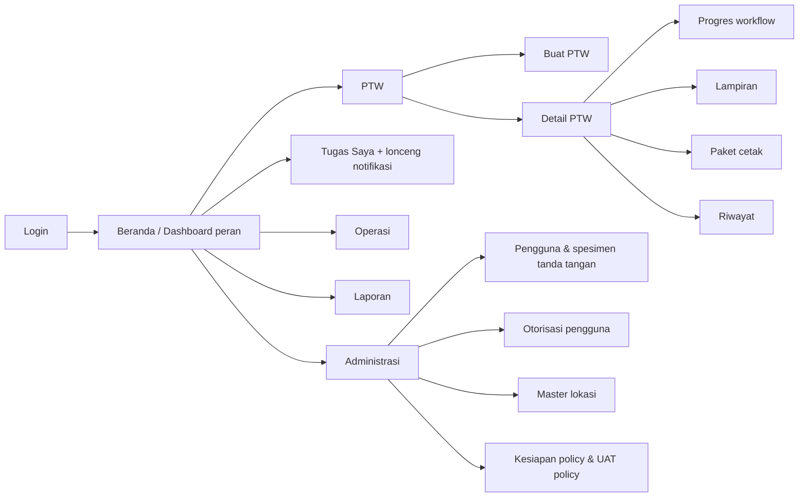
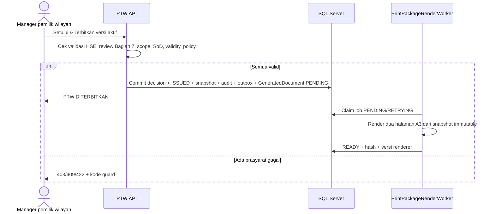
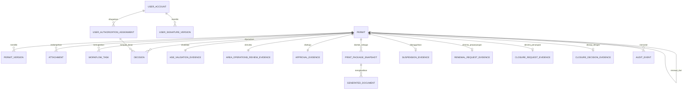

# Product Requirements Document (PRD)
## Nusantara Regas Permit to Work Online

| Atribut | Nilai |
| --- | --- |
| Versi | 1.8 — penyelarasan flow dengan sistem berjalan: review Bagian 7 SO/Officer, pembagian pengisian formulir, renewal dan closure berbasis hardcopy terverifikasi |
| Tanggal | 22 September 2026 |
| Status | Draft untuk validasi Product Owner dan SME |
| Acuan bisnis | [BRD v1.8](BRD-NR-PTW-Online-v1.8-ID.md) |
| Acuan desain | [FSD v1.8](FSD-NR-PTW-Online-v1.8-ID.md) |
| Menggantikan | PRD v1.7 (16 September 2026) |
| Baseline platform | .NET 10 LTS / ASP.NET Core 10, Angular 22, SQL Server 2025 (17.x), Docker Compose Specification |

## 0. Ringkasan perubahan v1.8

Lihat BRD v1.8 Bagian 0 untuk ringkasan bisnis. Dampak pada requirement produk:

- Epic F memperkenalkan task review Bagian 7 (`AREA_OPERATION_REVIEW`) untuk pool SO/Officer pemilik wilayah di antara validasi HSE dan approval Manager, serta pemisahan tugas empat aktor.
- Epic C membatasi input Sponsor pada header klasifikasi dan Bagian 1–4; Bagian 5 milik PIC HSE (Epic F); checklist kondisi operasi Bagian 7 milik SO/Officer. Input CLSR, SIMOPS, dan isolasi/precaution bebas dihapus dari form Sponsor.
- Epic E mewajibkan lampiran JSA, ID, BPJS TK, FTW, dan E-SIMI sebelum submit, dan menautkan setiap pilihan Bagian 4 ke lampiran.
- Epic H mengganti "renewal draft langsung" dengan permintaan renewal yang ditinjau Manager pemilik wilayah, dan menambahkan verifikasi Bagian 10 terstruktur serta jalur tindak lanjut closure.
- Epic G menetapkan paket cetak dua halaman A3 yang setia pada formulir terkontrol; QR dan halaman kampanye menjadi backlog.
- Epic A menetapkan akun lokal, cookie HTTP-only, assignment role dengan action code turunan server, dan spesimen tanda tangan berversi untuk rilis Development; SSO produksi tetap OPN-007.
- Epic D (rules engine) diturunkan menjadi backlog; rilis awal memakai katalog formulir terkontrol statis.

## 1. Definisi produk

NR PTW Online adalah aplikasi web terkontrol untuk Kontraktor dan pengguna internal NR. Kontraktor atau User Sponsor mengajukan PTW beserta dokumen dasar wajib; setiap submission divalidasi oleh tepat satu validator, yaitu PIC HSE, yang menetapkan Bagian 5. SO/Officer departemen pemilik wilayah memverifikasi kondisi operasi Bagian 7. Manager departemen pemilik wilayah memberikan approval penerbitan, dan sistem secara atomik menetapkan **DITERBITKAN (`ISSUED`)**, mengunci snapshot, dan menghasilkan paket PDF resmi dua halaman A3 yang setia pada formulir FM-001/002/003-B-002-NR-B220.

Rilis awal mencakup ORF, Site Office, dan Water-Based Activity serta menggunakan proses hibrida. ORF dirutekan ke Departemen Distribusi Gas dan Pengelolaan ORF; Site Office ke Departemen General Affair; dan Water-Based Activity ke Departemen Transport & Operasi FSRU. Data pengajuan dan keputusan berada di aplikasi, sedangkan gas test, revalidasi harian, pembukaan/penutupan harian, serta tanda tangan lapangan berada pada hardcopy yang dicetak dari sistem. Sponsor mengunggah hardcopy final sebagai evidence close; salinan terpilih menjadi unduhan utama PTW, lalu Manager atau SO/Officer pemilik wilayah memverifikasi Bagian 10 dan menutup PTW; PIC HSE memperoleh rekap tanpa approval close. Renewal diajukan Sponsor dengan hardcopy hasil verifikasi lapangan dan ditinjau Manager pemilik wilayah sebelum draft penerus dibuat. Status `ISSUED` tidak menghapus kewajiban prasyarat lapangan pada hardcopy.

### 1.1 Prinsip produk

1. Keselamatan direpresentasikan sebagai state digital dan kontrol hardcopy yang eksplisit; batas keduanya tidak boleh ambigu.
2. Server, bukan UI, menjadi otoritas untuk seluruh transisi, authorization, dan validasi katalog.
3. Formulir terkontrol adalah sumber kebenaran isi: katalog Bagian 1/4/5/7 dan layout cetak ditranskripsi dari template, bukan dirancang ulang.
4. Setiap bagian formulir memiliki satu pengisi yang berwenang: Sponsor (Bagian 1–4), PIC HSE (Bagian 5), SO/Officer (checklist Bagian 7), Manager (baris approval Bagian 7), lapangan (Bagian 6, 8–10).
5. Bukti lapangan dicatat pada hardcopy dan direkonsiliasi ke paket cetak resmi serta versi PTW yang sama saat renewal dan close.
6. Satu PTW memiliki sejarah lengkap; renewal membuat nomor baru dan lineage setelah disetujui pemilik wilayah.
7. Identitas aktor pada evidence berasal dari profil akun server, bukan klien.
8. Modular monolith dipilih untuk scope NR; bukan microservices prematur.

## 2. Sasaran, non-sasaran, dan asumsi produk

### 2.1 Sasaran

- pengguna dapat menyusun PTW lengkap sesuai formulir terkontrol dengan validasi kelengkapan server-side;
- task tiba pada orang yang benar (Sponsor, PIC HSE, pool SO/Officer, Manager) dan keputusan dapat diaudit;
- approval penerbitan hanya dapat dilakukan setelah validasi PIC HSE dan review Bagian 7 lengkap pada versi yang sama;
- paket cetak identik dengan formulir terkontrol dan mengisi Bagian 1–5 serta evidence Bagian 7 dari snapshot;
- dashboard menampilkan state digital dan mengingatkan bahwa kontrol harian berada pada hardcopy;
- deployment konsisten untuk dev, UAT, dan produksi melalui Docker Compose.

### 2.2 Non-sasaran MVP

Registrasi kontraktor mandiri, authoring JSA/MOC/LOTO, pengisian gas test/revalidasi harian online, integrasi sensor/gate, microservices, penggantian E-SIMI, aktivasi HO/FSRU, rules engine deklaratif, QR dan halaman kampanye pada paket cetak, dan tanda tangan tersertifikasi PSrE.

### 2.3 Personas

Kontraktor/Pengaju Eksternal dan User Sponsor (role `Sponsor`), Performing Authority/crew (tanpa akun), PIC HSE (`HSEValidator`), SO/Officer Pemilik Wilayah (`AreaOwnerSeniorOfficer`), Manager Pemilik Wilayah (`AreaOwnerManager`), petugas lapangan/Gas Tester (hardcopy), Administrator, dan Auditor mengikuti definisi pada BRD. Departemen pemilik wilayah menyediakan SO/Officer dan Manager; bukan validator.

### 2.4 Routing pemilik area

| Lokasi | Departemen pemilik area | Status rilis |
| --- | --- | --- |
| HO | Departemen General Affair | Tidak aktif |
| ORF | Departemen Distribusi Gas dan Pengelolaan ORF | **Aktif pada rilis awal** |
| Site Office | Departemen General Affair | **Aktif pada rilis awal** |
| FSRU | Departemen Transport & Operasi FSRU | Tidak aktif |
| Water-Based Activity | Departemen Transport & Operasi FSRU | **Aktif pada rilis awal** |

Task review Bagian 7, approval penerbitan, review renewal, dan verifikasi closure dirutekan ke role pemilik wilayah dengan scope lokasi yang cocok. Keputusan approval menerbitkan snapshot PTW; tidak ada task penerbitan digital kedua. Penggantian tidak boleh dilakukan hanya dengan meneruskan task atau memilih nama secara bebas.

## 3. Arsitektur informasi dan navigasi



Detail PTW menampilkan ringkasan pekerjaan, header klasifikasi, Bagian 1–4, Bagian 5 (setelah validasi), Bagian 7 (setelah review), progres workflow dengan nama aktor dari profil server, aksi sesuai role dan status, lampiran, paket cetak, permintaan renewal/closure, dan riwayat. Tidak ada tab authoring bahaya/pengendalian, CLSR, SIMOPS, atau isolasi bebas.

## 4. Lifecycle produk

```mermaid
stateDiagram-v2
    [*] --> Draft
    Draft --> UnderValidation: submit + satu task HSE_VALIDATION
    UnderValidation --> RevisionRequired: PIC HSE minta revisi + task SPONSOR_REVISION
    RevisionRequired --> UnderValidation: submit ulang (versi naik) + task HSE baru
    UnderValidation --> Rejected: PIC HSE menolak
    UnderValidation --> AwaitingAreaApproval: PIC HSE valid + Bagian 5 → task AREA_OPERATION_REVIEW
    AwaitingAreaApproval --> AwaitingAreaApproval: SO/Officer menetapkan Bagian 7 → task AREA_APPROVE_AND_ISSUE
    AwaitingAreaApproval --> RevisionRequired: SO/Officer atau Manager minta revisi
    AwaitingAreaApproval --> Rejected: SO/Officer atau Manager menolak
    AwaitingAreaApproval --> Issued: Manager approve-and-issue + snapshot cetak
    Issued --> Suspended: PIC HSE / Manager suspend
    Suspended --> Issued: Manager resolve; revalidasi hardcopy tetap wajib
    Issued --> ClosureRequested: Sponsor upload hardcopy final + request close
    Suspended --> ClosureRequested: Sponsor request close
    Expired --> ClosureRequested: Sponsor request close
    ClosureRequested --> ClosureRequested: Manager minta tindak lanjut / Sponsor ajukan ulang
    ClosureRequested --> Closed: Manager verifikasi Bagian 10
    Issued --> Expired: expire setelah masa berlaku
    Suspended --> Expired: expire setelah masa berlaku
    Draft --> Cancelled: Sponsor cancel
    UnderValidation --> Cancelled: Sponsor cancel
    RevisionRequired --> Cancelled: Sponsor cancel
```



Permintaan renewal dari `ISSUED`/`EXPIRED` tidak mengubah status PTW asal; ia membuat task `AREA_RENEWAL_REVIEW`. Approval Manager membuat PTW penerus baru berstatus `DRAFT` yang mengikuti lifecycle di atas dari awal.

Tidak ada state digital `APPROVED`, `READY_FOR_ISSUE`, `WORK_PERIOD_ACTIVE`, atau `RENEWAL_DRAFT`. Approval penerbitan dan transisi `ISSUED` dilakukan dalam satu transaksi, lalu PDF dibuat dari snapshot yang sama. `ISSUED` tidak otomatis berarti pekerjaan sedang berjalan. Tidak ada endpoint generik `setStatus`.

## 5. Epic dan kebutuhan fungsional

### 5.1 Epic A — Identitas dan otorisasi

| ID | Requirement / acceptance utama |
| --- | --- |
| FR-AUT-001 | Rilis Development: login akun lokal terkelola dengan cookie HTTP-only; login ditolak di luar Development sampai IdP/SSO OPN-007 disahkan. Halaman awal adalah layar login; route aplikasi memerlukan sesi. |
| FR-AUT-002 | UI menampilkan identitas, role efektif, dan scope lokasi dari `/api/v1/me`; klien tidak menyimpan token di `localStorage`. |
| FR-AUT-003 | API mengevaluasi role, scope lokasi, kepemilikan Sponsor, dan status PTW pada setiap query dan command; role/scope dihitung ulang dari assignment yang disetujui dan efektif. |
| FR-AUT-004 | Session kedaluwarsa aman; reauthentication tidak mengulang command sebelumnya. |
| FR-AUT-005 | Administrator mengelola akun (profil, jabatan, departemen, status aktif, password) dan assignment role dengan maker-checker serta effective dates; Development boleh mengizinkan Administrator menyetujui pengajuannya sendiri, produksi tidak. |
| FR-AUT-006 | Assignment langsung hanya meminta pengguna, role, area kewenangan bila role area-scoped, waktu mulai, dan tanggal akhir opsional; action code dan kompetensi diturunkan server dari profil role. Input action code dari klien diabaikan; tanpa profil terkonfigurasi jalur ini fail-closed. |
| FR-AUT-007 | Assignment pengganti Manager wajib memuat principal, acting user, dasar dokumen, scope, risk limit, effective dates, issuer/approver, alasan, dan status; sampai tersedia, approval dengan `ActingAssignmentId` ditolak. |
| FR-AUT-008 | Administrator mengunggah spesimen tanda tangan PNG (maksimum 256 KB, 2000×2000 piksel) berversi; versi lama tidak ditimpa dan versi exact dibekukan pada evidence. |
| FR-AUT-009 | Pengguna tanpa scope tidak dapat menemukan data melalui URL, daftar, task, attachment, atau paket cetak. |
| FR-AUT-010 | Akun Kontraktor terkait Sponsor NR dan masa aktif; scope perusahaan eksplisit menunggu OPN-006. |
| FR-AUT-011 | Nama dan jabatan aktor pada evidence dan UI berasal dari profil akun server; username/ID tidak dipakai sebagai fallback nama. Evidence lama tanpa nama diperkaya saat dibaca. |
| FR-AUT-012 | Sponsor tidak dapat memvalidasi PTW miliknya; Sponsor dan validator HSE tidak dapat menjadi reviewer Bagian 7; Manager penerbit harus berbeda dari Sponsor, validator HSE, dan reviewer. |

### 5.2 Epic B — E-SIMI

| ID | Requirement / acceptance utama |
| --- | --- |
| FR-INT-001 | Draft menyimpan nomor/external ID E-SIMI; submit mewajibkan lampiran bertaut dengan kode dokumen `ESIMI`. |
| FR-INT-002 | Saat API tersedia, sistem mengisi otomatis nomor, status, orang/perusahaan, lokasi, tujuan, dan periode (backlog). |
| FR-INT-003 | PTW menampilkan mode tautan dan status sinkronisasi saat adapter tersedia (backlog). |
| FR-INT-004 | Perubahan material E-SIMI memicu evaluasi suspend sesuai SOP (backlog). |
| FR-INT-006 | Tidak ada penulisan langsung dari PTW ke tabel E-SIMI. |

### 5.3 Epic C — Penyusunan PTW (Sponsor)

| ID | Requirement / acceptance utama |
| --- | --- |
| FR-PTW-001 | Sponsor membuat draft dengan judul, uraian, lokasi aktif, kelas izin, tipe pengaju, perusahaan, pelaksana, masa berlaku, dan referensi E-SIMI. Sponsor aktif berasal dari `/api/v1/me`. |
| FR-PTW-002 | Form Sponsor memuat: klasifikasi header (HOT multi-select `Api Terbuka`/`Percikan Api`; COLD tepat satu `Low Risk`/`High Risk`; CSE tanpa pilihan), Bagian 1 multi-select dari katalog per kelas dengan detail `Lain-lain` maksimum 80 karakter, Bagian 2 (nomor/nama equipment, Work Order No., plant/area, referensi bahaya tambahan opsional), Bagian 3 (Sponsor/pelaksana/perusahaan), dan Bagian 4 (15 pilihan dokumen, JSA wajib dengan nomor/revisi/tanggal). |
| FR-PTW-003 | Form tidak menyediakan Bagian 5, CLSR, SIMOPS, isolasi/precaution, atau kolom bebas bahaya/pengendalian; payload yang membawa Bagian 5 ditolak dan field legacy dikosongkan server. |
| FR-PTW-004 | Nomor resmi baru dibuat saat submit; draft memakai ID internal. |
| FR-PTW-005 | Validity maksimum tujuh hari dan awal < akhir divalidasi server. |
| FR-PTW-006 | Halaman lampiran menampilkan kesiapan dokumen dasar (JSA, ID, BPJS TK, FTW, E-SIMI) dan pilihan Bagian 4 yang belum berlampiran sebelum submit; server mengulang validasi. |
| FR-PTW-007 | Draft penerus renewal memuat data perencanaan Bagian 1–4 dari PTW asal dengan periode yang disetujui; Sponsor dapat mengeditnya dan wajib mengunggah ulang lampiran. |
| FR-PTW-008 | Submit ulang setelah revisi menaikkan versi PTW dan menginvalidasi evidence Bagian 5/7 versi lama. |
| FR-PTW-009 | Draft menyimpan submitter type (`CONTRACTOR`/`USER_SPONSOR`), perusahaan, pelaksana, dan Sponsor accountable. |
| FR-PTW-010 | Pengguna melihat identitas/revisi JSA dan dapat membuka lampirannya; JSA tetap sumber bahaya/pengendalian. |
| FR-PTW-011 | Sponsor merekam pelaksana dan mengakui mewakili crew pada sistem; tanda tangan pelaksana pada hardcopy. |
| FR-PTW-012 | Submit hanya diterima untuk `ORF`, `SITE_OFFICE`, dan `WATER_BASED`; lokasi lain ditolak dengan pesan lokasi belum diaktifkan. |
| FR-PTW-013 | Sponsor dapat membatalkan PTW miliknya dari `DRAFT`, `UNDER_VALIDATION`, atau `REVISION_REQUIRED` dengan alasan; task tertunda dibatalkan. |
| FR-PTW-014 | Wizard multi-langkah, autosave, dan diff antarversi menjadi backlog; form saat ini satu halaman reactive form dengan ringkasan error dan asosiasi error per field. |

### 5.4 Epic D — Katalog formulir dan rules (backlog rules engine)

| ID | Requirement / acceptance utama |
| --- | --- |
| FR-RUL-001 | Katalog header klasifikasi, Bagian 1, Bagian 4, Bagian 5, dan Bagian 7 dibaca dari endpoint reference data server dan divalidasi ulang server; katalog adalah transkripsi formulir terkontrol. |
| FR-RUL-002 | Perubahan katalog hanya melalui decision record dan kenaikan versi renderer; tidak ada editor katalog di UI pada rilis awal. |
| FR-RUL-003 | Penerbitan memerlukan policy penerbitan aktif (versi ruleset, versi template cetak, versi campaign asset) yang dikonfigurasi server; tanpa itu approve-and-issue diblokir. |
| FR-RUL-004 | Ruleset deklaratif, simulasi, publish future-effective, dan `RuleEvaluationSnapshot` menjadi backlog setelah OPN-003. |

### 5.5 Epic E — Dokumen dan bukti

| ID | Requirement / acceptance utama |
| --- | --- |
| FR-DOC-001 | Upload PDF/JPEG/PNG dengan batas ukuran dan jumlah file per PTW yang dikonfigurasi; kategori `SUPPORTING`, `JSA`, atau `SIGNED_FIELD_COPY`. |
| FR-DOC-002 | Server memeriksa ekstensi, signature file, ukuran, nama aman, SHA-256, status malware scan, dan authorization parent PTW. |
| FR-DOC-003 | Lampiran menyimpan kode dokumen (`supportingDocumentCode` untuk dokumen dasar dan Bagian 4), nomor/revisi/tanggal untuk JSA dan hardcopy, uploader, timestamp, target versi PTW, PrintPackage untuk hardcopy, dan lineage penggantian. |
| FR-DOC-004 | File tidak diberikan lewat public path; download memakai endpoint terotorisasi; file selain `CLEAN` tidak dapat diunduh. |
| FR-DOC-005 | Penggantian/penghapusan file bersifat logis; versi yang menjadi dasar keputusan tidak dihapus. Sponsor hanya dapat menambah/menghapus saat `DRAFT`/`REVISION_REQUIRED` dan saat lampiran tidak terkunci oleh review renewal. |
| FR-DOC-006 | Submit mewajibkan lampiran untuk JSA, ID, BPJS TK, FTW, dan E-SIMI, serta untuk setiap pilihan Bagian 4; metadata lampiran JSA harus sama dengan nomor/revisi/tanggal JSA pada draft. |
| FR-DOC-007 | Item khusus pekerjaan di luar katalog menjadi backlog OPN-003. |
| FR-DOC-008 | Draft penerus renewal tidak menyalin file; UI menampilkan daftar dokumen yang harus diunggah ulang. |
| FR-DOC-009 | `SIGNED_FIELD_COPY` wajib merujuk PrintPackage `READY`, membawa nomor/revisi/tanggal, dan hanya dapat diunggah saat `ISSUED`, `SUSPENDED`, `EXPIRED`, atau saat tindak lanjut closure diminta. |
| FR-DOC-010 | Development dengan `RequireMalwareScan=false` memakai pemindai upload lokal tepercaya; produksi memerlukan adapter scanner resmi dan fail-closed tanpa itu. |

### 5.6 Epic F — Validasi, review Bagian 7, dan persetujuan

| ID | Requirement / acceptance utama |
| --- | --- |
| FR-RVW-001 | Submit membuat tepat satu task `HSE_VALIDATION` pada versi PTW yang sama untuk pool PIC HSE. |
| FR-RVW-002 | PIC HSE melihat ringkasan pengajuan, klasifikasi, Bagian 1–4, lampiran, dan riwayat keputusan. |
| FR-RVW-003 | Validate mewajibkan pernyataan dan minimal satu pilihan Bagian 5 dari katalog per kelas; request revision, reject, dan escalate mewajibkan alasan. Escalate mencatat audit tanpa mengubah status. |
| FR-RVW-004 | Request revision membatalkan task tertunda dan membuat satu task `SPONSOR_REVISION` yang ditugaskan langsung ke Sponsor PTW; task mengikuti versi draft saat draft/lampiran berubah, selesai saat submit ulang, dan dibatalkan saat cancel/reject. |
| FR-RVW-005 | Setelah validasi valid, sistem membuat tepat satu task `AREA_OPERATION_REVIEW` untuk pool SO/Officer pemilik wilayah dengan scope lokasi PTW. |
| FR-RVW-006 | SO/Officer menetapkan checklist kondisi operasi Bagian 7 (`Isolasi` + rincian, `Depressurized`, `Drained`, `Ventilated`, `Bilas` + rincian, `Lainnya` + penjelasan ≤ 200 karakter), mengonfirmasi kondisi telah diperiksa, dan memberi pernyataan. Reviewer pertama yang menyelesaikan task menang; reviewer berikutnya memperoleh `404`. |
| FR-RVW-007 | Task `AREA_APPROVE_AND_ISSUE` untuk Manager pemilik wilayah hanya dibuat setelah review Bagian 7 selesai pada versi yang sama. |
| FR-RVW-008 | Request revision dan reject tersedia pada task validasi (PIC HSE), task review (SO/Officer), dan task approval (Manager). |
| FR-APR-001 | Approver harus Manager pemilik wilayah dengan scope lokasi cocok dan assignment terverifikasi server; pengganti resmi ditolak sampai model penugasan lengkap. |
| FR-APR-002 | Approval menyimpan pernyataan, aktor, nama/jabatan dari profil, kapasitas, ID otorisasi, versi PTW, versi ruleset/template/campaign, spesimen tanda tangan, dan waktu. |
| FR-APR-003 | Approval yang berhasil membuat decision dan `PERMIT_ISSUED` dalam satu transaksi serta mengantrekan render paket dari versi yang disetujui. |
| FR-APR-004 | Routing pemilik area diturunkan dari lokasi dan konfigurasi release; tidak dapat diubah pengaju. |
| FR-APR-005 | Approval ditolak bila Bagian 5 atau Bagian 7 belum ada, aktor sama dengan Sponsor/validator/reviewer, atau masa berlaku telah lewat; pesan mengarahkan ke revisi bila evidence kurang. |
| FR-APR-006 | Expiry/revocation assignment sebelum keputusan menghasilkan penolakan. |
| FR-APR-007 | UI/PDF menampilkan bukti elektronik: nama, jabatan, keputusan, dan waktu SO/Officer dan Manager; label tidak menyatakan PSrE. |

```mermaid
sequenceDiagram
    actor S as Sponsor
    participant API as PTW API
    actor H as PIC HSE
    actor O as SO/Officer pemilik wilayah
    actor M as Manager pemilik wilayah
    S->>API: POST /permits/{id}/submit (If-Match, Idempotency-Key)
    API-->>S: UNDER_VALIDATION + task HSE_VALIDATION
    H->>API: POST /tasks/{taskId}/validate + Bagian 5
    API-->>O: AWAITING_AREA_APPROVAL + task AREA_OPERATION_REVIEW (pool)
    O->>API: POST /tasks/{taskId}/review-area-operations + checklist Bagian 7
    API-->>M: task AREA_APPROVE_AND_ISSUE
    M->>API: POST /tasks/{taskId}/approve-and-issue
    API->>API: Commit decision + ISSUED + PrintPackageSnapshot
    API-->>S: DITERBITKAN; paket PDF diproses Worker
```

### 5.7 Epic G — Penerbitan dan paket cetak

| ID | Requirement / acceptance utama |
| --- | --- |
| FR-ISS-001 | Aksi **Setujui & Terbitkan PTW** hanya tersedia bagi Manager pemilik area setelah validasi PIC HSE dan review Bagian 7 pada versi yang sama. |
| FR-ISS-002 | API mengulang guard lokasi aktif, pemilik wilayah, assignment, SoD, evidence Bagian 5/7, validity, dan versi; mismatch menghasilkan 403/409/422. |
| FR-ISS-003 | Keputusan, `ISSUED`, audit, outbox, `PrintPackageSnapshot`, dan antrean `GeneratedDocument` dicommit atomik. Kegagalan renderer memberi status `RETRYING` dengan backoff lalu `FAILED`; Administrator dapat render ulang secara idempotent. |
| FR-PRN-001 | PDF resmi terdiri dari dua halaman A3: halaman 1 landscape Bagian 1–7 dan halaman 2 portrait mulai Bagian 8, di atas template vektor formulir terkontrol sesuai kelas izin (HOT merah, COLD biru, CSE hijau). |
| FR-PRN-002 | Sistem mengisi header klasifikasi, Bagian 1 (termasuk detail `Lain-lain`), Bagian 2, Bagian 3 (nama, jabatan, departemen, spesimen tanda tangan berversi, waktu submit Sponsor; tanda tangan pelaksana kosong), Bagian 4 (checklist), Bagian 5 (pilihan PIC HSE), dan Bagian 7 (checklist kondisi operasi, masa berlaku, baris SO/Officer dan Manager dengan nama, jabatan, spesimen, waktu). Bagian 6 dan 8–10 kosong. |
| FR-PRN-003 | Halaman kampanye 10 CLSR/8 Arahan Direksi/9 Perilaku Wajib dan QR/reference tidak termasuk rilis awal; backlog OPN-011/012. |
| FR-PRN-004 | Teks, urutan, kolom, dan kotak centang mengikuti formulir; perubahan output menaikkan versi renderer dan disertai regresi visual. |
| FR-PRN-005 | Hanya paket `READY` dari versi `ISSUED` yang resmi dan dapat diunduh dengan audit; pratinjau draft ber-watermark `DRAFT / TIDAK BERLAKU` dan tidak disimpan. |
| FR-PRN-006 | Paket `READY` immutable; renderer baru tidak merender ulang paket lama. |



### 5.8 Epic H — Operasi hardcopy, suspend, renewal, dan close

| ID | Requirement / acceptance utama |
| --- | --- |
| FR-FLD-001 | Setelah paket dicetak, gas test/readiness/revalidasi diisi manual; UI menampilkan instruksi bahwa `ISSUED` belum menghapus kewajiban tersebut. |
| FR-FLD-002 | Sistem tidak mewajibkan akses aplikasi setiap hari; bukti lapangan direkonsiliasi melalui hardcopy final. |
| FR-SUS-001 | PIC HSE atau Manager pemilik wilayah mencatat suspend seketika dengan alasan; status dan task tampil. |
| FR-SUS-002 | Manager pemilik wilayah menyelesaikan suspend dengan pernyataan; PTW kembali `ISSUED` dan UI mengingatkan revalidasi hardcopy. |
| FR-REN-001 | Sponsor pemilik mengajukan renewal dari PTW `ISSUED`/`EXPIRED` yang belum memasuki closure dan belum memiliki penerus dengan memilih paket cetak `READY`, satu atau lebih `SIGNED_FIELD_COPY` yang `CLEAN` dan cocok dengan paket/versi, periode baru ≤ 7 hari yang dimulai pada/setelah akhir masa PTW asal, dan pernyataan kelanjutan. |
| FR-REN-002 | Permintaan membuat task `AREA_RENEWAL_REVIEW` untuk Manager pemilik wilayah tanpa mengubah status PTW asal; selama tertunda, lampiran PTW asal terkunci dan closure ditolak. |
| FR-REN-003 | Manager dapat **Minta hardcopy ulang** (Sponsor wajib mengganti evidence sebelum mengajukan lagi), **Tolak**, atau **Setujui** setelah mengonfirmasi verifikasi lapangan dan keterbacaan hardcopy. |
| FR-REN-004 | Approval membuat PTW penerus `DRAFT` secara atomik dengan Sponsor dan lokasi sama, periode yang disetujui, lineage `RenewedFromPermitId`, tanpa lampiran/Bagian 5/Bagian 7; penerus menjalani submit, validasi HSE, review Bagian 7, dan approval penerbitan normal. Satu PTW asal hanya memiliki satu penerus. |
| FR-CLO-001 | Sponsor mengunggah `SIGNED_FIELD_COPY` untuk paket cetak `READY`, memberi pernyataan penyelesaian, lalu mengajukan close dari `ISSUED`, `SUSPENDED`, atau `EXPIRED`. |
| FR-CLO-002 | API menolak request close tanpa file `CLEAN`, bermetadata lengkap, tidak superseded, dan cocok dengan PrintPackage/PermitVersion; juga ditolak selama review renewal aktif atau setelah penerus dibuat. |
| FR-CLO-003 | Manager atau SO/Officer pemilik wilayah dengan scope lokasi cocok membuka satu task pool `AREA_CLOSE_VERIFICATION`, mengunduh signed field copy pilihan Sponsor sebagai dokumen utama PTW, lalu memilih **Tutup PTW** dengan verifikasi Bagian 10 terstruktur (nama Officer ≤ 100 karakter, area diinspeksi dan bersih, pekerjaan selesai, Pemilik Wilayah setuju selesai, sistem inhibited dipulihkan, handback dan pengaman dipulihkan, hardcopy terbaca) atau **Minta tindak lanjut** dengan alasan. |
| FR-CLO-004 | Setelah tindak lanjut diminta, close terkunci; Sponsor mengunggah hardcopy pengganti untuk paket cetak yang sama dan mengajukan ulang dengan evidence berbeda; task mengikuti versi baru; status tetap `CLOSURE_REQUESTED`. |
| FR-CLO-005 | PIC HSE tidak menerima task approval close; PIC HSE melihat status dan bukti sesuai scope. |
| FR-CLO-006 | `CLOSED` immutable; addendum koreksi tidak mengubah event, approval, atau file dasar close. |
| FR-EXP-001 | Kedaluwarsa dicatat melalui command eksplisit oleh Administrator setelah masa berlaku berakhir; otomatisasi Worker menjadi backlog. |

```mermaid
sequenceDiagram
    actor S as Sponsor
    participant API as PTW API
    actor M as Manager pemilik wilayah
    S->>API: Upload SIGNED_FIELD_COPY (PrintPackage READY)
    S->>API: POST /permits/{id}/closure-requests
    API-->>M: CLOSURE_REQUESTED + task AREA_CLOSE_VERIFICATION
    M->>API: Buka evidence dan bandingkan dengan paket cetak
    alt Bagian 10 lengkap
        M->>API: POST /closure-tasks/{taskId}/close + verifikasi Bagian 10
        API-->>S: CLOSED
    else Pekerjaan belum selesai / bukti kurang
        M->>API: POST /closure-tasks/{taskId}/request-evidence + alasan
        S->>API: Upload hardcopy pengganti (paket sama)
        S->>API: POST /permits/{id}/closure-requests/resubmit
        API-->>M: task mengikuti versi baru; status tetap CLOSURE_REQUESTED
    end
```

### 5.9 Epic I — Task, dashboard, laporan, notifikasi, audit

| ID | Requirement / acceptance utama |
| --- | --- |
| FR-TSK-001 | Daftar tugas menampilkan task pool (difilter role dan scope lokasi) dan task yang ditugaskan langsung ke identitas aktor (terlihat walaupun role berubah). |
| FR-TSK-002 | Shell aplikasi memuat ulang daftar task setiap 30 detik untuk ikon lonceng; error ditelan. |
| FR-DSH-001 | Dashboard peran menampilkan hitungan dan daftar per status: Draft, Menunggu Validasi, Perlu Revisi, Menunggu Persetujuan Wilayah, Diterbitkan, Ditangguhkan, Penutupan Diminta, Ditutup, Ditolak, Dibatalkan, Kedaluwarsa. |
| FR-DSH-002 | Angka dashboard dapat ditelusuri ke daftar PTW. |
| FR-REP-001 | Daftar PTW terpaginasi dengan scope; pencarian/filter lanjutan dan ekspor menjadi backlog. |
| FR-NOT-001 | Notifikasi in-app melalui task; kanal email/webhook melalui outbox menjadi backlog. |
| FR-AUD-001 | Riwayat PTW menggabungkan perubahan status, keputusan, evidence, lampiran, unduhan dokumen resmi, dan versi. |

### 5.10 Epic J — Administrasi

| ID | Requirement / acceptance utama |
| --- | --- |
| FR-ADM-001 | Master lokasi effective-dated dengan draft, submit, approve, dan return-for-changes (maker-checker). |
| FR-ADM-002 | Perubahan kritis membutuhkan maker-checker; produksi tidak mengizinkan self-approval. |
| FR-ADM-003 | Halaman kesiapan policy menampilkan status referensi keputusan OPN dan versi policy; simulasi policy dan suite UAT policy tersedia untuk Administrator. |
| FR-ADM-004 | Administrator melihat status render paket dan dapat menjadwalkan render ulang. |
| FR-ADM-005 | Konfigurasi release lokasi ada di server: Development membuka ORF, Site Office, dan Water-Based Activity; produksi fail-closed sampai release, assignment effective-dated, dan bundle disahkan. |
| FR-ADM-006 | Profil role (`Administrator`, `Sponsor`, `HSEValidator`, `AreaOwnerSeniorOfficer`, `AreaOwnerManager`, `Auditor`) dikonfigurasi server dengan action code dan flag `LocationRequired`; profil Development bukan matriks OPN-002. |

## 6. Validasi dan pengalaman pengguna

### 6.1 Aturan UX

- Gunakan Bahasa Indonesia; istilah Inggris hanya untuk konsistensi SOP; `ISSUED` ditampilkan sebagai **Diterbitkan**.
- Status memakai teks + ikon, tidak hanya warna.
- Tombol hanya mengkomunikasikan kemungkinan; keputusan final tetap dari server.
- Setiap blokir menjelaskan prasyarat, pemilik tindakan, dan cara penyelesaian.
- Error command terlihat di dekat aksi pemicunya; ringkasan error global tetap tersedia.
- Form memakai reactive forms dengan asosiasi error per field; selector katalog responsif untuk desktop dan mobile.
- Waktu selalu menampilkan zona WIB/Asia Jakarta.
- Desain responsive minimal 360 px.
- Target WCAG 2.2 AA: keyboard, focus visible, label, contrast, heading, dan error association.
- Peringatan bahwa Diterbitkan belum mengizinkan mulai kerja tampil pada detail PTW dan paket cetak.

### 6.2 Validasi umum

Validasi client hanya membantu; API mengulang semua rule. Request yang basi mengembalikan `409` dengan ETag terbaru. Field terkontrol memakai kode katalog; free text dibatasi panjang dan di-output-encode. Sebelum submit, Sponsor melihat daftar dokumen dasar dan pilihan Bagian 4 yang belum berlampiran. Sebelum renewal atau close, Sponsor memilih paket cetak dan hardcopy yang cocok; Manager tetap menjadi verifier akhir.

## 7. Model informasi logis



Data rinci, tipe, constraint, index, dan schema terdapat pada FSD.

## 8. API dan interoperabilitas produk

- API versioning: `/api/v1`; OpenAPI hanya diekspos pada Development.
- Command transisi memakai `Idempotency-Key`; update memakai `ETag/If-Match`; task command memakai `taskId`.
- Error mengikuti `ProblemDetails` dengan kode bertitik stabil dan correlation ID.
- Reference data katalog dibaca dari `/api/v1/reference-data/*`.
- Timestamp ISO-8601 UTC; kode katalog stabil.
- Perubahan kontrak breaking membutuhkan versi baru dan masa transisi.

## 9. Kebutuhan nonfungsional produk

| ID | Kebutuhan / acceptance |
| --- | --- |
| NFR-PER-001 | P95 read umum ≤ 3 dtk, daftar/dashboard ≤ 5 dtk, command transisi ≤ 3 dtk, tidak termasuk upload dan render. |
| NFR-CAP-001 | Baseline diuji minimal 200 pengguna konkuren, 50.000 PTW/tahun, 20 lampiran/PTW; angka final melalui sizing. |
| NFR-AVL-001 | Availability target 99,5%; health endpoint live/ready tersedia. |
| NFR-SEC-001 | OWASP ASVS level 2 baseline, TLS, least privilege, secure headers/CSP, secrets eksternal, dependency/image scanning. |
| NFR-SEC-002 | Lampiran private, malware scan (produksi wajib), encryption at rest sesuai infrastruktur, dan audit akses. |
| NFR-PRV-001 | PII hanya ditampilkan sesuai tujuan dan scope; log tidak menyimpan token, secret, atau dokumen. |
| NFR-REL-001 | State transition, task, audit, outbox, dan idempotency commit atomik dalam satu transaksi. |
| NFR-BCP-001 | Target awal RPO 15 menit/RTO 4 jam; backup dan restore drill wajib sebelum go-live. |
| NFR-OBS-001 | Structured log dengan `EventId`, correlation, dan alert untuk render gagal dan outbox backlog. |
| NFR-ACC-001 | WCAG 2.2 AA pada journey utama. |
| NFR-MNT-001 | Modul memiliki batas jelas, automated tests, migration additive, dan dokumentasi operasi. |
| NFR-WEB-001 | `index.html` selalu direvalidasi, aset ber-hash immutable, chunk hilang tetap `404`, pemulihan chunk basi dibatasi satu reload per menit. |

## 10. Analitik dan event produk

Event domain tanpa isi sensitif: `permit_submitted`, `hse_validation_completed`, `hse_validation_escalated`, `revision_requested`, `area_operations_review_completed`, `permit_issued`, `permit_rejected`, `permit_cancelled`, `permit_suspended`, `permit_suspension_resolved`, `permit_renewal_requested`, `renewal_evidence_replacement_requested`, `renewal_rejected`, `renewal_approved`, `closure_requested`, `closure_evidence_replacement_requested`, `closure_resubmitted`, `permit_closed`, `permit_expired`, dan event render paket. Setiap event memuat permit ID, versi, aktor, timestamp, dan correlation ID.

## 11. Strategi delivery dan feature flag

| Increment | Isi | Status |
| --- | --- | --- |
| I1 Fondasi | Identity lokal, authorization, master lokasi, release lokasi, audit, Compose | Tersedia (Development) |
| I2 Pengajuan | Form Bagian 1–4 sesuai formulir, dokumen dasar, submit, validasi PIC HSE + Bagian 5, notifikasi revisi | Tersedia |
| I3 Review & Terbit | Review Bagian 7 SO/Officer, approve-and-issue Manager, paket cetak A3 dua halaman | Tersedia |
| I4 Renewal & Penutupan | Renewal berbasis review, closure dengan verifikasi Bagian 10 dan tindak lanjut | Tersedia |
| I5 Produksi | SSO, scanner produksi, scope Kontraktor, expiry otomatis, notifikasi eksternal, laporan/ekspor, UAT tiga lokasi | Backlog |

Feature flag/release lokasi hanya untuk rollout aman; tidak boleh melewati safety guard.

## 12. Strategi pengujian dan acceptance

- unit test domain untuk state machine, katalog, SoD, renewal, closure, dan snapshot cetak;
- integration test API + SQL Server nyata dalam container;
- Angular component/API test dengan `HttpTestingController`;
- regresi visual paket cetak untuk tiga kelas izin, Bagian 3/5/7 terisi, dua halaman A3;
- security test authorization matrix, upload, replay/idempotency, dan session;
- UAT HSSE/Operasi/General Affair/Transport & Operasi FSRU pada ketiga lokasi aktif dengan hardcopy nyata.

### 12.1 Skenario UAT minimum

1. Hot Work ORF: klasifikasi header multi-select, Bagian 1–4 lengkap, dokumen dasar, validasi PIC HSE + Bagian 5, review Bagian 7 SO/Officer, approval Manager ORF, `ISSUED`, PDF dua halaman A3 benar.
2. Cold Work Site Office: tepat satu klasifikasi risiko, routing ke SO/Officer dan Manager General Affair.
3. CSE Water-Based Activity: tanpa klasifikasi header, routing ke Transport & Operasi FSRU, Bagian 6 kosong pada cetak.
4. Submit ditolak tanpa salah satu dokumen dasar, tanpa lampiran pilihan Bagian 4, atau metadata JSA tidak cocok.
5. Sponsor yang juga PIC HSE tidak dapat memvalidasi; validator lain dapat.
6. Reviewer SO/Officer pertama menang; reviewer kedua memperoleh `404`; Sponsor/validator ditolak sebagai reviewer.
7. Manager yang sama dengan Sponsor/validator/reviewer ditolak; Manager wilayah lain ditolak; approval tanpa Bagian 5 atau 7 ditolak.
8. Revisi dari PIC HSE, SO/Officer, dan Manager membuat task Sponsor; submit ulang menaikkan versi dan membuat task validasi baru.
9. Idempotency: key+payload sama mengembalikan hasil pertama; payload berbeda `409`; If-Match basi `409`.
10. HO/FSRU ditolak `permit.location.not_released`.
11. Suspend oleh PIC HSE/Manager, resolve oleh Manager dengan peringatan revalidasi.
12. Renewal: request tanpa hardcopy `CLEAN` ditolak; overlap ditolak; Manager minta hardcopy ulang, tolak, lalu setujui; draft penerus lahir hanya setelah approval dan menjalani workflow penuh.
13. Closure happy path dengan verifikasi Bagian 10; jalur pekerjaan belum selesai: close terkunci, upload pengganti paket sama, ajukan ulang, lalu tutup.
14. Request closure ditolak saat review renewal aktif, evidence bukan `CLEAN`, atau paket belum `READY`.
15. Cancel oleh Sponsor dari `DRAFT`/`UNDER_VALIDATION`/`REVISION_REQUIRED`; ditolak dari status lain.
16. Paket `READY` dapat diunduh dengan audit; pratinjau ber-watermark; paket `FAILED` dapat dirender ulang Administrator.
17. Assignment langsung: action code dari klien diabaikan; role area-scoped mewajibkan area.
18. Spesimen tanda tangan versi baru tidak mengubah paket cetak lama.

## 13. Definition of Done

Sebuah requirement selesai apabila acceptance telah diuji positif dan negatif; authorization dan audit tersedia; error handling dan logging terstruktur tersedia; migrasi database additive teruji; dokumentasi dan `implementation-status.md` diperbarui; accessibility/security review lulus; tidak ada vulnerability high/critical; Product Owner/SME menerima hasil; dan deployment Compose dapat direproduksi.

## 14. Ketertelusuran ringkas

| PRD | BRD | FSD |
| --- | --- | --- |
| FR-AUT | BR-AUT | Identity, role profiles, assignment, sec schema |
| FR-INT | BR-INT | Evidence E-SIMI; adapter backlog |
| FR-PTW/FR-RUL/FR-DOC | BR-INI/CLS/RSK/DOC | Permit aggregate, katalog, attachment service |
| FR-RVW/FR-APR | BR-RVW/APR | Workflow tasks, decision evidence |
| FR-ISS/PRN | BR-ISS/PRN | Issuance transaction, print snapshot/renderer |
| FR-FLD/SUS/REN/CLO/EXP | BR-FLD/LIF/WPR/SUS/REN/CLO | Suspension, renewal review, closure verification |
| FR-TSK/DSH/REP/NOT/AUD | BR-TSK/DSH/REP/NOT/AUD | Task read model, dashboard, audit |
| FR-ADM | BR-ADM | Users, authorizations, locations, policy readiness |

## 15. Isu produk terbuka

PRD mengikuti OPN-001 sampai OPN-012 pada BRD. Item tersebut harus dikonversi menjadi decision record sebelum aktivasi produksi; terutama posisi SO/Officer dan Manager per wilayah (OPN-002), pengesahan katalog formulir sebagai master effective-dated (OPN-003), SLA (OPN-005), onboarding/scope Kontraktor (OPN-006), SSO dan E-SIMI (OPN-007), status hukum bukti persetujuan visual (OPN-008), definisi tujuh hari dan renewal berantai (OPN-010), serta halaman kampanye dan QR (OPN-011/012).

## 16. Referensi versi platform resmi

- [.NET support policy](https://dotnet.microsoft.com/en-us/platform/support/policy/dotnet-core): .NET 10 adalah LTS aktif.
- [Angular version compatibility](https://angular.dev/reference/versions) dan [Angular releases](https://angular.dev/reference/releases): Angular 22 aktif pada baseline dokumen ini.
- [SQL Server 2025 Linux container](https://learn.microsoft.com/en-us/sql/linux/quickstart-install-connect-docker?view=sql-server-ver17).
- [Compose Specification](https://docs.docker.com/compose/compose-file/).

**Kebijakan versi:** major version di atas adalah baseline arsitektur. Build harus memakai patch/CU yang masih didukung dan telah lulus regression/security test. Image produksi harus dipin ke tag/digest yang disetujui; tag `latest` tidak diperbolehkan.
